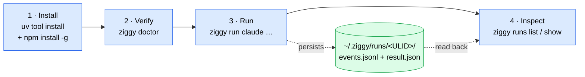

# Getting Started

This page takes you from an empty machine to a **recorded agent run** you can
read back months later. Four steps: install Ziggy and the pinned adapters,
verify the environment with a live handshake probe, run one agent against one
prompt, then inspect what landed on disk.

Budget about fifteen minutes, most of it waiting on `npm`.

!!! danger "Read this before you run anything"
    Ziggy **mediates and records** the ACP surface an agent chooses to route
    through it. It does **not** sandbox, isolate, or contain the agent
    subprocess — that subprocess is a normal OS process and can open files,
    spawn shells, and reach the network without Ziggy ever seeing it. Treat a
    policy decision as *evidence about what was asked and answered*, never as
    proof of what the agent could do. The full boundary — including why every
    v0.1 built-in is classified as advisory — is in
    [Trust and policy](reference/trust-and-policy.md).



---

## 1. Prerequisites

| Requirement | Why |
| --- | --- |
| **Python `>=3.12,<3.15`** | The package pins this range in `pyproject.toml`; nothing older or newer is supported in v0.1 |
| **macOS or Linux** | The process lifecycle relies on POSIX process groups and signals. Windows is not supported in v0.1 |
| **Node.js with `npx` on `PATH`** | The `claude` and `codex` built-ins are Node adapters launched through `npx` (the `opencode`/`devin` built-ins run their own CLI instead) |
| **[uv](https://docs.astral.sh/uv/)** (recommended) | The install command below uses `uv tool install`; it is also how you develop on Ziggy |

`PATH` matters more than usual here: Ziggy composes the agent's child
environment explicitly rather than passing yours through wholesale, forwarding
only `HOME`, `PATH`, `TERM`, and `LANG` (plus anything the agent's config names).
If `npx` is not on the `PATH` of the shell that runs `ziggy`, the agent will not
launch. See
[the child environment](reference/configuration.md#how-the-child-environment-is-composed).

## 2. Install

!!! warning "v0.1.0 is not tagged or released yet"
    Ziggy is **not on PyPI**, and the `v0.1.0` tag does not exist. Install from
    the repository at `main`. The tag form below will work once the release
    lands — the remaining live and human sign-off items are tracked in the
    [release checklist](RELEASE-CHECKLIST.md).

```bash
uv tool install git+https://github.com/sequenzia/ziggy@main

# once v0.1.0 is tagged:
# uv tool install git+https://github.com/sequenzia/ziggy@v0.1.0
```

Confirm the console script is on your `PATH`:

```bash
ziggy --help
```

!!! note "There is no `--version` flag"
    Invoking `ziggy` bare prints help and exits, and so does each sub-app group
    (`agents`, `runs`, `config`, `workflow`, `schemas`). `python -m ziggy` runs
    the identical application if you would rather skip the script shim. See the
    [CLI reference](reference/cli.md).

### Install the pinned agent adapters — explicitly

This is a **separate, deliberate step**. Ziggy will not do it for you:

```bash
npm install -g claude-agent-acp@0.63.0 codex-acp@1.1.7
```

`claude` and `codex` launch as `npx --no-install <pinned-package>`. That
`--no-install` is load-bearing: `npx` will use the package if it is already
installed and **fail otherwise**, rather than silently fetching and executing
code from the network in the middle of a run. A missing adapter therefore
surfaces as an `AgentLaunchError` at a moment you chose, instead of an invisible
download you did not. The error names the command and points at `ziggy doctor`,
which prints the exact install line for that agent.

Two more built-ins — `opencode` and `devin` — are registered by default but
speak ACP from their own CLI, so they have no adapter to install. Install the
CLI only if you intend to use it:

```bash
npm install -g opencode-ai@1.18.9              # or the install script / Homebrew
brew install --cask devin-cli                  # Linux: curl -fsSL https://cli.devin.ai/install.sh | bash
```

| Agent | Launch command | Provider (egress identity) | Credential |
| --- | --- | --- | --- |
| `claude` | `npx --no-install claude-agent-acp@0.63.0` | `anthropic` | adapter-managed login state under `HOME` (`api_key_env` is unset by default) |
| `codex` | `npx --no-install codex-acp@1.1.7` | `openai` | ChatGPT login state under `HOME` |
| `opencode` | `opencode acp` (found on `PATH`) | `custom:opencode` | `opencode auth login` state under `HOME`, or the configured provider's own env vars |
| `devin` | `devin acp` (found on `PATH`) | `custom:devin` | browser login to a Devin Cloud account |

The adapter versions are exact reviewed pins, never `latest`. The two vendor
CLIs cannot be version-pinned at launch — Ziggy runs whatever `opencode` /
`devin` resolves to on `PATH` and records the version the agent reports during
the handshake. Nothing is downloaded either way: a CLI that is not installed
fails the launch with `command not found`, and `ziggy doctor --agent <name>`
prints the install line.

`opencode` and `devin` carry the egress identities `custom:opencode` and
`custom:devin` on purpose. OpenCode routes to whichever model provider you
configured, so calling it `anthropic` or `openai` would misstate where your code
goes, and the same caution applies to Devin here. A distinct `custom:` identity
is never conflated with another agent's, and it means a workflow mixing `claude`
and `opencode` counts as cross-provider and must be acknowledged
(`--acknowledge-egress anthropic,custom:opencode`).

You authenticate each agent the way its own documentation describes — Ziggy
forwards `HOME`, which is where that login state lives. If you prefer an API key
instead, name the environment **variable** (never the value) with `api_key_env`;
see [Registering agents](reference/configuration.md#registering-agents).

## 3. Verify with `ziggy doctor`

```bash
ziggy doctor
```

!!! info "`doctor` is a live probe, not a static check"
    For every selected agent, `doctor` **actually launches the registered
    command**, performs a real ACP `initialize` round-trip with a **20-second**
    timeout, and shuts the subprocess down cleanly — all under a
    deny-everything probe policy that refuses every file read, file write,
    terminal request, and permission request it might be asked for. It is the
    fastest way to learn that an adapter is missing, unauthenticated, or
    speaking a protocol version Ziggy does not.

    It still never downloads anything: the npm-adapter built-ins stay behind
    `npx --no-install`, the vendor-CLI built-ins run an already-installed binary,
    and command resolvability is probed with `which` alone. `api_key_env` is
    checked for **presence only** — the value is never read into a message or
    printed.

    A bare `ziggy doctor` probes `claude` and `codex`. `opencode` and `devin`
    are optional installs, so they are left out of the default scope rather than
    failing the run on a machine that never wanted them — probe them explicitly
    with `ziggy doctor --agent opencode` or `--all`.

A healthy machine looks like this:

```text
[pass] config-load: fingerprint 3d394375f474…
[pass] config-forbidden-project-keys: no forbidden project-scope settings
[pass] store-writable: /Users/you/.ziggy is writable
[skip] index-integrity: index not created yet (no persisted runs)
[pass] agent-command-resolvable:claude: 'npx' -> /usr/local/bin/npx (nothing downloaded)
[skip] api-key-env-set:claude: no api_key_env configured (agent-managed login)
[pass] acp-handshake:claude: protocol v1; agent claude-code 1.2.3; clean shutdown
[pass] capability-summary:claude: promptCapabilities={"embeddedContext":true,"image":false}
[warn] direct-tools-advisory:claude: agent is assumed to run direct (non-ACP) local tools; guarded mediation is advisory, not OS-enforced
       hint: run the agent in a separately verified OS sandbox for hard enforcement
[pass] agent-command-resolvable:codex: 'npx' -> /usr/local/bin/npx (nothing downloaded)
[skip] api-key-env-set:codex: no api_key_env configured (agent-managed login)
[pass] acp-handshake:codex: protocol v1; agent codex 1.1.7; clean shutdown
[pass] capability-summary:codex: no capabilities reported
[warn] direct-tools-advisory:codex: agent is assumed to run direct (non-ACP) local tools; guarded mediation is advisory, not OS-enforced
       hint: run the agent in a separately verified OS sandbox for hard enforcement
[skip] orchestrator-planning-eligibility: no orchestrator agent configured
[skip] trusted-workflow-hashes: no trusted workflows configured
[pass] server-readiness: 4 agent routes; max_active_runs=1; lease directory writable; permission forwarding per current adapter fixture
doctor: ok
```

### Reading the output

Each line is `[status] name: detail`, with agent-scoped checks carrying a
`:<agent>` suffix. A `fail` or `warn` adds an indented `hint:` line telling you
what to do about it. The last line is the verdict.

| Status | Meaning | Affects exit code? |
| --- | --- | --- |
| `pass` | The check established what it set out to establish | no |
| `fail` | Something is broken and will bite you at run time | **yes — exit 1** |
| `warn` | An honest caveat you should know about, not a defect | no |
| `skip` | Not applicable, or a prerequisite check did not produce input | no |

The run ends with `doctor: ok` when nothing failed, or `doctor: problems found`
otherwise — and **only `fail` sets the exit code to 1**, so a `warn` still exits
0 and is safe in CI. When configuration itself cannot load, every
config-dependent check is reported `skip` rather than guessed at.

### The `direct-tools-advisory` warning is expected

Every built-in warns here, on every healthy machine, in v0.1. This is **not** a
misconfiguration and there is no setting that clears it.

Ziggy classifies an agent with `direct_tools_assumed = true` when it assumes the
agent has filesystem and shell tools of its own that Ziggy cannot disable. The
live capability probe that would prove otherwise is deferred, so the
conservative default stands: mediation for these agents is reported as
**advisory** — Ziggy observes and records the ACP client-bound surface, and the
agent subprocess remains free to act outside it. The hint points at running the
agent under a separately verified OS sandbox if you need hard enforcement,
because Ziggy does not provide one. See
[What would change this](reference/trust-and-policy.md#what-would-change-this).

### Scope, and what to do about failures

```bash
ziggy doctor                    # claude + codex (the default)
ziggy doctor --all              # every registered agent: both vendor CLIs and custom ones
ziggy doctor --agent claude     # exactly one agent
ziggy doctor --agent opencode   # how you probe a vendor-CLI builtin
ziggy doctor --json | jq '.checks[] | select(.status == "fail")'
```

`--agent` takes precedence over `--all` when both are given, and an unknown
agent name is a usage error (exit 2), not a check failure. Expect
`--all` to fail on any vendor CLI you have not installed — that is the whole
reason the default scope leaves them out.

| First-run failure | What it means | Fix |
| --- | --- | --- |
| `agent-command-resolvable:*` fails | The launch command is not on `PATH` for this shell — `npx` for `claude`/`codex`, the vendor binary for `opencode`/`devin` | Install Node.js (or the vendor CLI), or fix `PATH` |
| `acp-handshake:*` fails with an install hint | The pinned adapter package is not installed — `--no-install` refused to fetch it | `npm install -g claude-agent-acp@0.63.0 codex-acp@1.1.7` |
| `acp-handshake:*` times out after 20s | The adapter launched but never completed `initialize` — usually an unauthenticated or wedged adapter | Complete the adapter's own login, then re-probe with `ziggy doctor --agent <name>` |
| `api-key-env-set:*` fails | Config names an `api_key_env` variable that is unset or empty | `export` it in the shell that runs Ziggy, or correct the name in user config |
| `store-writable` or `server-readiness` fails | The store root cannot be written | Check ownership and permissions of `$ZIGGY_HOME` (default `~/.ziggy`) |

Every check, in order, with what each one establishes:
[`ziggy doctor` in the CLI reference](reference/cli.md#ziggy-doctor).

## 4. Your first run

Ziggy always acts on the directory you invoke it from — there is no
`--workspace` flag. `cd` into the repository you want the agent to work on:

```bash
cd ~/code/my-project
ziggy run claude "summarize the uncommitted changes in this repo"
```

On an interactive terminal you get a live status line, the agent's text streamed
as it arrives, and one line per lifecycle event, followed by a summary table.
Piping or `--plain` gives you the same information without ANSI escapes:

```text
[run] 01JAV4K2Q7X8Z9MNBVCXZ1234 started: agent claude (capture=standard)
[policy] guarded (enforcement: advisory)
[agent] launching: npx
[agent] launched (pid 51234)
[agent] claude-code 1.2.3 (protocol v1)
[agent] session sess_01hq…
[agent] prompt sent
[permission] Run git status --porcelain: denied (rule terminal-default-deny)
[tool] Read src/api/handlers.py (read): completed
Three files are modified: src/api/handlers.py, tests/test_api.py, README.md …
[agent] terminated (exit 0, turn_complete)
[step] main: success (14820 ms)
[run] finished: success
--- run summary ---
status: success
duration: 15042 ms
files changed: 0
permissions denied: 1
result: /Users/you/.ziggy/runs/01JAV4K2Q7X8Z9MNBVCXZ1234/result.json
```

That denial is normal. The guarded policy denies mediated terminal execution by
default, and the agent simply worked around it — which is also the boundary in
miniature: the record proves Ziggy refused the *mediated* request, not that no
shell ran.

### What just got persisted

The `result:` path is the point of the exercise. Under `$ZIGGY_HOME` (default
`~/.ziggy`), the run left behind a ULID-named directory:

```text
~/.ziggy/runs/01JAV4K2Q7X8Z9MNBVCXZ1234/
├── events.jsonl    # append-only, redacted source of truth — one event per line
└── result.json     # the RunResult manifest, written once, atomically
```

`events.jsonl` is written first and is authoritative; `result.json`, the SQLite
listing index, the metadata logs, and everything that scrolled past in your
terminal are derived views of that same single pass. Directories are `0700`,
files `0600`.

For a scratch run that writes nothing at all:

```bash
ziggy run claude "what protocol version do you speak?" --no-save
```

The full anatomy of a run — prepare, the workspace lease, launch and handshake,
capture profiles, timeouts, cancellation — is in
[Running agents](guides/running-agents.md).

## 5. Read what was recorded

```bash
ziggy runs list
```

```text
run-id                      kind      target   status   started-at                duration
--------------------------  --------  -------  -------  ------------------------  --------
01JAV4K2Q7X8Z9MNBVCXZ1234   agent     claude   success  2026-07-29T14:02:11.418Z  15042 ms
```

```bash
ziggy runs show 01JAV4K2Q7X8Z9MNBVCXZ1234
```

The detail view is ordered so the trust-relevant facts arrive before the
narrative: identity and timing, workspace, whether the manifest was persisted,
the config fingerprint, the effective policy line, per-artifact **capture
completeness**, then per-step file changes and policy decisions — each decision
carrying its `enforcement_scope` — and finally any errors.

!!! tip "Read the capture block, not just the status"
    `status: success` says the work completed. The capture block says how much
    of it Ziggy can actually prove. `file_changes` in particular is at best
    `derived` at **every** capture profile: Ziggy infers changes from ACP tool
    calls and mediated writes, and never diffs the workspace. Files an agent
    wrote with its own tools produce no entry at all.

### The `--json` contract

Under `--json`, **stdout carries only the machine-readable document**. Every
progress line, warning, summary, and error moves to stderr. That separation is
what makes piping safe:

```bash
# terminal state and where the manifest landed
ziggy run claude "review src/api for fail-open paths" --json \
  | jq -r '[.status, .persisted, (.result_path // "null")] | @tsv'

# what the agent asked for, and how policy answered
ziggy runs show 01JAV4K2Q7X8Z9MNBVCXZ1234 --json \
  | jq -r '.steps[].permission_decisions[]
           | [.decision, .rule_id, .enforcement_scope] | @tsv'
```

The same contract holds for `runs list`, `workflow list`, `config show`, and
`doctor`. Browsing, `events.jsonl`, retention, and pruning are covered in
[Runs and audit](guides/runs-and-audit.md); the field-by-field manifest contract
is in [Schemas](reference/schemas.md).

## 6. Minimal configuration

Ziggy reads **two** TOML files, and the difference between them is the whole
design:

| Scope | File | Trust | May do |
| --- | --- | --- | --- |
| **user** | `~/.ziggy/config.toml` (or `$ZIGGY_HOME/config.toml`) | trusted | everything — register agents, name credentials, set every ceiling and policy |
| **project** | `<workspace>/.ziggy/config.toml` | **untrusted** | only *restrict* — tighten six engine ceilings, lower capture, add deny rules, name a default workflow |

Both files are optional; with neither present the schema defaults apply. A
project config arrives with `git clone` and changes with `git pull`, so Ziggy
treats it as adversarial input: anything outside that narrow allowance is a hard
error raised before a single project value is applied.

=== "User config (trusted)"

    ```toml title="~/.ziggy/config.toml"
    schema_version = 1

    [engine]
    default_step_timeout_seconds = 900    # ceiling; --timeout can only lower it

    [results]
    capture = "standard"                  # metadata | standard | debug
    retention_days = 30                   # the window 'runs prune' uses

    # Optional: authenticate the builtin with an API key instead of adapter login.
    # This is an env var NAME — never a value. Literal secrets are rejected.
    [agents.claude]
    api_key_env = "ANTHROPIC_API_KEY"
    ```

=== "Project config (untrusted)"

    ```toml title="<workspace>/.ziggy/config.toml"
    schema_version = 1

    # Lower is applied; equal is ignored; higher is a hard ConfigError.
    [engine]
    default_step_timeout_seconds = 300

    # Deny-only additions — valid ONLY in project scope.
    [[permissions.project_denials]]
    kind = "path"
    pattern = "**/infra/**"
    ```

`schema_version = 1` is required in both files, and every table forbids unknown
keys, so a typo is a load-time error naming the exact path.

Check what is actually in force, and where each value came from:

```bash
ziggy config show        # every effective leaf, with source + project-action
ziggy config validate    # 'ok', or a path-precise ConfigError (exit 2)
```

Each row reports `source` (`default`, `user`, `env`, or `project`) and
`project-action` (`none`, `applied`, `tightened`, `ignored`, `rejected`),
followed by the config fingerprint that gets embedded in every `RunResult` — so
an archived run records exactly which configuration produced it.

!!! tip "`ZIGGY_HOME` moves everything at once"
    Setting `ZIGGY_HOME` relocates the user config file, the run store, the
    metadata logs, and user-scope workflows together — which makes it the
    cleanest way to work against an isolated environment:

    ```bash
    ZIGGY_HOME=/tmp/ziggy-scratch ziggy doctor
    ```

The full field list, the per-leaf merge rules, environment overrides
(`ZIGGY_<SECTION>__<KEY>`), credentials, and worked accept/reject examples are
in the [Configuration reference](reference/configuration.md).

## Where to go next

| Go here | For |
| --- | --- |
| [Running agents](guides/running-agents.md) | What one `ziggy run` does end to end: prepare, lease, handshake, capture profiles, timeouts, cancellation, and a troubleshooting table |
| [Workflows](guides/workflows.md) | Constrained agent-only YAML: declared variables, typed data flow between steps, and what a repository-controlled file deliberately cannot express |
| [Orchestration](guides/orchestration.md) | Turning a goal into a bounded, validated plan — planner eligibility, the uncontained-planner gate, and `--plan-only` |
| [ACP server mode](guides/acp-server.md) | `ziggy serve` — exposing Ziggy itself as an ACP agent for an editor like Zed |
| [Runs and audit](guides/runs-and-audit.md) | The run store, `events.jsonl`, capture and truncation, redaction limits, the workspace lease, reindexing, and pruning |
| [CLI reference](reference/cli.md) | Every command, flag, exit code, environment variable, and output mode |
| [Configuration reference](reference/configuration.md) | Every field, every scope, and exactly what project scope may and may not do |
| [Trust and policy](reference/trust-and-policy.md) | The boundary itself: the mediated surface, the guarded policy, `enforcement_scope`, egress acknowledgement, and redaction's honest limits |
| [Schemas](reference/schemas.md) | `result.json` and `events.jsonl`, field by field, plus the shipped JSON Schema artifacts |

## Developing on Ziggy itself

Clone the repository and use uv:

```bash
git clone https://github.com/sequenzia/ziggy
cd ziggy

uv sync                              # install the project + dev dependencies
uv run pytest                        # the suite (live-marked tests are deselected)
uv run ruff check src/ tests/        # lint
```

Tests marked `live` require real agent adapters and provider accounts and are
deselected by default; `slow` tests spawn real subprocess fixtures.

For this documentation site:

```bash
uv sync --group docs
uv run mkdocs serve                  # http://127.0.0.1:8000
```

Design notes, per-phase implementation contracts, the checkpoint-gate record,
and the deferred-items release checklist all live under **Internals** in the
navigation.
