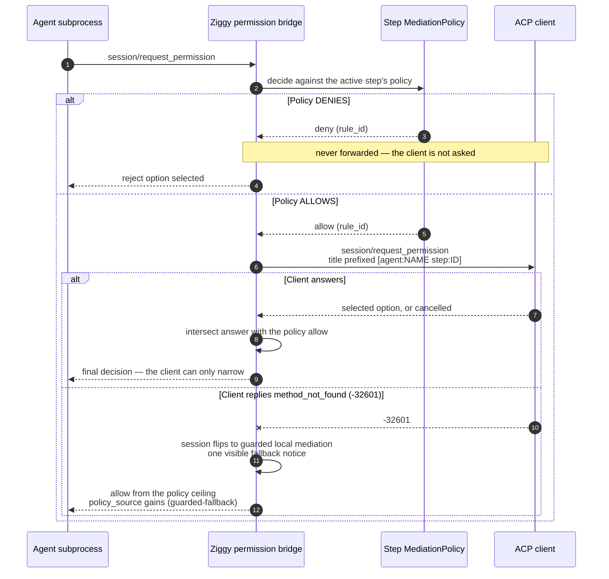

# Running Ziggy as an ACP agent

Every other way of using Ziggy has it playing the ACP **client**: you type `ziggy run`, and Ziggy launches an agent subprocess, drives its turn, and mediates what it asks for. `ziggy serve` inverts that. Ziggy becomes the ACP **agent**, speaking JSON-RPC over stdio to an external client — an editor like [Zed](https://zed.dev), or anything else that speaks ACP v1 — and that client drives Ziggy.

The client sees exactly one agent, named `ziggy`. Behind that single identity, a prompt can become a direct single-agent run, a named workflow, or a full plan-then-execute orchestration, depending on the route the session has selected. Whichever it becomes, it goes through the ordinary engine entry points (`prepare_run`/`execute_run`, `prepare_workflow`/`execute_workflow`, `prepare_orchestration`/`run_orchestration`), so a server-mode run persists the same `RunResult` as a CLI run and shows up in `ziggy runs list` alongside everything else.

## The direction inversion

```mermaid
flowchart LR
    subgraph CLIENT["External ACP client (e.g. Zed)"]
        UI["Editor UI<br/>prompt box, permission dialogs"]
    end

    subgraph ZIGGY["ziggy serve — one process"]
        SRV["ziggy.acp.server<br/>agent side of ACP"]
        APP["ZiggyServer<br/>routes, admission, permission bridge"]
        ENG["Engine<br/>prepare / execute / recorder"]
        CLI["ziggy.acp.client<br/>client side of ACP"]
    end

    A1["Agent subprocess<br/>direct agent route"]
    A2["Agent subprocess<br/>workflow / execution step"]

    UI -- "ACP over stdio: initialize,<br/>session/new, session/prompt" --> SRV
    SRV --> APP
    APP --> ENG
    ENG --> CLI
    CLI -- "ACP over stdio<br/>Ziggy is the CLIENT here" --> A1
    CLI -- "ACP over stdio" --> A2
    APP -. "session/update stream,<br/>session/request_permission" .-> UI

    style CLIENT fill:#f8fafc,stroke:#94a3b8,color:#000
    style ZIGGY fill:#f8fafc,stroke:#94a3b8,color:#000
    style SRV fill:#dbeafe,stroke:#2563eb,color:#000
    style APP fill:#dbeafe,stroke:#2563eb,color:#000
    style ENG fill:#dbeafe,stroke:#2563eb,color:#000
    style CLI fill:#dbeafe,stroke:#2563eb,color:#000
    style UI fill:#dbeafe,stroke:#2563eb,color:#000
    style A1 fill:#fef3c7,stroke:#d97706,color:#000
    style A2 fill:#fef3c7,stroke:#d97706,color:#000
```



Both ACP boundaries live in the same process, and they are genuinely separate roles. The upstream boundary answers `initialize`, `session/new`, and `session/prompt`. The downstream boundary is the one you already know from [running agents](running-agents.md) — Ziggy launching an agent, mediating its `fs/*`, `terminal/*`, and `session/request_permission` traffic. The permission bridge is what stitches them together: a downstream agent's request can be surfaced as a dialog in the upstream client.

!!! warning "Serving does not add containment"
    Nothing about serve mode changes the trust boundary. Ziggy still **mediates** exactly the ACP client-bound surface of the agents it launches, and an agent subprocess remains a normal OS process that can touch the filesystem, spawn shells, and reach the network without asking. Forwarding a permission prompt into an editor makes a decision *visible to a human*; it does not make it enforceable. Every recorded decision carries `enforcement_scope: acp_mediated`. See [Trust and policy](../reference/trust-and-policy.md).

## Starting the server

```bash
ziggy serve
```

The command takes no options. It is meant to be launched *by* a client, not typed interactively — if you run it in a terminal it will sit waiting for JSON-RPC frames on stdin.

Two properties are worth internalizing before you wire anything up:

- **stdout carries ACP JSON-RPC frames and nothing else.** The wire format is newline-delimited JSON-RPC 2.0 with camelCase parameter keys. Anything Ziggy prints to stdout that isn't a protocol frame would corrupt the stream, so nothing else is printed there.
- **All diagnostics go to stderr**, via `logging` at `INFO`, formatted `%(asctime)s %(levelname)s %(name)s: %(message)s`. Client connection, session creation, route counts, ignored non-text content blocks, config warnings, and the `max_active_runs` ceiling all land there. If your client shows an agent's stderr, that is your log.

### Where configuration comes from

Configuration is read twice, at two different moments, and the distinction matters:

| Read | When | What it determines |
| --- | --- | --- |
| Launch cwd | Once, at process start | `server.max_active_runs`, and the `agent:<name>` route catalog (from the agent registry) |
| Session cwd | On every `session/new` | Everything the run itself uses: policy profiles, engine ceilings, orchestrator settings, results/capture |

That second read is deliberate. Reloading config from the session's own directory is what engages *that workspace's* untrusted-project scope for the session, so a project-scope `.ziggy/config.toml` gets the same tighten-only treatment it gets on the CLI. A project config that overreaches — say, one that tries to set `server.max_active_runs`, which is user-scope only — fails `session/new` with a typed error instead of taking effect. See [Configuration](../reference/configuration.md).

Because `server.max_active_runs` is fixed at launch, changing it means restarting the server:

```bash
ZIGGY_SERVER__MAX_ACTIVE_RUNS=2 ziggy serve
```

### A manual smoke test

You can drive the server by hand to confirm it is alive. Each frame is one line of JSON on stdin; responses come back one line at a time on stdout.

```json
{"jsonrpc":"2.0","id":1,"method":"initialize","params":{"protocolVersion":1,"clientCapabilities":{"fs":{"readTextFile":false,"writeTextFile":false}},"clientInfo":{"name":"my-client","version":"0"}}}
{"jsonrpc":"2.0","id":2,"method":"session/new","params":{"cwd":"/path/to/your/workspace","mcpServers":[]}}
```

The `initialize` response reports `protocolVersion: 1`, `agentInfo: {"name": "ziggy", "version": ...}`, and `agentCapabilities.loadSession: false`. The `session/new` response carries a `sessionId` and a `configOptions` array containing the single `route` select — which is the subject of the next section but one.

## Connecting a client

Ziggy registers like any other custom ACP agent: a command to spawn, and stdio as the transport.

| Setting | Value |
| --- | --- |
| Command | `ziggy` (or `python -m ziggy`) |
| Arguments | `serve` |
| Transport | stdio, newline-delimited JSON-RPC 2.0 |
| Working directory | The workspace you want Ziggy to act on |

The working directory matters twice over: it is where the launch-time config is read from, and it is typically what the client will pass as `cwd` on `session/new`.

!!! note "The exact Zed settings JSON is not documented yet — on purpose"
    Registering `ziggy serve` in Zed's custom-agent configuration and recording the exact settings block is an open item on the [release checklist](../RELEASE-CHECKLIST.md), together with the live interoperability smoke test that would confirm it: direct-agent, workflow, and orchestrated runs; streamed progress visible in the editor; permission prompts appearing and being honored; cancellation from Zed tearing down the agent tree. That test is **deferred and has not been run**, and v0.1.0 is not tagged.

    Rather than print a settings schema nobody has verified against a running editor, this page documents what *is* verifiable from the code and the loopback test suite: the command, the transport, the handshake, and the route-selection flow. Check your client's own documentation for the shape of its custom-agent block, and expect to feed it the command and arguments above.

Any ACP v1 client can drive Ziggy — the loopback integration suite does exactly that with a hand-rolled, SDK-free NDJSON client. What a client needs to support is modest: `initialize`, `session/new`, `session/prompt`, and ideally `session/set_config_option` (to pick a route other than the default) and `session/request_permission` (to answer forwarded prompts). A client that cannot do the last one still works; see [the guarded fallback](#when-the-client-cannot-answer).

## Routes

A route is the one knob a session exposes. It is built fresh at `session/new` and surfaced to the client as an ACP session config option with id `route`, name `Route`, and type `select`.

| Route | Count | What a prompt becomes |
| --- | --- | --- |
| `orchestrator` | Always exactly one; **the default** | The prompt text is the goal for a plan-then-execute orchestration |
| `agent:<name>` | One per registered agent | A direct single-agent run with the prompt as its prompt |
| `workflow:<name>` | One per workflow discoverable from the session cwd | A run of that workflow (no variables) |

The catalog is ordered `orchestrator` first, then the agent routes, then the workflow routes sorted by name. Agent routes come from the registry built at launch — agents are user-scope configuration, so they are identical for every session. Workflow routes come from `discover()` against the session cwd, which means project-scope workflows in `<cwd>/.ziggy/workflows/` plus user-scope ones, exactly as [`ziggy workflow list`](workflows.md) sees them.

!!! danger "Routes can never widen policy"
    Selecting a route picks an entry from a catalog Ziggy built. It does not — and cannot — touch policy, ceilings, or which commands may run. An unknown route value is rejected as `invalid_params`.

### Selecting a route

```json
{"jsonrpc":"2.0","id":3,"method":"session/set_config_option","params":{"sessionId":"ziggy-...","configId":"route","value":"workflow:nightly-audit"}}
```

The response echoes the full `route` select with its new `currentValue`, so a client can re-render its picker from the answer. `route` is the only recognized `configId`; anything else is `invalid_params`, as is a non-string value or a route value not in the session's catalog.

### What a prompt does on each route

`session/prompt` is **text-only**. Text content blocks are joined with a newline; any non-text block is counted, logged to stderr, and ignored. This is not a silent limitation — it is declared in the handshake, where `promptCapabilities` reports `image: false`, `audio: false`, `embeddedContext: false`.

=== "orchestrator (default)"

    The prompt text *is* the goal. Ziggy prepares an orchestration exactly as [`ziggy orchestrate`](orchestration.md) would: the configured planner produces a plan, and the plan is executed.

    Two gates fire before any subprocess launches, and both surface to the client as errors rather than as a failed run: a `ConfigError` when `orchestrator.agent` is unset, and a `TrustPolicyError` when the planner is uncontained and that has not been acknowledged.

=== "agent:&lt;name&gt;"

    A direct single-agent run against the named agent, with the prompt text as the prompt and the session cwd as the workspace. Identical in every respect to `ziggy run <name> "<prompt>"` — same preparation, same policy, same persisted result.

=== "workflow:&lt;name&gt;"

    Runs the named workflow with **no variable values supplied**. Steps execute serially in dependency order, each under its own step policy.

!!! warning "A workflow with a required variable cannot be used as a route in v0.1"
    Prompts cannot carry `--var` values over ACP, so the server passes an empty variable map. Before preparing anything, it checks the workflow's declared variables: if any is declared `required: true`, the prompt fails immediately with a `ValidationError` naming the offending variables.

    Since the workflow schema forbids a variable from being both `required: true` and having a `default`, the practical rule is: **every variable a workflow route needs must carry a `default`**. A workflow with a genuinely required input stays CLI-only for now. See [Workflows](workflows.md).

## What the client sees while a run is happening

Engine events are re-emitted as ACP `session/update` notifications while the run is live. Some map straight through; the rest collapse into one-line human-readable notices.

| Engine event | Re-emitted as |
| --- | --- |
| `message_chunk` | `agent_message_chunk` |
| `thought_chunk` | `agent_thought_chunk` |
| `tool_call` / `tool_call_update` | `tool_call` / `tool_call_update` |
| `plan` | `plan` |
| `usage` | `usage_update` — **only** when both `used` and `size` are present |
| `step_started` | notice: `[step <id>] started (agent: <name>)` |
| `step_finished` | notice: `[step <id>] finished: <status>` |
| `permission_decided` | notice: `[policy] <rule_id>: <decision>` |
| `egress_notice` | notice: `[egress] providers: ... (acknowledged_by: ...)` |
| `truncation` | notice: `[truncation] step <id>: event stream truncated (capture degraded)` |
| `error` | notice: `[error] <code>: <message>` |

Notices are plain `agent_message_chunk` updates — a client that renders agent text renders them without any special support.

Config-option, mode, and unmodeled update events are server-internal and are not re-emitted; there is no v1 serving-side shape for them.

Every update carries correlation metadata so a client can tie a stream back to a persisted run:

```json
"_meta": {"ziggy": {"run_id": "...", "step_id": "..."}}
```

`step_id` is `null` for updates that arrive outside a step. The `run_id` is the same one that names the directory under the run store, which is how you get from something you saw in an editor to `ziggy runs show <run-id>` and the full [`RunResult`](../reference/schemas.md).

!!! note "Redaction is defense in depth, not a proof"
    Re-emitted text passes through the same bounded streaming redactor as persisted events. It reduces the chance of a secret reaching the client's screen; it does not guarantee one never will.

## Permission forwarding

This is the most consequential part of serve mode, and the ordering of its steps is the whole design. The policy ceiling is consulted **first**, and the client is asked **second** — never the other way around.



Spelled out as rules:

1. **Find the ceiling.** The bridge looks up the `MediationPolicy` registered for the currently active step. On the orchestrator route, `execute/*` steps are produced mid-run by the plan and so cannot be pre-registered; those fall back to a fixed guarded workspace-ceiling policy built from the session's default profile and project denials.
2. **A policy deny is decided locally and is never forwarded.** The client is not asked, is not shown a dialog, and cannot override it. The recorded `client_response` is `null`.
3. **A policy allow is forwarded** to the client via `session/request_permission`, with the tool-call title prefixed `[agent:<name> step:<id>]` so the human can see which downstream agent, in which step, is asking.
4. **The client's answer is intersected with the policy allow.** An allow-kind selection approves; a reject-kind selection, an option id Ziggy never offered, or a cancelled outcome all deny. The client can only **narrow** — there is no path by which a client approval widens a policy denial, because a policy denial never reaches the client in the first place.
5. **No active step means denial.** A request that cannot be attributed to a step is denied under rule id `server-no-active-step-deny`.
6. **A broken forward denies.** If the connection drops or the client answers with an error other than `method_not_found`, the request is denied under rule id `server-forward-failed-deny` — and, importantly, this does *not* engage the session-wide fallback below. One broken request stays one broken request.

### When the client cannot answer {#when-the-client-cannot-answer}

If the client answers `session/request_permission` with `method_not_found` (`-32601`), the session flips to **guarded local mediation** for that request and every subsequent one. Exactly one visible notice is emitted, once per session:

```text
[policy] the connected client does not support session/request_permission; this and
subsequent permission requests are resolved by guarded local mediation
```

Guarded local mediation is not a loosening. The policy ceiling had already allowed the request — the only thing lost is the human confirmation on top. Decisions taken this way record their `policy_source` with a `(guarded-fallback)` suffix, so an audit can tell afterwards which decisions a human actually saw.

### Planning steps are never forwarded

On the orchestrator route the bridge governs **execution steps only**. Permission requests raised during planning are decided locally by the planning profile — reduced exposure: no writes, no terminal, reads confined to an empty temp directory — and are never routed to a client. A client approval cannot widen the planning profile because it is never consulted about it.

### What gets recorded

Every decision, forwarded or not, lands in the run's events and result with the same shape:

| Field | Meaning |
| --- | --- |
| `request_summary` | Tool-call title, falling back to the tool call id |
| `options_offered` | The option kinds the agent offered |
| `decision` | `approved` or `denied` |
| `rule_id` / `policy_name` / `policy_source` | Which rule decided it, and where that rule came from |
| `enforcement_scope` | Always `acp_mediated` for bridge decisions |
| `client_response` | `approved`, `denied`, or `null` when the client was never asked |
| `ts` | UTC timestamp |

`client_response: null` is the audit signal that a decision was made without a human in the loop — either because policy denied it outright, or because the fallback was in effect.

## Concurrency

There is one process-wide ceiling on active runs, `server.max_active_runs`, which defaults to **1**.

Admission is immediate and there is **no queueing**. A prompt is rejected the moment either condition holds:

- the number of active runs already equals `server.max_active_runs`, or
- the session issuing the prompt already has a run in flight.

Rejection is a typed `ServerBusyError` whose details carry `max_active_runs` and `active_runs`. It arrives at the client as a JSON-RPC internal error whose `data` is the typed shape — `{"code": "ServerBusyError", "message": ..., "details": ...}` — and the server recovers cleanly: the next prompt after the active run finishes is admitted normally.

!!! note "The workspace lease still applies underneath"
    Server-mode runs take the same cross-process workspace lease as CLI runs, per run, with the same semantics. Two Ziggy processes — say a served run and a `ziggy run` you started in a terminal — contending for the same workspace produce a `WorkspaceBusyError`, with nothing launched. `server.max_active_runs` bounds one server process; the lease coordinates between processes.

`server.max_active_runs` is user-scope configuration only. A project cannot raise it, and cannot set it at all.

## Cancellation and shutdown

**`session/cancel`** is a notification. It sets the active run's cancel event, which starts the ordinary teardown ladder — the same one `Ctrl-C` triggers on the CLI, tearing down the downstream agent tree. It is idempotent, and a cancel for a session with no active run is a silent no-op. A run cancelled this way answers `session/prompt` with `stopReason: "cancelled"`.

**Shutdown** has two triggers, and they converge on the same path: client EOF (the client closed its end) and `SIGTERM`/`SIGINT`. Either one cancels every active run, awaits bounded completion through each run's own teardown ladder, lets the runners release their leases, and exits. Whatever could be persisted is persisted. If a client disconnects *during* a prompt, the in-flight engine task is shielded from the handler's teardown so shutdown — not an abandoned request handler — owns its wind-down.

### Stop reasons

ACP v1 has no error stop reason, and Ziggy declines to invent one by abusing the JSON-RPC error channel. That channel is reserved for transport and validation failures — a malformed request, an unknown route, an unknown session — not for a run that completed and happened to fail.

| Run status | `stopReason` | Also emitted |
| --- | --- | --- |
| `success` | `end_turn` | — |
| `partial` | `end_turn` | — |
| `cancelled` | `cancelled` | — |
| `failed` | `end_turn` | A final notice: `[error] run <id> failed: <code>: <message>` |
| `abandoned` | `end_turn` | The same final error notice |

So a client that only reads `stopReason` will see a failed run as a completed turn. The failure is in the stream, in the notice, and in the persisted `RunResult` — check `ziggy runs show <run-id>` when the transcript ends with an `[error]` line.

## ACP method support

| Method | Supported | Behavior |
| --- | --- | --- |
| `initialize` | Yes | Answers `protocolVersion: 1`, `agentInfo: {name: "ziggy", version}`, `loadSession: false`, `promptCapabilities: {image: false, audio: false, embeddedContext: false}`. A client requesting a different version is logged and still answered with version 1 — it decides whether to continue |
| `session/new` | Yes | Canonicalizes `cwd` (must be an existing directory), loads config fresh from it, discovers workflows, builds the route catalog, returns a `ziggy-<uuid>` session id |
| `session/set_config_option` | Yes | `configId: "route"` only |
| `session/prompt` | Yes | Text-only; non-text blocks logged and ignored |
| `session/cancel` | Yes | Notification; sets the active run's cancel event |
| `authenticate` | No | `method_not_found` |
| `session/load` | No | `method_not_found` |
| `session/list` | No | `method_not_found` |
| `session/set_mode` | No | `method_not_found` |
| `session/fork` | No | `method_not_found` |
| `session/resume` | No | `method_not_found` |
| `session/close` | No | `method_not_found` |
| `_ext/*` methods and notifications | No | `method_not_found`, echoing the requested method name |

Every unsupported surface is implemented **explicitly** so it answers `method_not_found` rather than falling through to a generic internal error. A client probing for capabilities gets a truthful answer instead of a crash report.

Error mapping on the supported surfaces:

| Situation | JSON-RPC response |
| --- | --- |
| Unknown `configId`, non-string route value, unknown route value, unknown session on a route switch | `invalid_params` (`-32602`) with explanatory `data` |
| Any typed Ziggy error (`ValidationError`, `ConfigError`, `TrustPolicyError`, `ServerBusyError`, `WorkspaceBusyError`, …) | `internal_error` (`-32603`) with `data: {code, message, details}` |
| Unsupported method | `method_not_found` (`-32601`) |

The typed `code` in `data` is the useful field — it is the same taxonomy the CLI maps to exit codes, so a client can distinguish "you asked for a workflow with a required variable" (`ValidationError`) from "I am already running something" (`ServerBusyError`) without parsing prose.

## The SDK-free boundary

Ziggy pins one ACP SDK, and the protocol will move. The codebase is arranged so that a protocol or SDK bump is a small, bounded edit rather than a sweep through the engine.

Three files — and only three — know that an SDK exists:

| File | Owns |
| --- | --- |
| `src/ziggy/acp/client.py` | The client side: launching agents, driving their turns |
| `src/ziggy/acp/server.py` | The agent side: `serve_stdio`, the SDK-protocol adapter, `ServerConnection`, JSON-RPC error mapping |
| `src/ziggy/acp/convert.py` | Every SDK ⇄ native conversion, in both directions |

Everything else — `server/app.py`, the engine, the orchestrator, the workflow runner — sees only the frozen dataclasses in `src/ziggy/acp/types.py`: `MessageChunkEvent`, `ToolCallEvent`, `PlanEvent`, `UsageEvent`, `ServerNotice`, `PermissionRequestN`, `PermissionReply`, `ServerHandshake`, `SessionOpened`, `RouteState`, `ServerStopInfo`. No SDK model ever crosses that line in either direction.

The server application implements a native-typed protocol whose signatures mention only native types, and the adapter in `acp/server.py` translates. This is enforced by tests, not just by convention: one test asserts that the SDK import allowance is confined to `ziggy.acp`, another asserts the native protocol's signatures are SDK-free, and the loopback integration suite drives a real `ziggy serve` subprocess with a hand-rolled NDJSON client that imports nothing from the SDK at all — so the wire contract is validated independently of the library that implements it.

The practical consequence: an SDK or protocol version bump touches those three files. It does not touch how runs are prepared, how policy decides, or how results are recorded.

## Troubleshooting

??? question "The client connects but no routes appear beyond `orchestrator`"
    Agent routes come from the registry built at **launch**, from the config in the launch working directory. If you registered agents in a config the server never read, they will not appear. Workflow routes come from the **session** cwd — check that `<session cwd>/.ziggy/workflows/` holds what you expect, and that `ziggy workflow list` from that directory agrees.

    Run `ziggy doctor` in the launch directory: the `server-readiness` check reports the route count alongside `max_active_runs`, and confirms the lease directory is writable.

??? question "`session/new` fails with a typed error"
    The most common causes, in order: the `cwd` does not resolve to an existing directory; or the project config at that path is rejected. Config is loaded **fresh** from the session cwd precisely so an untrusted project config is evaluated under project scope — a project trying to set a user-scope-only field fails session creation rather than silently taking effect. The error `data` carries the typed `code` and a path-precise message. Confirm with `ziggy config validate` run from that directory.

??? question "Every prompt comes back with `ServerBusyError`"
    A run is already active, or the same session already has one in flight. There is no queue — retry after the active run reaches a terminal state, or restart with a higher ceiling: `ZIGGY_SERVER__MAX_ACTIVE_RUNS=2 ziggy serve`. If nothing appears to be running, look for a run that is still tearing down; the slot is released when the run reaches a terminal state, not when the client stops watching.

??? question "A run fails with `WorkspaceBusyError` and nothing launched"
    That is the cross-process workspace lease, not the server ceiling. Another Ziggy process holds the lease on that workspace. Finish or cancel it. Nothing was launched, so nothing partial happened.

??? question "Permission prompts never appear in the client"
    Look for the one-time notice in the transcript: `the connected client does not support session/request_permission`. If it is there, the client answered `method_not_found` and the session is in guarded local mediation — decisions are still being made against the policy ceiling and still recorded, just without a human confirming them. Their `policy_source` carries the `(guarded-fallback)` suffix.

    If the notice is absent, the requests may simply be getting denied by policy before they ever reach the client — a policy deny is never forwarded. Look for `[policy] <rule_id>: denied` lines in the stream, and check the profile in [Trust and policy](../reference/trust-and-policy.md).

    On the orchestrator route, remember that planning steps never forward. Only `execute/*` steps reach the bridge.

??? question "The stream just stops, or the client reports a protocol error"
    Anything written to stdout that is not a JSON-RPC frame corrupts the stream. Ziggy itself routes all logging to stderr — but if you wrapped `ziggy serve` in a shell script, make sure the wrapper is not echoing anything to stdout. Check stderr for the actual diagnostics.

    Separately, if re-emission to the client fails mid-run, further updates for that run are suppressed and a warning is logged to stderr; the run itself continues and still persists its result.

??? question "The turn ended with `end_turn` but nothing useful happened"
    `end_turn` covers `success`, `partial`, `failed`, and `abandoned` — ACP v1 has no error stop reason. Look for a final `[error] run <id> failed: ...` notice in the stream, then inspect the persisted result with `ziggy runs show <run-id>`. The `run_id` is in the `_meta.ziggy` field of every update the run emitted.

??? question "A workflow route rejects the prompt"
    `ValidationError` naming required variables means the workflow declares at least one `required: true` variable, which cannot be supplied over ACP in v0.1. Give those variables defaults — a variable cannot be both `required` and defaulted, so this means flipping `required: true` to a `default` — or run that workflow from the CLI with `--var`.

??? question "`orchestrator` route fails before anything runs"
    `ConfigError` means `orchestrator.agent` is not set. `TrustPolicyError` means the configured planner is uncontained and that has not been acknowledged. Both gates fire before any subprocess launches, which is why they arrive as errors rather than as a failed run. See [Orchestration](orchestration.md).

## See also

- [CLI reference](../reference/cli.md) — `ziggy serve` and every other command
- [Configuration](../reference/configuration.md) — `server.max_active_runs`, scope rules, and the tighten-only merge
- [Trust and policy](../reference/trust-and-policy.md) — what mediation observes, and what it cannot
- [Schemas](../reference/schemas.md) — the `RunResult` and event shapes a served run persists
- [Running agents](running-agents.md) — the downstream direction, where Ziggy is the client
- [Workflows](workflows.md) — variables, discovery, and the `workflow:<name>` routes
- [Orchestration](orchestration.md) — what the default route actually does
- [Release checklist](../RELEASE-CHECKLIST.md) — the deferred Zed interoperability smoke test
