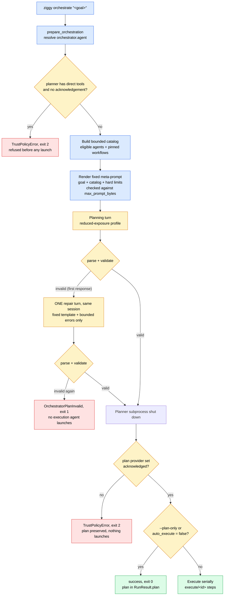

# Goal-driven orchestration

`ziggy orchestrate "<goal>"` hands one natural-language goal to a configured **planning agent**, takes back a plan that can only name things a bounded catalog offered, validates that plan against trusted user config, and — unless you asked for the plan alone — executes it on exactly the same scheduler, interpolation, and policy machinery that runs a hand-written [workflow](workflows.md).

The plan is model output. Every constraint on this page exists because of that one fact: what a plan may *say* is bounded by a strict schema, what it may *target* is bounded by trusted user config, and what it may *obtain* is bounded by ceilings no plan can reach.

!!! danger "Structural validation is never semantic validation"

    Ziggy proves that a plan's **shape** and **targets** are permitted. It never proves that a generated prompt is a good idea. Every executed plan step is recorded with `prompt_origin: "orchestrator-plan"` and `prompt_trust: "untrusted-model-output"`, and the plan step's `step_finished` event carries `semantic_safety: "not_validated"`. Nothing in a `RunResult` ever labels a plan or a prompt "safe" or "vetted" — `tests/security/test_hostile_plans.py` asserts those words are absent from the persisted document.

    A structurally valid plan can still contain a prompt that says something destructive. `--plan-only` exists so you can read it first.

---

## When to use it

| Situation | Reach for |
|---|---|
| You already know the steps, the agents, and the order | A [YAML workflow](workflows.md) — deterministic, reviewable, diffable, no planning round-trip |
| You know the steps but want them run once, right now | [`ziggy run`](running-agents.md) against one agent |
| The **decomposition** is the part you want a model to do | `ziggy orchestrate` |
| You want a model to *choose* among workflows you already trust | `ziggy orchestrate` with `orchestrator.trusted_workflows` pinned |

Orchestration costs a planning turn (and a real provider crossing — see [Egress](#egress-on-orchestrator-runs)) and gives back something strictly less expressive than a workflow. That is the trade: an inline plan cannot set a working directory, an environment variable, a timeout, or a policy, because the schema those fields would live in does not exist.

If you find yourself wanting orchestration to express one of those things, the answer is a workflow.

---

## The flow, end to end



One run id, one `events.jsonl`, one `RunResult`. The planning turn is the implicit step `plan`; everything the plan produces is namespaced `execute/<id>`.

---

## Enabling orchestration

Every `[orchestrator]` key is **user scope only**. A repository can never nominate the planner, widen the agent pool, pin a workflow, or grant the acknowledgement — see [`[orchestrator]`](../reference/configuration.md#orchestrator) and [the two-scope trust model](../reference/trust-and-policy.md#the-two-scope-trust-model).

```toml
# $ZIGGY_HOME/config.toml (or ~/.ziggy/config.toml) — trusted user scope
schema_version = 1

[orchestrator]
agent = "claude"                       # who plans
allow_uncontained_planner = true       # see the gate below
eligible_agents = ["claude", "codex"]  # what a plan may invoke
max_inline_steps = 8                   # default
auto_execute = true                    # default

[agents.claude]
api_key_env = "ANTHROPIC_API_KEY"
provider = "anthropic"
orchestration_eligible = true          # required to be an execution target

[agents.codex]
provider = "openai"
orchestration_eligible = true
```

Three separate decisions, deliberately not collapsed into one:

- **`orchestrator.agent`** names the planner. It does *not* need `orchestration_eligible` — who plans and who may be invoked by a plan are different questions.
- **`orchestrator.eligible_agents`** lists the agents a generated plan may target. Every name must be registered **and** carry `orchestration_eligible = true` on its own `[agents.<name>]` entry. Either condition missing is a `ConfigError` (exit 2) naming which condition failed — not a silent drop.
- **`orchestrator.trusted_workflows`** pins workflows a plan may select, by path *and* `sha256`.

```toml
[[orchestrator.trusted_workflows]]
path = "workflows/review.yaml"
sha256 = "3f786850e387550fdab836ed7e6dc881de23001b2ff2f3c1d6f1e1b0a94a8dfa"
```

A pinned path must canonicalize inside the invocation workspace or the user workflows directory. An entry that fails containment, is unreadable, whose content hash no longer matches the pin, that fails workflow validation, or that duplicates an earlier entry's workflow name is **dropped from the catalog with a warning** rather than raising — a changed workflow simply stops being offered until you re-approve it.

!!! danger "The uncontained-planner gate"

    An agent whose `direct_tools_assumed` is true is one Ziggy assumes has direct filesystem or shell tools it cannot disable. **In v0.1 that is both built-ins and every custom agent.**

    Using such an agent as the planner is refused by default: `prepare_orchestration` raises `TrustPolicyError` (exit 2) **before any subprocess launches** unless trusted user config sets:

    ```toml
    [orchestrator]
    allow_uncontained_planner = true
    ```

    Project config can never set it. The acknowledgement is recorded, not assumed away — an `egress_notice` event carrying `uncontained_planner_ack: true`, `enforcement: "advisory"`, `acknowledged_by: "config:orchestrator.allow_uncontained_planner"`, plus a matching entry in the run's policy provenance.

    What you are acknowledging: Ziggy [mediates](../reference/trust-and-policy.md) only what the planner routes through ACP. A planner with its own tools can read your disk without asking. The gate makes that an explicit, recorded decision instead of a silent default.

Check the state of the gate before you run anything:

```bash
ziggy doctor
```

```text
[warn] orchestrator-planning-eligibility: planner 'claude' is assumed uncontained (direct tools); planning requires the orchestrator.allow_uncontained_planner acknowledgement
       hint: set [orchestrator] allow_uncontained_planner = true in user config
[pass] trusted-workflow-hashes: 1 entry verified
```

Once the acknowledgement is in place the same check reads `[pass] orchestrator-planning-eligibility: planner 'claude' acknowledged as uncontained by trusted user config`. Only `fail` affects `ziggy doctor`'s exit code — this `warn` does not.

---

## How planning works

### The planning profile: reduced exposure

While the planner runs, Ziggy narrows what the ACP surface will give it. This is **reduced exposure, not a sandbox** — it shapes what the planner can obtain *through the protocol*, and says nothing about direct tools:

- **Working directory** — an empty `tempfile.mkdtemp(prefix="ziggy-plan-")` that Ziggy creates, puts nothing in, and removes in a `finally`. The workspace is never the planner's cwd, and no workspace file names reach it.
- **Environment** — the documented minimal baseline (`HOME`, `PATH`, `TERM`, `LANG` when present) plus the planner's explicit trusted-config `env` table and `api_key_env`. The `inherit_env` passthrough list is *cleared* for planning: no parent variable beyond the baseline reaches the planner.
- **Mediated reads** — allowed only inside that empty temp directory.
- **Mediated writes** — denied unconditionally by an overriding rule (`planning-write-deny`). This is categorical, not a directory trick: a write *inside* the temp dir is denied too.
- **Terminal** — denied outright; the planning profile carries no allowlist.
- **Workspace lease** — for an uncontained planner it is acquired *before* the planner launches and held through execution or plan-only completion.

!!! warning "A client approval cannot widen the planning profile"

    Under [`ziggy serve`](acp-server.md), execution-step permission requests are bridged to the connected client. **Planning-step permission requests never are** — they are decided locally by the planning profile inside the planner session, by design. There is no path by which an upstream editor's "allow" widens what the planner can reach.

The recorded policy name for this profile is the stable identifier `planning-isolation`; it is a grep handle in `events.jsonl`, not a containment claim.

### The meta-prompt

The planner receives one fixed, deterministic template — same catalog, same goal, same limits produce byte-identical text. It has five parts:

1. **Role** — produce a plan, choose exactly one of three plan types, execute nothing.
2. **Goal**, wrapped in `<<<ziggy:goal>>>` / `<<<ziggy:end-goal>>>` delimiters, explicitly labelled as data that cannot change the instructions, the limits, or the output contract.
3. **Catalog** — eligible agents (name, provider, capability line) and trusted workflows (name, description, declared variables with `type`/`required`/`secret`/`max_bytes`), both ordered by name. Descriptions are repository-derived and therefore untrusted: every one is wrapped in `<<<ziggy:untrusted-description>>>` delimiters and truncated at 500 characters with a `[truncated]` marker. Agent capability lines are Ziggy-built from trusted config but wrapped identically — uniform labelling beats a clever exception.
4. **Hard limits** — the inline step ceiling, that steps always run serially, the byte ceiling, the list of things a plan can never contain, and that only catalog names may be used.
5. **Output contract** — raw JSON only, exactly one object, one of three shapes, exactly the listed fields.

An agent assumed to have direct tools is described honestly in its own capability line: `provider=anthropic; direct local tools assumed (advisory mediation)`.

The composed meta-prompt (goal included) must fit `engine.max_prompt_bytes` (default 262144). If it doesn't, the run fails with `ResourceLimitError` before the planner launches.

### One repair turn — and only one

If the first response fails to parse *or* fails validation, Ziggy sends exactly one repair prompt **in the same planner session**:

```text
Your previous response was not a valid plan. Problems found:
- steps.0.env: extra fields forbidden
- steps.1.agent: not in the orchestration-eligible agent set

Return the corrected plan now as RAW JSON only: exactly one JSON object
matching one of the three plan shapes from the original instructions,
with no prose, no markdown, and no code fences.
```

That is the whole repair prompt: a fixed frame plus the bounded error list. **The raw invalid response is never echoed back** — a hostile response cannot launder itself into the next turn, and cannot smuggle a forged delimiter into the record. Error entries are capped at 10 entries of 200 characters, and are rendered from field paths and error *types* only, never from model-supplied values (agent names, workflow names, prompts, input sources, rationale text).

If the second response is also invalid, the run records `OrchestratorPlanInvalid` with:

```json
{ "attempt_count": 2, "repair_requested": true, "valid": false, "errors": ["..."] }
```

and **no execution agent is ever launched** (exit 1). The planner subprocess is shut down after planning finishes, before any execution agent starts — verified in `tests/security/test_hostile_plans.py` by asserting the plan step's `terminated` event precedes the first `execute/*` `agent_launching` event.

Parsing is tolerant about packaging and strict about content: a markdown fence is stripped, the first balanced top-level JSON object is extracted with string- and escape-aware brace matching (so prose before or after is ignored), and the result is validated strictly against the three-variant schema.

!!! note "Parsing consumes the *recorded* planner text"

    The plan is parsed from the redacted transcript, not the raw stream. A plan that would only parse un-redacted means the planner emitted a seeded secret — failing closed there is deliberate. Redaction itself is defense in depth, not a proof: it covers seeded values and known token shapes, and cannot recognize a secret it was never told about.

---

## The three plan types

A plan is a discriminated union on `plan_type`. Every object in the tree sets `extra = "forbid"`, so a single unknown field anywhere invalidates the whole plan.

=== "single_agent"

    One agent handles the goal.

    ```json
    {
      "plan_type": "single_agent",
      "rationale": "The change is local to the ACP client and its tests; one agent can do it in a single turn.",
      "agent": "claude",
      "prompt": "Add retry-with-backoff to the ACP client and cover it with unit tests."
    }
    ```

    | Field | Rule |
    |---|---|
    | `rationale` | required, at most 2000 characters |
    | `agent` | must be in the eligible-agent catalog |
    | `prompt` | non-empty, at most `engine.max_prompt_bytes` UTF-8 bytes, **no template syntax at all** |

    The prompt is sent verbatim — there are no inputs to interpolate — so any `{{ … }}` or `` in it is rejected rather than passed through. It becomes the single step `execute/main`.

=== "named_workflow"

    A pre-approved trusted workflow handles the goal; the planner supplies its variables.

    ```json
    {
      "plan_type": "named_workflow",
      "rationale": "The pinned review workflow already encodes this two-stage review.",
      "workflow_name": "review",
      "variables": { "topic": "quarterly sales", "depth": 3, "strict": true }
    }
    ```

    | Field | Rule |
    |---|---|
    | `workflow_name` | must be in the trusted catalog (present, containment-resolved, hash matching its pin, valid) |
    | `variables` | validated against the workflow's own declared variable schema |

    Variables arrive as **JSON values**, so typing is exact — there is no CLI-style string coercion. A `string` variable requires a JSON string, an `integer` requires a JSON integer (a boolean is never an integer), a `boolean` requires a JSON boolean, and `json` accepts anything. Unknown names, missing required variables, and values over `max_bytes` are all errors. A `secret: true` variable still requires a `workflows.secret_variable_allowances` entry for the receiving step's provider, exactly as for a CLI workflow run.

=== "inline_agent_workflow"

    A small serial multi-step plan the planner composes itself.

    ```json
    {
      "plan_type": "inline_agent_workflow",
      "rationale": "Gather first, then summarize what was gathered.",
      "steps": [
        {
          "id": "gather",
          "agent": "claude",
          "prompt": "Collect the failing test names for: {{ inputs.topic }}",
          "inputs": { "topic": "goal" },
          "depends_on": []
        },
        {
          "id": "summarize",
          "agent": "codex",
          "prompt": "Summarize these failures into one paragraph:\n{{ inputs.findings }}",
          "inputs": { "findings": "steps.gather.outputs.text" },
          "depends_on": ["gather"]
        }
      ]
    }
    ```

    An `InlineStep` is **exactly** `{id, agent, prompt, inputs, depends_on}` — nothing else parses.

    | Field | Rule |
    |---|---|
    | `id` | matches `^[a-zA-Z][a-zA-Z0-9_-]{0,63}$`, unique, and never the reserved value `plan` |
    | `agent` | must be in the eligible-agent catalog |
    | `prompt` | non-empty; may reference `{{ inputs.<name> }}` for its own declared inputs and nothing else |
    | `inputs` | each value is exactly `"goal"` or `"steps.<id>.outputs.text"` |
    | `depends_on` | ordering only; the union with input-implied edges must stay acyclic |

    A data edge implies its ordering edge: referencing `steps.gather.outputs.text` creates the dependency on `gather` whether or not `gather` is listed in `depends_on`. It is an error when the referenced step does not exist, when a step references itself, or when the combined graph has a cycle — checked by the same `topo_order` scheduler that orders YAML workflows.

!!! info "The inline schema is a deliberate subset of the workflow schema"

    `working_dir`, `env`, `policy_profile`, `timeout_seconds`, and `type` do not exist as inline-plan fields — not "are ignored", not "are validated away". A plan that contains one fails to parse with `steps.0.working_dir: extra fields forbidden`. The subset is the boundary; see the [schema reference](../reference/schemas.md).

---

## What a plan can never contain

Bounds are enforced against **trusted user config and the original ceilings**, never against anything the plan says.

| Bound | Comes from | Error when broken |
|---|---|---|
| Unknown fields anywhere | plan schema (`extra = "forbid"`) | `steps.0.env: extra fields forbidden` |
| `plan_type` is one of exactly three values | discriminated union | `plan_type: must be 'single_agent', 'named_workflow', or 'inline_agent_workflow'` |
| `rationale` ≤ 2000 characters | plan schema | `rationale: string exceeds the maximum length` |
| Target agent in `orchestrator.eligible_agents` **and** `orchestration_eligible = true` | trusted user config | `agent: not in the orchestration-eligible agent set` |
| `workflow_name` in the trusted catalog | `orchestrator.trusted_workflows` pins | `workflow_name: not in the trusted workflow catalog` |
| Inline steps ≤ `orchestrator.max_inline_steps` (default 8) | config | `steps: 9 steps exceeds orchestrator.max_inline_steps (8)` |
| Step id matches the identifier pattern | plan schema | `steps.0.id: does not match the required id pattern` |
| Step id is not `plan`; ids unique | validator | `steps.0.id: 'plan' is reserved for the planning step` |
| Graph acyclic (`depends_on` ∪ input edges) | workflow scheduler | cycle / self-dependency / unknown dependency |
| Only `{{ inputs.<name> }}` tokens for declared inputs | validator | `steps.0.prompt: 'vars.*' tokens are not allowed` / `references undeclared input` / `unsupported template syntax` |
| Prompt bytes ≤ `engine.max_prompt_bytes` | **original, unwidened** engine ceiling | `prompt: 300000 bytes (UTF-8) exceeds engine.max_prompt_bytes (262144)` |
| Trusted workflow step count ≤ `engine.max_workflow_steps` | engine ceiling, at execution build | `ResourceLimitError` before anything launches |

For inline steps the size check is a **worst case**: each `{{ inputs.<name> }}` occurrence of a goal-sourced input is counted as the full goal plus the untrusted-input delimiter overhead. The runner re-enforces the real composed size at render time as well.

Concretely, none of these ever execute — each is covered by a parametrized case in `tests/security/test_hostile_plans.py`, which asserts both the rejection *and* that no `execute/*` step or `agent_launching` event exists afterwards:

- a `script` field, or a `command` / `args` pair on a step;
- an `env` table at plan or step level;
- a `working_dir`, an absolute path, or a `../../etc/passwd`-style traversal;
- a step id that escapes (`"../escape"`);
- a `policy` / `permissions` override;
- a `resources` block or a per-step `timeout_seconds`;
- `plan_type: "orchestrate"`, or a nested plan inside a step;
- an agent that is registered but *not* orchestration-eligible;
- template expressions such as `{{ vars.api_key }}` or ``;
- a forged `<<<ziggy:…>>>` delimiter used as a field name or a mapping key.

!!! note "Error messages are bounded and content-free by contract"

    Every recorded error list is at most 10 entries of at most 200 characters, and entries are built from field paths, schema-constrained identifiers, and derived numbers only. A planner-chosen key that is not a valid identifier is reported *positionally* (`variables: 1 provided variable name(s) are not valid identifiers`) rather than echoed — otherwise a hostile key could carry a forged delimiter straight into the persisted `plan_validation.errors`.

---

## Reviewing a plan before running it

`--plan-only` stops after validation. The run is a **success** (exit 0) with the plan in `RunResult.plan`, the validation record in `RunResult.plan_validation`, and no `execute/*` steps at all.

```bash
ziggy orchestrate "migrate the run store to WAL mode" --plan-only
```

```text
--- plan ---
type: inline_agent_workflow
rationale: Two steps: change the store, then update the tests that assert journal mode.
steps (2):
  execute/change: agent claude
  execute/tests: agent codex (after: change)
```

The human summary is deliberately thin: the rationale is truncated at 200 characters and **generated prompts are never echoed to the terminal**. Both are planner model output whose semantics were never validated; the full redacted plan lives in the persisted `RunResult`.

To read the whole thing:

```bash
ziggy orchestrate "migrate the run store to WAL mode" --plan-only --json | jq '.plan'
```

Under `--json`, stdout is the `RunResult`, not a bare plan document — the plan is at `.plan` and the validation record at `.plan_validation`. Progress goes to stderr.

Setting `auto_execute = false` in `[orchestrator]` behaves like a permanent `--plan-only`, with the same exit 0 and the same empty step set.

!!! tip "Reviewing an already-persisted plan"

    Orchestrator runs persist like any other run, so the plan is still there afterwards:

    ```bash
    ziggy runs list
    ziggy runs show <run-id> --json | jq '.plan, .plan_validation'
    ```

---

## Egress on orchestrator runs

[Egress](../reference/trust-and-policy.md#egress-and-acknowledgement) is cross-provider data flow, and the orchestrator differs from a workflow in two ways.

**Planning is always egress.** The goal and the bounded catalog go to the planner's provider on every single run, recorded unconditionally:

```json
{ "step_id": "plan", "provider": "anthropic", "input_sources": ["goal", "catalog"] }
```

**The planner is a data sender into every executed step.** The plan — selected targets, generated prompts, variables — parameterizes each step, so the plan-derived provider set always includes the planner's provider. Intra-plan `steps.<id>.outputs.text` edges cross exactly as they do in a workflow. Each executed step's `EgressRecord` therefore lists the synthetic source `"plan"` first, followed by any upstream step sources it consumes:

```json
{ "step_id": "execute/summarize",
  "provider": "openai",
  "input_sources": ["plan", "steps.gather.outputs.text"],
  "acknowledged_by": "flag:--acknowledge-egress" }
```

The crossing gate necessarily runs **after** the planning turn — the provider set is not knowable until a plan exists — and **before any execution agent launches**. An unacknowledged crossing stops the run with the validated plan preserved in the result:

```text
TrustPolicyError: the validated plan sends data across providers {anthropic, openai}
(planner included) and this exact provider set is not acknowledged; re-run with
--acknowledge-egress anthropic,openai or add ['anthropic', 'openai'] to
[egress] acknowledged_provider_sets in trusted user config
```

Acknowledgement is **exact set equality** — order and duplicates are irrelevant, but a subset or superset never matches. Acknowledge either per invocation or in trusted user config:

```bash
ziggy orchestrate "review the diff with both models" --acknowledge-egress anthropic,openai
```

```toml
[egress]
acknowledged_provider_sets = [["anthropic", "openai"]]
```

!!! warning "`--plan-only` does not skip the gate"

    The crossing check runs as soon as a valid plan exists — *before* the plan-only branch. A `--plan-only` run whose plan would cross unacknowledged providers still fails with exit 2. The plan is preserved in the result, and nothing was executed, but the run is recorded as failed. Acknowledge the set to get a clean plan-only pass.

A single-provider plan produces an empty crossing set, never triggers the gate, and still gets per-step lineage with `acknowledged_by: null`. Recording is not prevention: an egress record tells you what was sent and how it was acknowledged. It cannot un-send it.

---

## From plan to execution

A validated plan is compiled into an internal `WorkflowDef` and run by the same machinery as a YAML workflow — the same scheduler order, the same failure propagation, the same restricted interpolation, the same guarded per-step policy, the same resource ceilings. Nothing in a plan reaches config, policy, or limits.

| Plan type | Compiles to | Result step ids |
|---|---|---|
| `single_agent` | a one-step graph; the prompt is sent verbatim | `execute/main` |
| `named_workflow` | the trusted workflow, **re-loaded and re-hashed** at execution time | `execute/<workflow step id>` |
| `inline_agent_workflow` | a synthesized graph from the plan's steps | `execute/<step id>` |

Every executed step is namespaced `execute/<id>` in the `RunResult` and in every event. The `plan` step id is reserved for the planning turn, which is why a plan may not name a step `plan`.

### Named workflows are re-verified at execution time

The hash pin was checked when the catalog was built, but the file could change between planning and execution. Before anything launches, Ziggy re-reads the file, and the current content hash must still equal a trusted `orchestrator.trusted_workflows` pin whose path resolves to that same catalog-pinned file. Anything else — unreadable, no matching pin, stale hash, failed re-load, renamed workflow — raises `TrustPolicyError` and **no execution agent launches**.

The definition that executes is parsed from the exact bytes that were hashed; the file is never re-opened for parsing. A post-hash swap cannot smuggle in a different workflow.

### Inline plans: the goal is user data, step outputs are not

In a synthesized inline graph, an input source of `"goal"` maps to a synthetic `vars.goal` carrying the **original user goal, verbatim**. That is deliberate: the goal is *your* input, not model output, and follows the ordinary variable rules — inserted as-is.

Upstream step output is model output, so it is wrapped in the same untrusted-input delimiters a YAML workflow uses:

```text
Summarize these failures into one paragraph:
<<<ziggy:untrusted-input name="findings" source="steps.gather.outputs.text">>>
…the upstream agent's text…
<<<ziggy:end-untrusted-input name="findings">>>
```

Substituted values are never re-scanned for tokens, so a `{{ vars.x }}` emitted by an upstream agent lands literally in the downstream prompt — template injection is inert. The `<<<ziggy:` sigil inside upstream output is neutralized before wrapping, so agent bytes cannot forge or close a delimiter.

### Under the original ceilings

Plan-launched agents run under the unchanged guarded workspace policy. In `tests/security/test_hostile_plans.py`, an in-workspace read permission is approved by the `read-in-workspace-allow` ceiling rule and an outside-workspace edit is denied by `outside-workspace-deny` — the plan expanded authority in neither direction, and the run's `PolicyProvenance` still reports `guarded` with `enforcement: advisory`. A denial is not a run failure.

Execution is serial, one step at a time, in scheduler order. The first failure stops new scheduling with blocked/skipped propagation; the run-level deadline (`engine.default_workflow_timeout_seconds`) is enforced around the active step. `ziggy orchestrate` has no `--timeout` flag — step deadlines come from `engine.default_step_timeout_seconds`.

---

## Troubleshooting

### `orchestrator.agent is not configured`

```text
error [ConfigError]: orchestrator.agent is not configured; set orchestrator.agent
to a trusted user-registered agent name to enable `ziggy orchestrate`
```

Exit 2, raised before any subprocess. Set `agent` under `[orchestrator]` in **user** config to a registered agent name. An unknown name is the same exit code with a different message.

### The planner is refused as uncontained

```text
error [TrustPolicyError]: planner agent 'claude' is assumed to have direct
filesystem/shell tools that Ziggy cannot disable or OS-contain; planning is
refused by default. To accept this advisory boundary, set
orchestrator.allow_uncontained_planner = true in trusted USER config
(project config can never set it).
```

Exit 2, before launch — nothing is persisted. Set `allow_uncontained_planner = true` under `[orchestrator]` in **user** config. Putting it in a project `.ziggy/config.toml` fails the load with `orchestrator.allow_uncontained_planner: forbidden in project scope (user-scope only)`; that is the point of the field. Re-read the [gate admonition](#enabling-orchestration) before you set it.

### An agent is not eligible

```text
error [ConfigError]: orchestrator.eligible_agents: agent 'codex' is registered but
does not set orchestration_eligible = true in trusted user config
```

Two separate conditions, and the message names which one failed. Both are required:

```toml
[orchestrator]
eligible_agents = ["codex"]     # 1. listed here

[agents.codex]
orchestration_eligible = true   # 2. and opted in on its own entry
```

If a *plan* names a non-eligible agent instead, the failure is different — `agent: not in the orchestration-eligible agent set` inside `plan_validation.errors`, not a `ConfigError`. The agent name is never echoed back.

### The plan was invalid twice

```bash
ziggy orchestrate "<goal>" --json | jq '.plan_validation'
```

```json
{
  "attempt_count": 2,
  "repair_requested": true,
  "errors": ["steps.0.env: extra fields forbidden"],
  "valid": false
}
```

Exit 1, `OrchestratorPlanInvalid`, `RunResult.plan` is `null`, and the step set is exactly `{"plan"}` — no execution agent ran. The errors are the diagnosis: they name the field path and the violation class. If they are structural (`extra fields forbidden`, `field required`, `invalid JSON`), the planner is not honouring the output contract; if they are eligibility errors, the catalog is narrower than the planner assumed — widen `eligible_agents` or pin the workflow it wanted.

The full planner transcript is still recorded on the `plan` step, so you can see what it actually said:

```bash
ziggy runs show <run-id> --json | jq -r '.steps.plan.outputs.text'
```

### `this exact provider set is not acknowledged`

Exit 2 after a *valid* plan. See [Egress](#egress-on-orchestrator-runs). The error carries a ready-to-paste rerun hint; remember that acknowledgement is exact set equality, so adding a third agent to a plan invalidates a two-provider acknowledgement.

### A trusted workflow silently disappeared

If the planner never offers a workflow you pinned, its catalog entry was dropped — the pin's path failed containment, the file is unreadable, the content hash no longer matches, the YAML no longer validates, or an earlier entry already claimed that workflow name. A plan that names it anyway fails with `workflow_name: not in the trusted workflow catalog`.

```bash
ziggy doctor            # 'trusted-workflow-hashes' reports mismatches
shasum -a 256 workflows/review.yaml
```

Update the `sha256` in `[[orchestrator.trusted_workflows]]` to re-approve the current content. This is intended behaviour: an edited workflow stops being orchestrator-selectable until a human re-pins it.

### A trusted workflow changed mid-run

```text
TrustPolicyError: trusted workflow 'review' changed after the catalog was built
(content hash no longer matches the trusted user pin); execution refused until
the pin is re-approved
```

The file changed between planning and execution. The plan stays in the result and no execution agent launches. Re-pin, then re-run.

### `planning meta-prompt is N bytes`

A `ResourceLimitError` before launch: goal plus catalog exceeded `engine.max_prompt_bytes`. Shorten the goal, trim workflow `description` fields, or raise the ceiling in `[engine]`. Catalog descriptions are already truncated at 500 characters each, so an oversized meta-prompt usually means a very large goal or a very large catalog.

### The workspace is busy

An uncontained planner holds the [workspace lease](running-agents.md) from *before* the planner launches through completion, so a concurrent Ziggy run in the same workspace fails with `WorkspaceBusyError`. Wait for the other run, or run from a different workspace.

---

## See also

- [`ziggy orchestrate`](../reference/cli.md#ziggy-orchestrate) — flags, exit codes, and output modes
- [`[orchestrator]`](../reference/configuration.md#orchestrator) — every configuration key, with scope rules
- [Trust model and mediation policy](../reference/trust-and-policy.md) — the uncontained-planner gate, egress, and what mediation does and does not prove
- [Schemas](../reference/schemas.md) — the plan contract and `RunResult` shapes
- [Workflows](workflows.md) — the full YAML schema an inline plan is a strict subset of
- [Running agents](running-agents.md) — one-shot runs, capture, leases, and cancellation
- [ACP server mode](acp-server.md) — the default `orchestrator` route and the permission bridge

!!! note "Version"

    v0.1.0 is not yet tagged or released. Behaviour on this page reflects the current `main` sources; where this page and the code disagree, the code wins.
