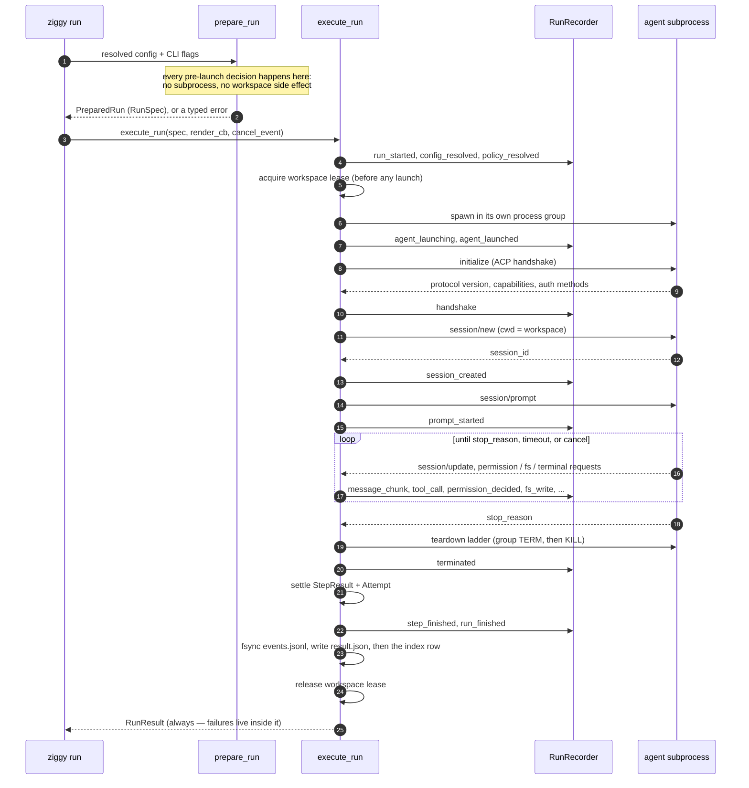

# Running a single agent

`ziggy run` is the command you reach for first and keep reaching for. It drives one
registered agent through one prompt, records everything that agent asked Ziggy to do,
and leaves behind a durable manifest you can read months later.

```bash
ziggy run <agent> "<prompt>"
```

Everything else in Ziggy — [workflows](workflows.md), [orchestration](orchestration.md) —
is built on the same per-step execution core described here. Learn this path and the
rest is composition.

!!! info "What mediation means here"
    Ziggy mediates the ACP surface an agent routes *through* it: permission requests,
    `fs/read_text_file`, `fs/write_text_file`, and `terminal/*`. The agent subprocess is a
    normal OS process — nothing stops it from opening files, spawning shells, or making
    network calls with its own built-in tools. Mediation is **observable governance and
    advisory enforcement**, not containment. See [Trust and policy](../reference/trust-and-policy.md).

## Your first run

You need Ziggy installed, a pinned adapter installed, and a workspace to work in. See
[Getting started](../getting-started.md) if you have not done that yet, then confirm the
environment is sane:

```bash
ziggy doctor --all
```

Ziggy always acts on the directory you invoke it from — there is no `--workspace` flag.
`cd` into the repository you want the agent to work on, and run:

```bash
cd ~/code/my-project
ziggy run claude "summarize the uncommitted changes in this repo"
```

In an interactive terminal you get a live status line, streamed agent text, and one line
per lifecycle event, followed by a summary table. With `--plain` (or on a non-TTY, or with
`NO_COLOR` set) the same information is line-oriented and free of ANSI escapes:

```text
[run] 01JAV4K2Q7X8Z9MNBVCXZ1234 started: agent claude (capture=standard)
[policy] guarded (enforcement: advisory)
[agent] launching: npx
[agent] launched (pid 51234)
[agent] claude-code 1.2.3 (protocol v1)
[agent] session sess_01hq...
[agent] prompt sent
[permission] Run git status --porcelain: denied (rule terminal-default-deny)
[tool] Read src/api/handlers.py (read): completed
Three files are modified: src/api/handlers.py, tests/test_api.py, README.md ...
[agent] terminated (exit 0, turn_complete)
[step] main: success (14820 ms)
[run] finished: success
--- run summary ---
status: success
duration: 15042 ms
files changed: 0
permissions denied: 1
result: /Users/you/.ziggy/runs/01JAV4K2Q7X8Z9MNBVCXZ1234/result.json
```

That denial is normal, not a misconfiguration: the guarded policy denies terminal execution
by default, and the agent worked around it. It is also a useful reminder of the boundary —
the denial only proves Ziggy refused the *mediated* request, not that no shell ran.

That `result:` path is the point of the whole exercise. The run is now auditable — see
[Reading the result](#reading-the-result) and [Runs and audit](runs-and-audit.md).

For a scratch run that writes nothing at all, add `--no-save`:

```bash
ziggy run claude "what protocol version do you speak?" --no-save
```

## Anatomy of a run

A direct run is one implicit step, named `main`, wrapped in run-level bookkeeping. The
sequence below is the whole thing.



Two properties are worth internalizing before the details:

- **Every pre-launch decision happens in prepare.** If a run is going to be refused for
  configuration, trust, or resource reasons, it is refused before any subprocess exists and
  before anything is written. The only side effect of a successful prepare is opening the
  metadata log (which prunes expired log files) — and for `--no-save` runs, not even that.
- **`execute_run` always returns a full `RunResult`.** Run-level failures are typed errors
  *inside* the result, not raised exceptions. The CLI maps the result to an exit code.

### 1. Prepare

`prepare_run` turns resolved configuration plus your CLI flags into an executable
`RunSpec`. In order:

| Decision | What happens | Failure |
| --- | --- | --- |
| Agent resolution | The name must exist in the registry built from trusted user config (builtins plus `[agents.*]`) | `ConfigError`, exit 2 |
| Prompt ceiling | The prompt's UTF-8 byte size must not exceed `engine.max_prompt_bytes` (default `262144`) | `ResourceLimitError`, exit 1 |
| Capture profile | `--capture` wins over `results.capture` when given | — |
| Child environment | Composed explicitly (see below); a named-but-unset `api_key_env` is fatal | `ConfigError`, exit 2 |
| Redaction seeding | Exact values of `api_key_env` and `redaction.extra_value_env_vars` present in the parent environment, plus configured custom patterns | — |
| Timeout clamp | `min(--timeout, engine.default_step_timeout_seconds)`; the default ceiling is `1800` seconds | — |
| Mediation policy | The guarded policy for the run, with `step_dir == workspace` (a direct run is one implicit step working in the workspace), the profile named by `permissions.default_policy`, plus project-scope deny-only additions | — |
| Metadata logger | A real logger, or a null logger when the run is unsaved (`--no-save` or `results.persist = false`) | — |
| Egress acknowledgement | Records *how* the agent provider's egress was acknowledged: `flag:--acknowledge-egress` beats `config` | — |

!!! note "Egress is recorded for a direct run, never gated"
    A single-agent run has no cross-provider data flow, so the absence of an
    acknowledgement never blocks `ziggy run`. It only lands on the result's `EgressRecord`
    as `acknowledged_by`. The fail-closed egress *preflight* belongs to
    [workflows](workflows.md) and [orchestration](orchestration.md), where step outputs can
    cross provider boundaries.

### 2. The child environment

Ziggy never passes the parent environment through wholesale. The subprocess environment is
composed explicitly, later layers winning:

1. **Baseline** — `HOME`, `PATH`, `TERM`, `LANG`, each forwarded *only if present* in the
   parent environment.
2. **`inherit_env`** — names the agent's trusted-config entry lists; names absent from the
   parent are skipped silently.
3. **`env`** — literal key/value pairs from the agent's config.
4. **`api_key_env`** — the single credential variable, read from the parent environment.

```toml
# ~/.ziggy/config.toml — trusted user scope
[agents.my-agent]
command = "my-acp-adapter"
args = ["--stdio"]
provider = "acme"
inherit_env = ["SSL_CERT_FILE", "NO_PROXY"]
env = { MY_ADAPTER_LOG = "warn" }
api_key_env = "ACME_API_KEY"
```

!!! warning "A missing credential fails before launch"
    If `api_key_env` names a variable that is unset or empty, prepare raises
    `ConfigError` — `Agent 'my-agent' requires env var ACME_API_KEY (not set).` — and exits
    **2** with no subprocess spawned. This is deliberate: a half-configured agent should
    never reach a provider.

    The honest limit: forwarding `HOME` also forwards whatever adapter-managed login state
    lives under it (that is how the `claude` and `codex` builtins authenticate by default,
    with no `api_key_env` at all). Ziggy controls the variable list, not what the agent
    reads through `HOME`.

Full field reference: [Configuration](../reference/configuration.md#how-the-child-environment-is-composed).

### 3. The workspace lease

Before **any** agent launches, `execute_run` acquires a cross-process lease on the
canonical workspace path. One mutating Ziggy run per workspace, across processes. Direct
runs are not assumed read-only just because the prompt sounds harmless.

If the lease is held, or its owner's liveness cannot be proven, the run fails with
`WorkspaceBusyError` and **nothing is launched**:

```text
error [WorkspaceBusyError]: workspace /Users/you/code/my-project is busy
(held by run 01JAV...): lease held by a live process
```

The lease file lives under the run store root, not in your repository, so project content
cannot forge or disable it. One consequence worth knowing: `--no-save` runs have no store,
so they take **no lease** — that is the price of the "unsaved runs touch nothing"
guarantee.

### 4. Launch, handshake, session, prompt

Ziggy spawns the subprocess itself with `start_new_session=True`, so the agent is the
leader of its own process group, and hands the pipes to the ACP connection. The recorded
`pid` and `pgid` are equal and stay valid for teardown even after the process dies.

Then, in order:

1. **`initialize`** — Ziggy advertises its client capabilities (filesystem read/write,
   terminal). A protocol version mismatch is fatal: Ziggy disconnects and the step fails
   with `ProtocolError`, as the ACP specification requires.
2. **`session/new`** — created with `cwd` set to the workspace.
3. **`session/prompt`** — your prompt text, sent as a single text block.
4. **Streaming** — every session update, permission request, filesystem operation, and
   terminal operation flows through one recorder: redact, apply the capture profile,
   enforce byte ceilings, assign a sequence number, append one line to `events.jsonl`,
   update in-memory aggregations, then fan out to your terminal. `events.jsonl` is the
   canonical record; what you see live and what lands on disk come from the same pipeline.

### 5. Terminate, settle, persist

When the turn resolves, Ziggy tears the subprocess down — **even on success**. The
shutdown is a ladder: wait for exit, then `SIGTERM` to the process *group*, wait up to five
seconds, then `SIGKILL` to the group and reap. A well-behaved agent exits at the first rung;
a wedged one still dies.

Settling fills the `StepResult`: the assembled transcript is re-redacted before becoming
`outputs.text` (a secret split across streaming chunks is invisible per chunk but contiguous
once concatenated), the handshake becomes `agent_info`, and the recorder's aggregations
become `tool_calls`, `file_changes`, and `permission_decisions`.

Persistence is ordered so the audit trail never lies: `events.jsonl` is flushed and
fsynced, `result.json` is written atomically, and only once that manifest is durable is the
SQLite index row inserted. The index is derived data — you can always rebuild it with
`ziggy runs reindex`.

### Stop reasons

The agent reports why its turn ended. Ziggy maps that to a step status with no optimism:

| `stop_reason` | Step status | Error attached |
| --- | --- | --- |
| `end_turn` | `success` | — |
| `cancelled` | `cancelled` | `CancelledError` |
| `refusal` **after a policy-denied permission** | `failed` | `PermissionDeniedError` |
| `refusal` (no denial recorded) | `failed` | `ProtocolError` |
| `max_tokens`, `max_turn_requests` | `failed` | `ProtocolError` |

`end_turn` is the *only* reason that makes a step succeed. The rest mean the agent stopped
without completing the requested work, and v0.1 has no retry or partial-completion
semantics to express that more precisely — failing honestly beats claiming success.

The `refusal`-after-denial case is the **guarded-denial path**: the agent abandoned the turn
because Ziggy refused an operation it needed, so you get a typed `PermissionDeniedError`
carrying the winning rule id rather than a bare protocol complaint. When you see it, the fix
is usually a policy profile, not a retry — see [Trust and policy](../reference/trust-and-policy.md).

`cancelled` maps to a cancelled step whether Ziggy requested the cancel or the agent
reported it unprompted.

## Choosing a capture profile

The capture profile decides how much of the agent's content reaches `events.jsonl` and the
manifest. It is set by `results.capture` (default `standard`) and overridden per invocation
with `--capture`.

| Profile | Content recorded | Cost | Use when |
| --- | --- | --- | --- |
| `metadata` | Content-bearing payloads are reduced to `{"bytes": n, "type": t}` — message chunks, thought chunks, tool-call `raw`/`rawInput`/`rawOutput`/`content`, `fs_read`/`fs_write` content, the tool call embedded in a permission request, and terminal commands. Identity fields (ids, kinds, titles, statuses, paths, decisions) survive | Smallest on disk; keeps proprietary code and prompt content off disk entirely | The work is sensitive and you need the audit trail, not the text |
| `standard` (default) | Everything except thought chunks, which are reduced to `{"bytes": n, "type": t}` | Balanced | Almost always |
| `debug` | Nothing is reduced. Thought chunks are kept in full and `protocol_payload_ref` values survive on envelopes | Largest; agent reasoning lands on disk verbatim | Diagnosing an agent that is behaving strangely |

Under `metadata`, the capture summary honestly reports `transcript`, `tool_calls`, and
`permissions` as `partial` with source `metadata_profile` — the record itself tells you it
is incomplete. Standard-profile thought reduction is that profile's documented contract, so
it alone does not degrade the transcript class.

!!! note "What `debug` does *not* give you in v0.1"
    The event vocabulary reserves a `raw_frame` event type for full JSON-RPC frames, and the
    recorder persists them only under `debug`. But no v0.1 execution path wires the
    raw-frame observer into the agent connection, so `ziggy run --capture debug` records **no
    `raw_frame` lines**. What `debug` actually buys you today is un-reduced thought chunks.

!!! warning "`file_changes` is always at best `derived`"
    Ziggy infers file changes from ACP tool calls (diff-typed content) and from mediated
    `fs/write_text_file` requests. It never performs a verified workspace diff. No capture
    profile changes this — the class is reported as `derived`, and degrades from there.
    An agent that writes a file with its own built-in tools, bypassing ACP, produces no
    `file_change` entry at all. Read `capture` in the manifest before you trust a file list.

    Similarly, redaction is a bounded streaming defense applied before anything is persisted
    or rendered. It is **defense in depth, not a proof** — do not treat a redacted transcript
    as a guarantee that no secret escaped.

Raising the profile above the configured value is direct user intent and always allowed;
the tighten-only merge rule binds *project-scope config*, not your command line. See
[Configuration](../reference/configuration.md#what-project-scope-may-and-may-not-do) and
[`--capture` in the CLI reference](../reference/cli.md#common-run-flags).

## Timeouts

`--timeout` sets the step deadline in seconds, and it can only ever **lower** the
configured ceiling:

```text
effective = min(--timeout, engine.default_step_timeout_seconds)   # default ceiling: 1800
```

Passing a value larger than the ceiling silently keeps the ceiling. To raise the ceiling
itself, change `engine.default_step_timeout_seconds` in trusted user config.

```bash
# fail fast on an exploratory question
ziggy run codex "explain the failing test in tests/unit/test_policy.py" --timeout 90
```

When the deadline expires, Ziggy walks the same teardown ladder cancellation uses, records
a `cancel_requested` event with reason `timeout`, and the step fails with `StepTimeoutError`.
The run is still persisted, capture is degraded to at least `partial` (the turn was
interrupted, so no artifact class may claim better), and the CLI exits **1**.

!!! note "What the deadline actually covers"
    The clock starts when the prompt is sent, so it bounds the *turn* — not process launch,
    the ACP handshake, or session creation. An adapter that hangs during `initialize` is not
    covered by `--timeout` in v0.1; `Ctrl-C` is your out, and `ziggy doctor --all` (which
    does apply a handshake timeout) is the way to catch a broken adapter before you rely on
    it.

## Cancellation

Press `Ctrl-C` and Ziggy sets the engine's cancel event, then runs a bounded teardown
ladder:

1. **Best-effort ACP `session/cancel`**, time-boxed to about **2 seconds**. An agent that
   stopped reading its stdin would otherwise block the send forever, so this rung can never
   starve the ones below it. Any failure or timeout here is ignored and the ladder continues.
2. **Wait `engine.cancel_grace_seconds`** (default `5.0`) for the turn to resolve on its own,
   still draining and recording events.
3. **`SIGTERM` to the process group**, unconditionally, with a bounded wait of up to
   5 seconds.
4. **`SIGKILL` to the process group**, then reap and close the streams.

Rungs 3 and 4 target the process *group*, not just the agent's own pid — that is what
actually guarantees the agent dies, along with any children it spawned. An agent that
ignores `session/cancel` and has forked helpers is still torn down group-wide.

The run then reaches terminal status `cancelled`, persists a durable manifest exactly like
any other run, and the CLI exits **130**. Cancelling is not data loss.

!!! danger "A second Ctrl-C skips teardown entirely"
    The second `SIGINT` calls `os._exit(130)` immediately. No teardown ladder, no manifest
    finalization, no lease release — the process is simply gone. Use it when you have decided
    the first Ctrl-C is not returning, and expect to clean up after it: the agent's process
    group may survive, the run directory may be left mid-write, and a stale lease may need to
    age out through liveness probing before the workspace is usable again.

    Worst case for a *clean* cancel is roughly `2s + cancel_grace_seconds + 5s` before
    `SIGKILL`. Give the first Ctrl-C that long before assuming it is stuck.

## Reading the result

### Human output

Without `--json`, progress and the summary table go to stdout. The summary reports status,
duration, the number of file changes recorded, the number of permission decisions denied,
and the manifest path (or `(not saved)`).

### `--json`

With `--json`, stdout carries **only** the final `RunResult` document, 2-space indented.
Every progress line, warning, and summary moves to stderr. That separation is the contract
that makes Ziggy scriptable:

```bash
ziggy run claude "review src/ziggy/policy for fail-open paths" --json > result.json
```

```bash
# terminal state and where the manifest landed
jq -r '[.status, .persisted, (.result_path // "null")] | @tsv' result.json

# the agent's assembled (redacted) text output
jq -r '.steps.main.outputs.text' result.json

# what the agent asked for, and how policy answered
jq -r '.steps.main.permission_decisions[]
       | [.decision, .rule_id, .enforcement_scope, .request_summary] | @tsv' result.json

# files Ziggy believes changed — and how it knows
jq -r '.steps.main.file_changes[]
       | [.change_type, .path, .capture_method, .capture_status] | @tsv' result.json

# how complete the record actually is, per artifact class
jq '.capture | map_values({status, source, truncated})' result.json

# why a run failed
jq -r '.errors[], .steps.main.errors[] | "\(.code): \(.message)"' result.json
```

Persisted runs live under `$ZIGGY_HOME` (default `~/.ziggy`) at
`runs/<run-id>/result.json` and `runs/<run-id>/events.jsonl`, written `0600` inside `0700`
directories. Field-by-field definitions are in [Schemas](../reference/schemas.md); browsing
and pruning are covered in [Runs and audit](runs-and-audit.md).

!!! warning "`persisted: false` is a real terminal state"
    A run can succeed and still fail to be recorded. If the manifest write fails at
    finalize, the in-memory result is still returned to you — with `persisted: false`,
    `result_path: null`, and a `PersistenceError` appended to `errors`. The work happened;
    the audit record did not. The CLI exits **1** in that case even though the agent's turn
    ended in `end_turn`.

    `--no-save` produces the same `persisted: false` / `result_path: null` shape
    deliberately, and with no `PersistenceError` in `errors`. Check `errors` to tell the two
    apart.

### Exit codes in practice

| Code | Meaning | Typical causes |
| --- | --- | --- |
| `0` | Success | The turn ended in `end_turn` and the run recorded cleanly |
| `1` | Execution or persistence failure | `AgentLaunchError`, `ProtocolError`, `StepTimeoutError`, `PermissionDeniedError`, `WorkspaceBusyError`, `PersistenceError`, prompt over `engine.max_prompt_bytes` (`ResourceLimitError`) |
| `2` | Usage, config, or trust refusal | Typer usage errors, unknown agent, invalid config, a named-but-unset `api_key_env`, `TrustPolicyError` |
| `130` | Cancellation | `Ctrl-C` (either the clean ladder or the hard second one) |

Two rules decide the code:

- **Cancellation always wins.** A cancelled run exits 130 regardless of what else went wrong.
- **Otherwise the first typed error in the result decides**, then the status. This is why a
  successful turn with a failed manifest write still exits 1.

!!! note "Prompt-too-large exits 1, not 2"
    It is easy to assume every pre-launch refusal is a usage error. `ResourceLimitError` is
    not: exceeding `engine.max_prompt_bytes` exits **1**, even though it is caught in prepare
    before anything launches. Unknown agents and missing credentials exit **2**.

## When things go wrong

Start with `ziggy doctor --all`. It checks config load, store permissions, index health,
command resolvability, credential presence, and per-agent handshakes, and prints a fix hint
for every failure. Most of the table below is something doctor would have told you first.

| Symptom | What it means | Fix |
| --- | --- | --- |
| `error [ConfigError]: unknown agent 'clade'; registered agents: claude, codex` | The name is not in the registry built from trusted user config | Check the spelling against `ziggy agents list`; register custom agents under `[agents.<name>]` in **user** config (project scope can never name a command) |
| `error [AgentLaunchError]: Failed to launch agent: command not found: 'npx'` | The launch command is not on `PATH` in the composed child environment — remember `PATH` is forwarded from the parent, not synthesized | Ensure `npx` (or your adapter's command) resolves in the shell that runs Ziggy |
| Launch fails even though `npx` exists | Builtins launch with `npx --no-install`, which **never downloads** the adapter at run time. Installs are deliberate in Ziggy | `npm install -g claude-agent-acp@0.63.0` or `npm install -g codex-acp@1.1.7` — the exact reviewed pins |
| `error [AgentLaunchError]: ... is not executable` | The command resolved but cannot be executed | Check file permissions and format; reinstall the adapter |
| `error [ConfigError]: Agent 'x' requires env var Y (not set).` | `api_key_env` names a variable that is unset or empty in the parent environment | `export Y=...` in the environment that runs Ziggy, or correct `api_key_env` in user config. Note the builtins use `api_key_env = None` and authenticate through adapter-managed login state under `HOME` |
| `error [WorkspaceBusyError]: workspace ... is busy (held by run ...)` | Another Ziggy run holds the single-mutator lease on this workspace, or the holder's liveness could not be proven | Wait for the other run, or find it with `ziggy runs list`. Ambiguous cases (unreadable lease, `EPERM` probe, a live pid whose start marker changed) deliberately stay busy rather than risk concurrent mutation |
| `error [ResourceLimitError]: prompt is N bytes; engine.max_prompt_bytes is 262144` | The prompt exceeded the byte ceiling — measured in UTF-8 bytes, not characters | Shorten the prompt, point the agent at a file instead of pasting it, or raise `engine.max_prompt_bytes` in user config |
| `error [TrustPolicyError]: ... not acknowledged; re-run with --acknowledge-egress a,b` | A **cross-provider** flow was refused before launch. This never happens for `ziggy run` — you are looking at a workflow or orchestration run | Re-run with the exact provider set named in the message (matching is set equality — subsets and supersets never match), or add it to `[egress] acknowledged_provider_sets`. See [Trust and policy](../reference/trust-and-policy.md#egress-and-acknowledgement) |
| `ProtocolError: agent protocol version mismatch` | The adapter speaks a protocol version Ziggy does not. Ziggy disconnects, as the spec requires | Install the pinned adapter version; check `ziggy doctor --all` |
| The step failed with `PermissionDeniedError` after a `refusal` | The guarded-denial path: the agent gave up because policy refused an operation it needed | Read the `rule_id` in the error details, then widen deliberately via a `[permissions.profiles.*]` entry in user config — see [Trust and policy](../reference/trust-and-policy.md#the-guarded-policy) |
| Run hangs before any `[agent] session ...` line | The adapter is not completing the ACP handshake. `--timeout` does not cover this window | `Ctrl-C`, then run `ziggy doctor --agent <name>`, which probes the handshake with its own timeout |
| `status: success` but `persisted: false` | The turn completed; the manifest write did not | Check `errors` for `PersistenceError`, then check ownership and permissions of the store root (`$ZIGGY_HOME`, default `~/.ziggy`) |
| Fewer `file_changes` than the agent claims it wrote | The agent used its own built-in tools instead of ACP filesystem requests, so Ziggy never saw the write | Expected, not a bug. `file_changes` is inferred, never a verified diff — read `capture.file_changes` in the manifest for the honest status |

## Related

- [CLI reference](../reference/cli.md#ziggy-run) — every flag, exactly
- [Configuration](../reference/configuration.md) — the knobs behind the defaults on this page
- [Trust and policy](../reference/trust-and-policy.md) — what mediation does and does not do
- [Schemas](../reference/schemas.md) — `RunResult` and `events.jsonl`, field by field
- [Runs and audit](runs-and-audit.md) — browsing, inspecting, and pruning what you recorded
- [Workflows](workflows.md) — many steps, deterministic order, declared data flow
- [Orchestration](orchestration.md) — plan-then-execute, and the gates it must pass
