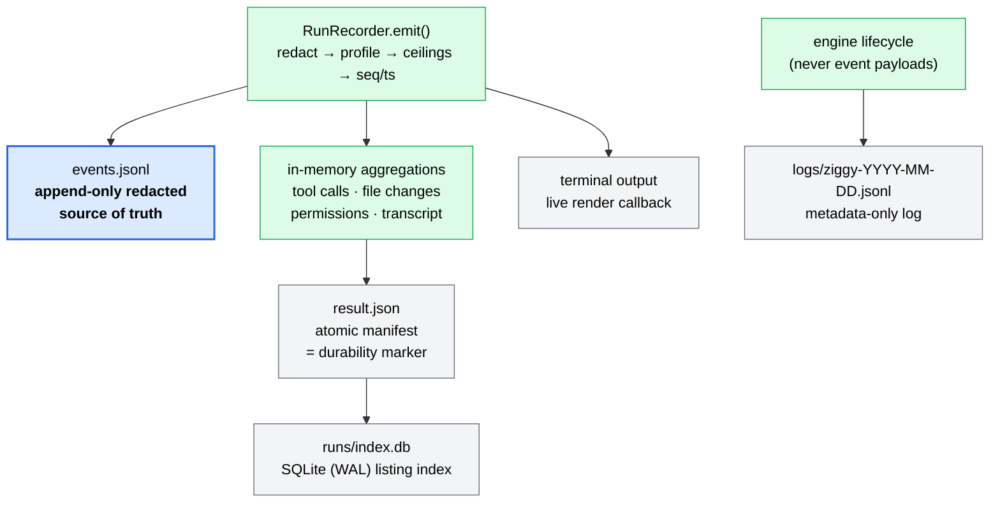

# Runs and Audit

Executing an agent is the easy half of Ziggy. The half that justifies the tool is what survives the run: a redacted, append-only record of everything the agent was observed doing, written to disk before any human or program is shown a summary of it.

This guide covers that record — where it lives, how to read it, what it deliberately does not contain, and how it is aged out.

## Why runs are recorded

Every Ziggy invocation funnels through a single recorder. `RunRecorder.emit()` is the one entry point for everything that happens during a run, and its order of operations is fixed:

1. redact the payload — before persistence, aggregation, or rendering sees it,
2. apply the capture profile (metadata-only reduction of content payloads),
3. enforce the byte ceilings,
4. stamp `seq` / `ts` / `monotonic_offset_ms` and build the envelope,
5. append one compact-JSON line to `events.jsonl`,
6. update the in-memory aggregations (tool calls, file changes, permission decisions, transcript),
7. fan out to the live render callback.

Step 5 comes before steps 6 and 7. That ordering is the whole design:

!!! abstract "`events.jsonl` is the source of truth"
    `events.jsonl` is the **append-only, redacted source of truth** for a run. `result.json`, the SQLite run index, the metadata logs, and whatever scrolled past in your terminal are all **derived views** — assembled from the same pass that wrote those lines, never from a second, independent observation.

    Nothing reaches a consumer that did not first pass through the line written to disk. If `result.json` and `events.jsonl` ever disagree, `events.jsonl` is the record.

### One pass, many views



The metadata log is the one artifact that is *not* derived from event payloads — it is written directly by the engine and is structurally incapable of carrying them. See [Metadata logs](#metadata-logs).

## What one run writes to disk

### The store root

Everything lives under the store root: `$ZIGGY_HOME` when set and non-empty, otherwise `~/.ziggy`. A trusted user config may relocate it with `results.store_path` (user scope only — a project cannot move your audit trail). Directories are created `0700`, files `0600`, and the mode is re-applied even to directories that already existed.

```text
~/.ziggy/                                  # store root — 0700
├── runs/
│   ├── index.db                           # derived SQLite index (WAL) — 0600
│   └── 01JZ8QK5S9T7YB3M4V6N2XPCDE/        # one directory per run, ULID-named — 0700
│       ├── .writer                        # O_EXCL single-writer sentinel (removed at finalize)
│       ├── events.jsonl                   # append-only event stream — 0600
│       ├── result.json                    # atomic manifest — the durability marker
│       ├── changes/                       # created on demand
│       └── artifacts/                     # created on demand
├── leases/
│   └── <sha256-of-canonical-workspace>.json
└── logs/
    └── ziggy-2026-07-29.jsonl             # daily-rotated metadata log — 0600
```

| Path | What it is |
| --- | --- |
| `runs/<ULID>/events.jsonl` | The canonical record. One `EventEnvelope` per line, appended, never rewritten. |
| `runs/<ULID>/result.json` | The `RunResult` manifest. Written once, atomically, at the end of the run. |
| `runs/<ULID>/.writer` | Single-writer sentinel: `{pid, run_id, started_at, process_start}`. Created `O_EXCL`, so a second writer for the same run directory fails immediately with a `PersistenceError`. Removed when the writer finalizes. |
| `runs/index.db` | Derived listing index. Rebuildable at any time; never authoritative. |
| `leases/<hash>.json` | One-mutator-per-workspace lease, keyed by `sha256` of the workspace realpath. |
| `logs/ziggy-<date>.jsonl` | Metadata-only lifecycle log, rotated by filename date. |

`changes/` and `artifacts/` are created lazily by the store API rather than up front. In v0.1 no code path writes into them, so you will not normally see them — the per-run artifact ceiling (`engine.max_artifact_bytes_per_run`, 50 MiB) is likewise carried through the engine as a passthrough that the recorder itself does not enforce.

Run ids are **ULIDs**: 26 characters of Crockford base32, lexicographically sortable by creation time. Sorting run directories by name sorts them by start time, which is why the store can iterate them in order without consulting any index. Persisted timestamps are UTC ISO-8601 with a `Z` suffix, but **durations always come from a monotonic clock**, never from subtracting wall-clock stamps.

### Atomic manifests

`result.json` is not written in place. `RunDirWriter.write_result()` goes through the store's atomic path:

1. create a uniquely-named temp file in the **same directory** (`O_EXCL`, mode `0600`),
2. write, flush, `fsync` the file,
3. `os.replace()` onto `result.json`,
4. `fsync` the directory.

On any failure the temp file is removed and a `PersistenceError` is raised. The target is therefore always either the previous complete content or the new complete content — never a partial file.

!!! info "The presence of `result.json` is the durability marker"
    A run directory **with** a durable manifest is finished and is never mutated again. A run directory **without** one is either in flight or a crash-recovery candidate. That single test — does the file exist — is what separates the two, and it is what `runs reindex` and `runs prune` both key off.

The index row is only inserted *after* the manifest write succeeds, so the index can never advertise a run whose manifest never landed.

## Finding runs — `ziggy runs list`

`runs list` reads the derived SQLite index, newest first.

```bash
ziggy runs list
```

```text
run-id                      kind      target   status   started-at                duration
--------------------------  --------  -------  -------  ------------------------  --------
01JZ8QK5S9T7YB3M4V6N2XPCDE  agent     claude   success  2026-07-29T14:02:11.418Z  38412 ms
01JZ8Q9WFA0R6C1D8H5K3TZVYM  workflow  review   partial  2026-07-29T13:47:55.002Z  91205 ms
```

Rows are ordered `started_at DESC, run_id DESC` and capped at **200** — that limit is fixed in the index API and is not exposed as a CLI flag. If the index file does not exist yet, the command prints `no runs recorded` rather than creating one.

| Filter | Behavior |
| --- | --- |
| `--failed` | Matches `failed`, `partial`, and `abandoned`. |
| `--kind` | Exact match on run kind: `agent`, `workflow`, or `orchestrator`. |
| `--agent` | Exact match on the run's `target` — the agent name for direct runs, the workflow name for workflow runs. |
| `--since` | ISO-8601 date or datetime, or a relative `<N>d`. Compared against `started_at`. |
| `--json` | Emits the index rows as JSON instead of a table. |

!!! warning "`--failed` excludes cancelled runs"
    `--failed` means "ended without completing all requested work". A run you stopped with Ctrl-C has status `cancelled`, which is *not* in that set — user-initiated cancellation is not a failure. Use `--json` and filter on `status` if you want cancellations too.

```bash
# Everything that went wrong on this machine in the last week
ziggy runs list --failed --since 7d

# Just this agent, since a specific instant
ziggy runs list --agent claude --since 2026-07-01T00:00:00Z

# Machine-readable rows
ziggy runs list --kind workflow --json
```

A naive `--since` datetime is interpreted as UTC. The `--json` form emits exactly the index columns — `run_id`, `kind`, `target`, `status`, `started_at`, `ended_at`, `duration_ms`, `workspace`, `result_path` — and nothing more; for anything else, follow the `result_path` or use `runs show`.

## Inspecting a run — `ziggy runs show`

```bash
ziggy runs show 01JZ8QK5S9T7YB3M4V6N2XPCDE
```

!!! note "`runs show` bypasses the index entirely"
    It reads `runs/<id>/result.json` directly. A missing, stale, or deleted index does not affect it — and conversely, a run that `runs list` cannot see is still fully inspectable if you know its id. The read fails loudly (exit 1) if the manifest is missing, unreadable, not a JSON object, or declares a `schema_version` this build does not support; an unsupported manifest is rejected whole, never partially interpreted.

### The human view

The detail view is deliberately ordered so the trust-relevant facts come before the narrative:

```text
run: 01JZ8QK5S9T7YB3M4V6N2XPCDE
kind: agent  target: claude  status: success
started: 2026-07-29T14:02:11.418Z  ended: 2026-07-29T14:02:49.830Z  duration: 38412 ms
workspace: /Users/ada/dev/repos/example
persisted: True  result: /Users/ada/.ziggy/runs/01JZ8QK5S9T7YB3M4V6N2XPCDE/result.json
config fingerprint: 9f2c1ab4e7d0…
policy: guarded (ceiling: default; enforcement: advisory; default scope: acp_mediated)
capture:
  file_changes: derived (3 events, 1284 bytes)
  permissions: complete (2 events, 918 bytes)
  tool_calls: complete (11 events, 20437 bytes)
  transcript: complete (46 events, 88210 bytes)
truncation: none
steps:
  main: success (agent claude, stop end_turn)
    files changed: 2
      modified src/app.py [acp_tool_call]
      created  tests/test_app.py [acp_fs_write]
    policy decisions: 2
      approved 'Edit src/app.py' rule=write-in-stepdir-allow scope=acp_mediated
      denied 'Read .env' rule=sensitive-path-deny scope=acp_mediated
errors:
  ...
```

Reading it top to bottom:

- **Identity and outcome** — run id, kind, target, status, timing, workspace.
- **`persisted` / `result`** — whether the manifest reached disk. See [Degraded and abandoned states](#degraded-and-abandoned-states).
- **Config fingerprint** — which resolved configuration produced this run ([Configuration](../reference/configuration.md)).
- **Policy line** — the effective mediation policy, its ceiling source, and the default enforcement scope ([Trust and policy](../reference/trust-and-policy.md)).
- **Capture block** — per-artifact-class completeness, event counts, byte counts, truncation marks. This is the honesty layer; read [Capture profiles](#capture-profiles) before trusting a `complete`.
- **Steps** — per step: status, agent, stop reason, file changes with the *method* each was captured by, and every policy decision with its rule id and enforcement scope.
- **Egress** — provider crossings and how each was acknowledged, when the run had any.
- **Errors** — typed run-level errors.

The view is tolerant of partial shapes: a store-recovered `abandoned` manifest has no `steps` or `capture` block and renders as `capture: (not recorded)` / `truncation: unknown` rather than failing.

### `--json` and jq

`--json` emits the **raw manifest** — the exact bytes on disk, parsed and re-indented, not a re-derived summary.

```bash
ziggy runs show 01JZ8QK5S9T7YB3M4V6N2XPCDE --json > run.json
```

```bash
# Which artifact classes are not fully captured?
ziggy runs show 01JZ8QK5S9T7YB3M4V6N2XPCDE --json \
  | jq -r '.capture | to_entries[] | select(.value.status != "complete")
           | "\(.key)\t\(.value.status)\t\(.value.source)\ttruncated=\(.value.truncated)"'

# Every file the run is believed to have touched, with its capture method
ziggy runs show 01JZ8QK5S9T7YB3M4V6N2XPCDE --json \
  | jq -r '.steps[].file_changes[] | "\(.change_type)\t\(.capture_method)\t\(.path)"'

# Every denied request across the run
ziggy runs show 01JZ8QK5S9T7YB3M4V6N2XPCDE --json \
  | jq -r '.steps[].permission_decisions[] | select(.decision == "denied")
           | "\(.rule_id)\t\(.enforcement_scope)\t\(.request_summary)"'

# Redaction counts (counts only — never the matched text)
ziggy runs show 01JZ8QK5S9T7YB3M4V6N2XPCDE --json | jq '.redaction'
```

The full field-by-field contract for `RunResult` lives in [Schemas](../reference/schemas.md), along with the shipped JSON Schema artifacts you can validate against without importing Ziggy.

### Reading `events.jsonl` directly

When the manifest is not enough — or when you want to see the ordering rather than the summary — read the source of truth:

```bash
RUN=~/.ziggy/runs/01JZ8QK5S9T7YB3M4V6N2XPCDE

# What kinds of events did this run produce, and how many of each?
jq -r '.event_type' "$RUN/events.jsonl" | sort | uniq -c | sort -rn

# The mediation trail in order
jq -c 'select(.event_type | test("^(permission_|fs_|terminal_op)"))
       | {seq, ts, event_type, payload}' "$RUN/events.jsonl"

# Any event whose capture was degraded
jq -c 'select(.capture_status != "complete") | {seq, event_type, capture_status}' "$RUN/events.jsonl"
```

Every line carries `seq`, `ts`, `monotonic_offset_ms`, `run_id`, optional `step_id` / `attempt_no` / `session_id`, `event_type`, `payload`, `capture_status`, and a `redaction` mark (`applied` plus per-kind `counts`). The event-type vocabulary is closed: the recorder rejects any type outside its fixed set, so typos cannot silently invent a new event name.

## Capture profiles

The profile decides how much *content* — as opposed to structure — is written down. It is set by `results.capture` (default `standard`) and can be overridden per invocation with `--capture`, which is treated as direct user intent and may exceed the configured profile.

`metadata` < `standard` < `debug`.

### What each profile keeps

=== "metadata"

    The most cautious profile. Content-bearing payload keys are replaced with `{"bytes": n, "type": t}` — the byte count describes the *redacted* content that would otherwise have been persisted, so it can be reported without leaking anything.

    Reduced at this profile: `message_chunk` and `thought_chunk` text/content, `tool_call` and `tool_call_update` raw input/output/content, `fs_read` and `fs_write` content, the `command` on `terminal_op`, and the embedded wire `tool_call` inside `permission_requested`.

    That nested `tool_call` is *recursed into* rather than collapsed whole: identity fields (`id`, `kind`, `title`, `status`) survive for auditability while only the content-bearing sub-keys are reduced.

    Consequence, reported honestly in the capture block: `transcript`, `tool_calls`, and `permissions` are all `partial` with source `metadata_profile`.

=== "standard (default)"

    Only `thought_chunk` content is reduced. Agent messages, tool-call payloads, mediated file content, terminal commands, and permission bodies are kept.

    Reducing reasoning text is this profile's documented contract, so it alone does **not** degrade the `transcript` class — a `standard` run with no truncation and no write failures can honestly report `transcript: complete`. Truncation still degrades it.

=== "debug"

    Nothing is reduced, and two things are added: `raw_frame` protocol events are persisted, and `protocol_payload_ref` is retained on envelopes.

    Outside `debug` both are suppressed structurally — `raw_frame` events are dropped before a sequence number is consumed, and `protocol_payload_ref` is cleared on every event.

    Use it to debug protocol behavior, not as a default. It writes the most content to disk and therefore has the largest exposure surface.

### What no profile can promise

!!! warning "`file_changes` is never a verified workspace diff"
    At **every** profile, the `file_changes` artifact class is at best `derived`. Ziggy infers changes from ACP tool calls (diff-typed content) and from mediated `fs/write_text_file` requests — it does not diff the workspace before and after. An agent subprocess is a normal OS process and can write files without routing through ACP at all; those writes are invisible here.

    Individual `FileChange` records carry the `capture_method` that produced them (`acp_tool_call`, `acp_fs_write`), so you can tell an inference from a mediated write. The class-level status stays `derived` regardless. This follows from the [trust boundary](../reference/trust-and-policy.md): ACP mediation is observable governance, not containment.

Three other things degrade capture status, and they compose — status only ever moves toward `unavailable`, never back:

- **Truncation** marks the affected class `truncated` and degrades it to `partial`.
- **An interrupted turn** — crash, timeout, or cancellation — degrades *every* class to at least `partial`, because the stream stopped mid-record rather than ending.
- **Events-write failures** degrade every class: `partial` if some events reached disk, `unavailable` if none did. Write failures never interrupt the run; they are collected as typed errors and surfaced in the manifest.

Usage figures get the same treatment. ACP reports a context gauge (`used` = tokens currently in context, `size` = window capacity, `cost` = cumulative session cost), not an input/output token breakdown, so `UsageSummary` is at best `derived` and its `units` field says `context_tokens`. It is never reported as `complete`.

## Truncation and byte ceilings

Two independent ceilings keep a runaway or hostile agent from filling the disk.

**Per step — `engine.max_event_bytes_per_step` (default 10 MiB).** The recorder tracks the serialized line size of every envelope written for a `step_id`. When the next line would cross the ceiling:

1. exactly one `truncation` event is emitted, carrying `limit_bytes` and `bytes_at_truncation`;
2. that event and every later event for the step is replaced with a metadata-only continuation payload — `{"truncated": true, "original_bytes": n}` — and marked `capture_status: partial`;
3. continuations are themselves capped at **20 lines**. After that, events for the step are no longer persisted at all: they are counted in memory, and the totals land on the step's `step_finished` event as `suppressed_events` and `suppressed_bytes`.

`step_finished` is always persisted, even past the continuation budget — the step's terminal record can never be the thing that gets dropped. (Suppressed bytes are an estimate: the exact line was never serialized, which is precisely the work being avoided.)

**Per event — `max_payload_bytes_per_event` (1 MiB).** A single payload larger than this is replaced with truncation metadata and marked `partial`.

!!! info "The per-event ceiling is measured *before* redaction"
    The raw payload is sized first, and an oversized frame is reduced to `{"truncated": true, "original_bytes": n}` **without ever being regex-scanned**. A hostile multi-megabyte payload therefore costs a size check, not a full redaction walk over its body. Nothing was scanned, so the event's redaction mark is empty — correctly reporting that no redaction was applied, because no content was persisted.

    This ceiling is a fixed engine constant in v0.1; only the per-step ceiling and the artifact ceiling are exposed in configuration.

In `runs show`, truncation surfaces twice: as `(truncated)` on the affected capture-class line, and as the summary `truncation:` line listing every affected class.

## Redaction and its limits

Before anything is persisted, aggregated, or rendered, the payload passes through the run's redactor. Three matcher classes are applied to the original text, and every matched span becomes a `[REDACTED:<kind>]` marker:

1. **Exact secret values** — the resolved value of an agent's `api_key_env`, every variable named in `redaction.extra_value_env_vars`, and resolved secret workflow variables. Literal substring matching, so regex metacharacters in a secret are harmless.
2. **Built-in token regexes** — `anthropic_api_key`, `openai_api_key`, `github_token`, `aws_access_key_id`, `aws_secret_access_key`, `slack_token`, `google_api_key`, `bearer_token`, `private_key`.
3. **User custom patterns** — `redaction.patterns` entries, each a `kind` / `regex` / optional `max_width`.

Overlapping candidates are merged into union intervals rather than one discarding the other, so adding a configured secret only ever *grows* coverage — a configured value that happens to be a substring of a longer wire credential can never suppress the built-in covering the rest. Each merged span is labelled by its most specific contributor, in that priority order. All matchers run against the raw text, never against already-marked text, so markers cannot be re-matched or corrupted.

**Streaming.** Live agent output is redacted chunk by chunk through a bounded carry window — the largest match width across all streaming-applicable matchers. Any still-incomplete secret prefix lies entirely inside the held window, so `feed()` never emits text that could be the start of a secret still being assembled, and a match that could still grow with the next chunk is never finalized early. A custom pattern without a `max_width` cannot be sized for this window, so it applies only to complete events, never on the streaming path.

**Re-redaction at settle time.** When a step settles, the *assembled* transcript is redacted again before it becomes `outputs['text']`. A secret split across stream chunks is invisible to any single chunk but contiguous — and matchable — once the chunks are concatenated. The per-step streaming redactors are also flushed before the step settles on every terminal path: success, crash, timeout, and cancel.

**What the summary reports.** `RedactionSummary` carries `total_redactions`, per-`kind` counts, and validation warnings. It never carries matched text. Neither does the per-event `redaction` mark, which is `applied` plus counts. A secret value shorter than 6 characters is still redacted but records a warning, because it can over-redact unrelated text.

!!! warning "Redaction is defense in depth, not a proof"
    Redaction is **not** a guarantee that secret or proprietary data cannot appear in captured output. It matches known credential shapes and values you have explicitly declared. It does not and cannot recognize an arbitrary secret, a novel token format, proprietary source code, or a credential the agent paraphrased.

    The stronger controls are **capture minimization** and **retention**: run at the `metadata` profile when content does not need to be on disk, keep `results.retention_days` short, and prune. Treat a run directory as containing whatever the agent said, not as a sanitized artifact.

One structural detail worth knowing when you write tooling against the record: `redact_payload` redacts string **values** recursively through nested dicts and lists — it does not touch dict **keys**. A secret used as a map key is not covered.

## The workspace lease

One mutating Ziggy run per canonical workspace, across processes.

The lease is a JSON file at `leases/<sha256 of the workspace realpath>.json` inside the store root — deliberately *outside* the repository, so project content cannot forge or disable it. Direct runs and workflow runs both acquire it **before any agent launch**, and release it in a `finally`; acquisition and release are recorded as `lease_acquired` / `lease_released` events. A run that cannot get the lease fails with `WorkspaceBusyError`, whose details name the holding `run_id`, the workspace, when it was acquired, and a `reason` of `held` or `ambiguous`.

An `O_EXCL` create is the **sole arbiter** of ownership. When a lease file already exists, Ziggy tries to prove the holder dead:

| Observation | Outcome |
| --- | --- |
| Recorded pid is alive, and its process-start marker matches the recorded one | **busy** (`held`) |
| Recorded pid is alive, but the start marker mismatches or is unavailable | **busy** (`ambiguous`) — could be a reused pid, cannot prove it |
| Liveness probe returns `EPERM` (a process exists, not ours to signal) | **busy** (`ambiguous`) |
| Lease file unreadable, corrupt, or vanished mid-check | **busy** (`ambiguous`) |
| Pid is `ESRCH`-dead **and** the recorded process group is also gone | recover: remove and retry the `O_EXCL` create |

Owner identity is the pair `(pid, process-start marker)`, where the marker is a stable hash of the process start time. Without it, a recycled pid would look like the original owner forever.

Recovery is race-safe rather than last-writer-wins: the stale file is re-read and unlinked *only while it is still byte-identical* to the content proven dead. If it changed underneath — another process already recovered it and installed a live lease — it is left alone and the loop re-reads the new holder. Recovery never returns a lease directly; the subsequent `O_EXCL` create decides, so exactly one contender can win. After 8 create/recover rounds against a churning file, Ziggy reports busy rather than looping.

!!! note "Ambiguity always resolves to busy"
    Every unprovable case is treated as busy. Refusing to start is cheap; two agents mutating one workspace is not.

    The honest limit: the lease is **cooperative among Ziggy processes**. It does not stop you — or anything else on the machine — from editing the same workspace by hand while a run is in flight.

## The run index and when to reindex

`runs/index.db` is a SQLite database in WAL mode with a 5-second busy timeout, `synchronous=NORMAL`, and `BEGIN IMMEDIATE` write transactions — safe for several Ziggy processes at once. It holds one table of run summaries (`run_id`, `kind`, `target`, `status`, `started_at`, `ended_at`, `duration_ms`, `workspace`, `result_path`) plus a `meta` table recording its schema version. Its file is `0600`, its parent `0700`.

It exists to make `runs list` fast. It is never the source of truth, and losing it loses nothing:

```bash
ziggy runs reindex
```

```text
finalized 1 interrupted run(s) as abandoned
indexed 47 run(s)
```

The command does two things, in order:

1. **`recover_abandoned`** — finalize provably-dead interrupted runs (see below).
2. **`reindex`** — rebuild the table from every durable manifest in the store. Manifests that are missing, unreadable, or of an unsupported schema are excluded entirely rather than partially interpreted.

The rebuild is concurrency-safe by construction. It never does a blind `DELETE FROM runs`. It snapshots the run ids present before the scan, upserts every manifest it finds, and — under the write lock — deletes only rows that were in that pre-scan snapshot *and* were not found on disk. A row another process inserted during the scan window is absent from the snapshot, so it is never a deletion candidate. Re-running changes nothing.

Reach for `runs reindex` when:

- `runs list` is empty or stale but run directories clearly exist;
- you deleted, moved, or restored `index.db`;
- you copied run directories in from another machine or a backup;
- a Ziggy process (or the machine) died mid-run and you want the interrupted run finalized and visible.

## Retention and pruning

!!! danger "`ziggy runs prune` is the only deletion mechanism"
    Nothing else in Ziggy removes a run directory. Runs do not expire on their own, no background job collects them, and `results.retention_days` by itself deletes nothing — it only supplies the default window that `prune` uses when you run it. (`results.auto_prune` is accepted by the config schema but no v0.1 code path acts on it.)

    Metadata logs are the one exception, and they are pruned by a different rule — see [Metadata logs](#metadata-logs).

```bash
ziggy runs prune --dry-run              # list candidates, delete nothing
ziggy runs prune --older-than 14        # list candidates, then refuse (exit 2)
ziggy runs prune --older-than 14 --yes  # actually delete
```

### Scope is the current workspace by default

!!! warning "The run store is global; the default prune scope is not"
    A single store root holds runs from **every** workspace you have ever used Ziggy in. An unscoped prune would delete audit evidence belonging to unrelated projects, so by default `runs prune` only considers runs whose manifest `workspace` resolves to the current working directory.

    Pass `--all-workspaces` to opt into cross-workspace pruning. The active scope is always printed before anything is listed:

    ```text
    scope: workspace /Users/ada/dev/repos/example
    ```
    ```text
    scope: all workspaces
    ```

    In scoped mode, a manifest with no attributable workspace is **never** pruned. Fail-safe: keep what cannot be proven to belong to this invocation.

### What counts as a candidate

A run directory is a candidate only when all of these hold:

- its name is a valid ULID;
- `lstat` says it is a **real directory** — symlinks are skipped, never followed, and never deleted;
- it has a durable `result.json` that reads cleanly at a supported schema version (in-flight and crashed runs are never candidates);
- its `ended_at` — or `started_at` when the manifest has no end — precedes the cutoff;
- in scoped mode, its manifest `workspace` realpath equals the current workspace realpath.

The cutoff is `now - days`, where `days` is `--older-than` when given and `results.retention_days` (default 30) otherwise. `results.retention_days` is user-scope-only and must be at least 1: deletion policy is not a ceiling a project may "tighten", because a shorter window destroys evidence sooner.

### `--yes` is required

!!! warning "Without `--yes`, prune lists and exits 2"
    Deletion is opt-in, and the refusal is headless-safe: there is no interactive prompt to hang a CI job. Without `--yes`, `runs prune` prints every candidate, writes the refusal to stderr, and exits **2**. `--dry-run` prints the same list and exits 0.

    Script accordingly — an exit code of 2 from `prune` means "nothing was deleted", not "something went wrong".

With `--yes`, each candidate directory is removed recursively and the corresponding index rows are dropped afterward. Per-run deletion failures are reported on stderr and the command exits 1; a failure to update the index is a warning, not a failure, since `runs reindex` repairs it.

## Degraded and abandoned states

Ziggy prefers an honest degraded record over a tidy fiction. Three states are worth recognizing.

### `persisted: false` with `result: (not saved)`

This is a **valid terminal state**, not a contradiction. The run may have succeeded completely while the manifest write failed — a full disk, a permissions change, a store root that vanished mid-run. When that happens the engine sets `persisted = false`, clears `result_path`, appends the `PersistenceError` to the run's typed errors, and still returns the complete in-memory `RunResult`. With `--json` you get the whole thing on stdout even though nothing reached disk.

The same shape appears deliberately when a run was executed with `--no-save` (or `results.persist = false`): nothing touches the filesystem, no run directory is created, and the metadata logger is a no-op — but sequencing, redaction, ceilings, and aggregation all behave identically. Store bootstrap failure is handled the same way: the run degrades to in-memory recording rather than aborting.

### `abandoned`

A run interrupted before a terminal result was persisted is finalized as `abandoned` by `runs reindex`. Recovery only touches a directory when the interruption is **provable**:

- the `.writer` sentinel is absent *and* the directory is older than a 5-second grace window (a directory younger than that may belong to a writer between `mkdir` and its `O_EXCL` sentinel), **or**
- the sentinel names a writer that is provably dead — a pid that no longer exists, or a live pid whose recorded start marker no longer matches, i.e. a reused pid.

Everything ambiguous — a live pid with a matching or unverifiable marker, a corrupt sentinel, a too-recent directory — is left untouched, and a directory with a durable manifest is never touched at all.

The synthesized manifest goes through the same atomic write path as a normal result. Its `kind`, `target`, and `workspace` are recovered best-effort from the first line of `events.jsonl`, falling back to `"unknown"`; `duration_ms` is `null`, `finalized_by` is `store_recovery`, and it carries one `AbandonedError` explaining that the run was interrupted before a terminal result was persisted. The index row is inserted only after that manifest is durable. Abandoned runs then show up in `ziggy runs list --failed`.

### Degraded capture on an otherwise successful run

A `success` status with `transcript: partial` is not a bug. Truncation, an interrupted turn, or events-write failures degrade the capture block independently of the run's outcome. Read the status and the capture block together: the first says whether the work completed, the second says how much of it Ziggy can prove.

## Metadata logs

Alongside the per-run record, Ziggy keeps a daily-rotated lifecycle log at `$ZIGGY_HOME/logs/ziggy-YYYY-MM-DD.jsonl` (files `0600`, directory `0700`). Rotation *is* the filename: opening the logger on a new UTC day opens a new file.

Each line is one JSON object:

```json
{"ts":"2026-07-29T14:02:11.418Z","level":"info","event":"run_started","run_id":"01JZ8Q…","agent":"claude","detail":{"kind":"agent","target":"claude"}}
```

`ts`, `level`, and `event` are always present; `run_id`, `step_id`, `agent`, and `detail` appear only when supplied. Levels are `debug`, `info`, `warning`, `error`.

!!! success "Metadata-only is enforced structurally, not by convention"
    The `detail` object accepts **only** these keys:

    `status` · `duration_ms` · `exit_code` · `stop_reason` · `rule_id` · `decision` · `kind` · `target` · `count` · `path_ref` · `reason_code` · `provider_set` · `route`

    Anything else raises `ValueError` at the call site. There is no "be careful what you log" rule to forget: a prompt, a response, a tool payload, a diff, a permission body, a secret name, or a workspace path simply cannot be passed to the logger, because there is no allowlisted key to carry it. `path_ref` values are run-directory references, never workspace paths.

    The same validation runs under `--no-save`, where the logger is a null implementation that writes nothing — misuse fails loudly even when logging is disabled.

**Retention.** On every logger open, files whose **filename date** is older than `logs.retention_days` (default 30) are deleted whole. The judgment is made purely from the name: files that do not match the `ziggy-YYYY-MM-DD.jsonl` pattern, or that carry an impossible date, are never touched, and symlinks are unlinked rather than followed. This is independent of `results.retention_days`, which governs run directories.

## See also

- [CLI reference](../reference/cli.md) — every `runs` flag, exit codes, and the rest of the command surface.
- [Schemas](../reference/schemas.md) — the field-level `RunResult` and `EventEnvelope` contracts, plus the shipped JSON Schemas.
- [Configuration](../reference/configuration.md) — `results`, `engine`, `redaction`, and `logs` settings, and which scopes may set them.
- [Trust and policy](../reference/trust-and-policy.md) — what ACP mediation does and does not observe, and why `enforcement_scope` is on every decision.
- [Running agents](running-agents.md) — producing the runs this guide reads.
- [Workflows](workflows.md) — multi-step runs, their step records, and secret variable handling.
