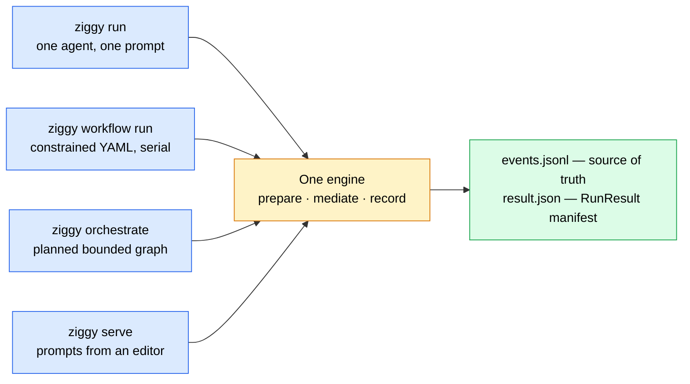

# Ziggy

Local execution, orchestration, and audit harness for AI coding agents that speak the
[Agent Client Protocol (ACP)](https://agentclientprotocol.com).

Ziggy puts one headless command surface in front of Claude, Codex, OpenCode, Devin, and
trusted custom agents, and records what each of them was observed doing. Every invocation — a one-shot
run, a multi-step workflow, a planned graph, or a prompt arriving from an editor — funnels
through the same engine and leaves behind the same schema-versioned `RunResult` and
append-only `events.jsonl`.

!!! danger "An audit and trust-boundary layer — not an OS sandbox"
    Ziggy **mediates** exactly the ACP client-bound surface an agent chooses to route
    through it: `session/request_permission`, `fs/read_text_file`, `fs/write_text_file`,
    and `terminal/*`. That mediation is **observable governance, not containment**.

    An agent subprocess is a normal OS process. Nothing in Ziggy prevents it from opening
    files, spawning shells, or making network calls **directly**, outside the protocol and
    outside every rule Ziggy enforces. In v0.1 every built-in agent is **assumed** to have
    exactly those direct tools — live capability probes are deferred — so `ziggy doctor`
    reports their mediation as `advisory`.

    Treat a Ziggy policy decision as *evidence about what was asked and answered*, never as
    proof of what the agent could do. Read [Trust and policy](reference/trust-and-policy.md)
    before you rely on any of it.

## What it does

| Surface | What you get |
| --- | --- |
| [`ziggy run`](guides/running-agents.md) | One registered agent, one prompt, one durable manifest. The execution core everything else composes |
| [`ziggy workflow run`](guides/workflows.md) | A checked-in YAML graph of **agent-only** steps, run strictly serially in a deterministic order. A workflow decides what to ask agents; it never decides what authority they get |
| [`ziggy orchestrate`](guides/orchestration.md) | A planning agent turns a goal into a bounded plan that can only name things a trusted catalog offered — then it runs on the workflow machinery |
| [`ziggy serve`](guides/acp-server.md) | Ziggy itself as an ACP agent over stdio, for editors like [Zed](https://zed.dev). Permission requests can surface as dialogs in the client |
| [`ziggy runs`](guides/runs-and-audit.md) | Browse, inspect, reindex, and prune what was recorded — redacted, replayable, attributable |



Four ways in, one recorded run. A served run shows up in `ziggy runs list` next to a run
you typed by hand, in the same shape.

## Is this for you?

**A good fit if** you want every agent invocation recorded, replayable, and attributable —
which agent, under which resolved config, asked for what, and how policy answered. Ziggy's
two-scope trust model keeps that record meaningful: trusted **user** config
(`~/.ziggy/config.toml`) decides which commands run, which credentials are named by
env-var, and every ceiling and policy; an untrusted **project** directory
(`./.ziggy/config.toml`, workflow YAML) may *tighten* those, and can never register a
command, inherit environment, name a credential, raise a ceiling, or weaken a policy.
Overreach fails closed with path-precise errors. See
[the two-scope trust model](reference/trust-and-policy.md#the-two-scope-trust-model).

**Not a fit if** you need hard OS-level containment. Ziggy does not provide it and does not
claim to. If an agent must be prevented — not merely observed and recorded — run it under a
separately verified sandbox, and use Ziggy for the audit trail on top.

## Quick start

Requires Python 3.12+ (`>=3.12,<3.15`), macOS or Linux, and Node.js for the pinned adapters.

```bash
# v0.1.0 is NOT tagged yet and Ziggy is not on PyPI — install from the repository.
uv tool install git+https://github.com/sequenzia/ziggy@main
```

Ziggy **never auto-downloads** an agent adapter — the `claude` and `codex` builtins launch
with `npx --no-install`. Install the exact reviewed pins yourself:

```bash
npm install -g @agentclientprotocol/claude-agent-acp@0.64.0 @agentclientprotocol/codex-acp@1.1.7
```

The `opencode` and `devin` builtins speak ACP from their own CLI, so they have no adapter
to pin. Install either one only if you use it:

```bash
npm install -g opencode-ai@1.18.9
brew install --cask devin-cli   # Linux: curl -fsSL https://cli.devin.ai/install.sh | bash
```

Verify the install, the store, and each agent's handshake:

```bash
ziggy doctor                    # claude + codex
ziggy doctor --agent opencode   # add a vendor CLI you installed
```

Then run something. Ziggy always acts on the directory you invoke it from — there is no
`--workspace` flag:

```bash
cd ~/code/my-project
ziggy run claude "summarize the uncommitted changes in this repo"
```

The run summary ends with a `result:` path. That manifest is the point of the exercise —
add `--json` to get it on stdout instead, with every progress line moved to stderr.

Full walkthrough: [Getting started](getting-started.md).

## Documentation map

### Guides

| Page | What you will find |
| --- | --- |
| [Running a single agent](guides/running-agents.md) | The whole `ziggy run` path: prepare, child environment, workspace lease, handshake, teardown, capture profiles, timeouts, cancellation, exit codes, and a troubleshooting table |
| [Workflows](guides/workflows.md) | The schema-v1 YAML contract, what a workflow deliberately *cannot* express, the two-token template grammar, untrusted-output wrapping, cross-provider egress, and failure propagation |
| [Goal-driven orchestration](guides/orchestration.md) | The bounded catalog, the reduced-exposure planning profile, the one repair turn, the three plan types, the uncontained-planner gate, and what a plan can never contain |
| [Running Ziggy as an ACP agent](guides/acp-server.md) | `ziggy serve`: the direction inversion, route selection, the permission bridge (policy first, client second), concurrency, stop reasons, and ACP method support |
| [Runs and audit](guides/runs-and-audit.md) | What one run writes to disk, reading `events.jsonl` and `result.json`, capture honesty, redaction limits, the workspace lease, reindexing, and pruning |

### Reference

| Page | What you will find |
| --- | --- |
| [CLI reference](reference/cli.md) | Every command and flag, the common run flags, exit codes, environment variables, and output modes |
| [Configuration](reference/configuration.md) | Every TOML section, file and env precedence, provenance, registering agents, and exactly what project scope may and may not do |
| [Trust and policy](reference/trust-and-policy.md) | The mediated surface, `enforcement_scope`, the guarded policy and its rule order, sensitive paths, egress acknowledgement, and credential redaction |
| [Schemas](reference/schemas.md) | Field-by-field `RunResult` and `EventEnvelope` contracts, the shipped `result.v1` / `events.v1` JSON Schemas, the error taxonomy, and how to validate a run without importing Ziggy |

### Internals

| Page | What you will find |
| --- | --- |
| [Architecture](design/ARCHITECTURE.md) | Module layout, import rules, and per-module contracts |
| [Phase contracts](design/phase2-contracts.md) | Per-phase implementation contracts ([2](design/phase2-contracts.md), [3](design/phase3-contracts.md), [4/5](design/phase45-contracts.md)) |
| [Trust boundary](phase0/trust-boundary.md) | The normative source for the vocabulary on this site — what Ziggy mediates versus what a subprocess does directly |
| [Capability matrix](phase0/capability-matrix.md) | Per-built-in capability rows, with every unverified row marked as such |
| [SDK pin decision](phase0/sdk-pin-decision.md) · [SDK API reference](phase0/sdk-api-reference.md) | Why the ACP SDK is pinned exactly, and the API surface Ziggy builds on |
| [Process lifecycle](phase0/process-lifecycle.md) | Cancellation and descendant cleanup for agent subprocesses |
| [Gate record](GATES.md) | Every checkpoint gate with its decision, evidence, and adversarial-review disposition |
| [Release checklist](RELEASE-CHECKLIST.md) | The live and human items that must be done before v0.1.0 is tagged |

The full product and technical specification lives outside this site, in the repository:
[`specs/ziggy-mvp-SPEC.md`](https://github.com/sequenzia/ziggy/blob/main/specs/ziggy-mvp-SPEC.md).

## Project status

All feature phases (0–5) are implemented: **1181 tests passing**, ruff clean, on
macOS/Python 3.12.

**v0.1.0 is not yet tagged or released.** Four things were deferred by explicit decision
because they need real accounts, a real editor, and human labelers, and they are tracked on
the [release checklist](RELEASE-CHECKLIST.md):

- live built-in contract runs against the reviewed adapter pins,
- the Zed interoperability smoke test (which is also why no verified Zed settings block is
  documented yet),
- clean-machine onboarding timing,
- the human-labeled orchestrator-quality trial.

Everything else is verified against raw-wire and SDK-backed mock agents. Where these pages
and the code disagree, the code wins.
