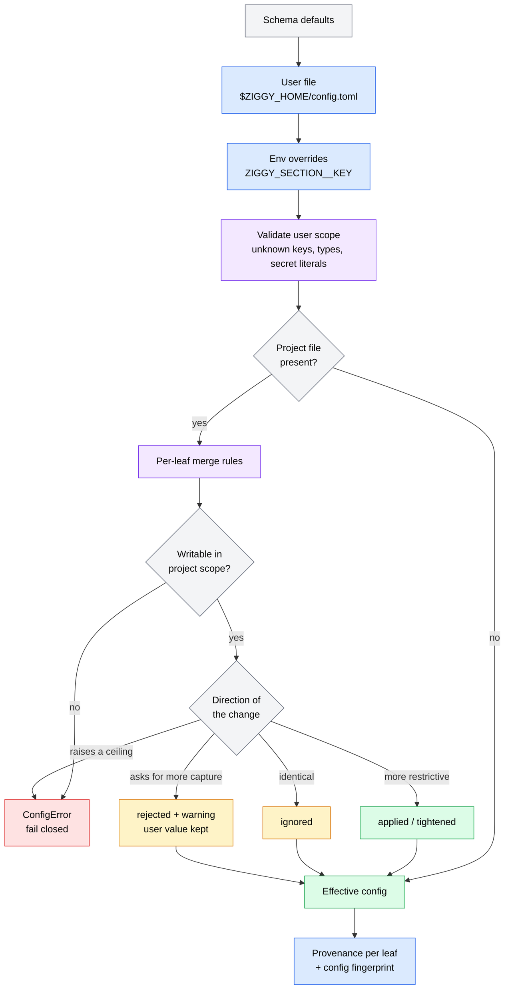

# Configuration

Ziggy reads configuration from **two TOML files**, and the difference between
them is the whole point: one is written by you, the other may be written by
whatever repository you happen to have cloned.

| Scope | File | Trust | Authority |
|-------|------|-------|-----------|
| **user** | `$ZIGGY_HOME/config.toml` (default `~/.ziggy/config.toml`) | trusted | everything: which commands run, which credentials are named, every ceiling and policy |
| **project** | `<workspace>/.ziggy/config.toml` | untrusted | may only *restrict*: tighten six engine ceilings, reduce capture, add deny rules, name a default workflow |

Both files are optional. With neither present, the schema defaults below apply.

A project config is repository content — it arrives with `git clone` and
changes with `git pull`. Ziggy therefore treats it as adversarial input: it is
parsed, validated, and merged under a **monotonic** rule set where a project
can only make a run more restrictive than the user already allowed, never less.
Anything outside that narrow allowance is a hard error, collected across the
whole file and raised before a single project value is applied.

!!! warning "Fail closed by default"
    The merge rule for any field **not explicitly listed** as project-writable
    is `USER_ONLY` — rejected in project scope. New config keys are therefore
    safe by construction: adding a field to the schema does not accidentally
    hand it to untrusted repositories.

Configuration governs Ziggy's *own* process — which subprocess it launches,
with what environment, and how it answers mediated ACP requests. It is not a
sandbox: an agent subprocess is a normal OS process and can act outside ACP
mediation entirely. See [Trust and Policy](trust-and-policy.md).

## Files, environment, and precedence

Every config file must declare its schema version at the root:

```toml
schema_version = 1
```

`schema_version = 1` is required in **both** files (a project file without it
fails with `schema_version = 1 is required`), and `1` is the only accepted
value. Every table in the tree forbids unknown keys — a typo anywhere is a
load-time error naming the exact path.

Resolution order, per leaf field:

1. **Schema defaults**
2. **User file** — `$ZIGGY_HOME/config.toml`, or `~/.ziggy/config.toml` when
   `ZIGGY_HOME` is unset
3. **Environment overrides** — `ZIGGY_<SECTION>__<KEY>`, applied over the user
   file and carrying **user authority**
4. **Project file** — `<workspace>/.ziggy/config.toml`, merged per-leaf under
   the rules in [What project scope may and may not do](#what-project-scope-may-and-may-not-do)



### Environment overrides

An environment variable named `ZIGGY_<SECTION>__<KEY>` (uppercase, **double**
underscore between section and key) overrides one leaf of the user scope:

```bash
ZIGGY_ENGINE__MAX_PROMPT_BYTES=1024 ziggy run claude "small prompt only"
```

Rules, all enforced at load time:

- Only scalar leaves — strings, integers, floats, booleans, and enum values.
  Lists and tables are rejected: `ZIGGY_REDACTION__EXTRA_VALUE_ENV_VARS` fails
  with `list/table values cannot be set via environment overrides`, and
  `ZIGGY_AGENTS__CLAUDE` fails because `[agents]` is a table.
- Booleans accept `1/true/yes/on` and `0/false/no/off`; anything else is an error.
- An unknown section (`ZIGGY_BOGUS__KEY`) or key (`ZIGGY_ENGINE__NOPE`) is an
  error, not a silent no-op.
- `ZIGGY_HOME` contains no `__` and is never parsed as an override; it selects
  the Ziggy home directory (user config, run store, logs, user workflows).
- `schema_version` cannot be set from the environment.

Error messages for overrides name the variable but **never echo its value** —
the value may be secret-shaped.

## `[engine]`

Resource ceilings for a single run. These six are also the only fields a
project may tighten.

| Key | Type | Default | Project scope |
|-----|------|---------|---------------|
| `max_workflow_steps` | int | `16` | tighten only |
| `max_prompt_bytes` | int | `262144` (256 KiB) | tighten only |
| `default_step_timeout_seconds` | int | `1800` | tighten only |
| `default_workflow_timeout_seconds` | int | `3600` | tighten only |
| `cancel_grace_seconds` | float | `5.0` | **user only** |
| `max_event_bytes_per_step` | int | `10485760` (10 MiB) | tighten only |
| `max_artifact_bytes_per_run` | int | `52428800` (50 MiB) | tighten only |

- `max_workflow_steps` is checked before a workflow runs; an over-long
  workflow fails with `ResourceLimitError` naming the step count.
- `max_prompt_bytes` bounds the UTF-8 byte length of the prompt, checked before
  any subprocess starts. The orchestrator applies the same ceiling to a goal.
- `default_step_timeout_seconds` is a ceiling, not just a default: `ziggy run
  --timeout` is applied as `min(flag, ceiling)`, so the flag can only lower it.
- `cancel_grace_seconds` is the teardown grace period in the cancellation
  ladder. It is deliberately **not** a tightenable ceiling — shrinking it would
  cut short the clean-shutdown window rather than restrict the agent.
- `max_event_bytes_per_step` bounds serialized event bytes written per step;
  `max_artifact_bytes_per_run` is the per-run artifact budget.

## `[agents.<name>]`

Agent registration. **User scope only, every field.** The table key is the
agent name and must match `^[a-zA-Z][a-zA-Z0-9_-]{0,63}$`.

| Key | Type | Default | Notes |
|-----|------|---------|-------|
| `command` | string \| null | `null` | required for custom agents; only the four builtin names may omit it |
| `args` | list of strings | `[]` | argv after `command` |
| `env` | table of string → string | `{}` | literal, non-secret environment entries |
| `inherit_env` | list of strings | `[]` | names copied from the parent environment when present |
| `working_dir` | string \| null | `null` | child working directory |
| `api_key_env` | string \| null | `null` | env var **name**, validated `^[A-Z][A-Z0-9_]*$` — never a value |
| `provider` | string \| null | `null` | egress identity (`anthropic`, `openai`, …); unset falls back to `custom:<agent-name>` |
| `orchestration_eligible` | bool | `false` | may a model-generated plan invoke this agent |

Two omissions are deliberate and, because unknown keys are forbidden, writing
them is a load error:

- `[agents.<name>]` has no `acknowledged_egress` — egress acknowledgement lives
  in [`[egress]`](#egress).
- `[permissions.profiles.<name>]` has no `allow_read_outside_workspace` — the
  guarded policy's read scope is fixed in v0.1 and user scope may not widen it.

See [Registering agents](#registering-agents) for builtin overrides and
[Credentials and the child environment](#credentials-and-the-child-environment)
for how these fields become a subprocess environment.

## `[permissions]`

How Ziggy answers mediated ACP filesystem and terminal requests.

| Key | Type | Default | Project scope |
|-----|------|---------|---------------|
| `default_policy` | string | `"guarded"` | **user only** |
| `profiles.<name>.terminal_allowlist` | list of `{command, args_prefix}` | `[]` | **user only** |
| `profiles.<name>.deny_paths` | list of glob strings | `[]` | **user only** |
| `project_denials` | list of `{kind, pattern}` | `[]` | **project only** |

- `guarded` is the only builtin policy name in v0.1. Setting `default_policy`
  to anything else requires a matching `[permissions.profiles.<name>]` table,
  otherwise the load fails with `permissions.default_policy: unknown policy
  profile '<name>'`. Workflow steps may also name a profile per step — see the
  [workflows guide](../guides/workflows.md).
- `terminal_allowlist` entries are an exact `argv[0]` plus an argument prefix
  (`args_prefix` defaults to `[]`, matching any arguments). Terminal requests
  that match nothing on the allowlist are denied by default.
- `deny_paths` are extra workspace-relative deny globs layered on top of the
  builtin sensitive set (`**/.env`, `**/.env.*`, `**/*_key`, `**/*.pem`,
  `**/id_rsa*`, `**/.aws/**`, `**/.ssh/**`, `**/.ziggy/config.toml`). Extras can
  only widen the deny set.
- `project_denials` is the inverse: it may **only** appear in project scope.
  Each entry is `kind = "path"` (a workspace-relative deny glob) or
  `kind = "terminal"` (an exact `argv[0]`, denying every invocation of it).
  Denials are evaluated before allow rules, so a project can veto something the
  user allowed but can never re-allow anything.

Writing `project_denials` in the user file is rejected:

```text
user config ~/.ziggy/config.toml: permissions.project_denials is allowed only in project scope (<workspace>/.ziggy/config.toml)
```

## `[results]`

Persistence of run records.

| Key | Type | Default | Project scope |
|-----|------|---------|---------------|
| `persist` | bool | `true` | **user only** |
| `capture` | `metadata` \| `standard` \| `debug` | `"standard"` | tighten only (see below) |
| `retention_days` | int (≥ 1) | `30` | **user only, both directions** |
| `auto_prune` | bool | `false` | **user only** |
| `store_path` | string \| null | `null` | **user only** |

- `store_path` defaults to the Ziggy home directory (`$ZIGGY_HOME`, else
  `~/.ziggy`), with runs under `runs/` and metadata logs under `logs/`.
- `capture` selects how much of a run is recorded. `ziggy run --capture` is
  direct user intent and *may* exceed the configured profile; a project config
  may not.
- `auto_prune` is declared in the schema, but v0.1 never deletes on its own:
  `ziggy runs prune --yes` is the only deletion path, and it uses
  `retention_days` as its default age when `--older-than` is not given.
- `retention_days` must be at least `1`; `0` or negative would make every
  completed run immediately eligible for deletion.

!!! info "Why `retention_days` is user-only in *both* directions"
    Every other numeric limit is a ceiling a project may lower. Retention is
    not a ceiling — it is a **deletion window**. A project that "tightened"
    it to `1` would not restrict the agent at all; it would destroy audit
    evidence sooner, quietly discarding history the user meant to keep. So a
    project config may neither raise nor lower it: both are rejected with
    `results.retention_days: forbidden in project scope (user-scope only)`.

## `[server]`

| Key | Type | Default | Project scope |
|-----|------|---------|---------------|
| `max_active_runs` | int | `1` | **user only** |

Concurrency ceiling for `ziggy serve` (Ziggy exposed as an ACP agent on stdio).

## `[orchestrator]`

Goal-to-plan execution. Every field is **user only** — a repository must never
be able to nominate the planner, widen the agent pool, or grant the
uncontained-planner acknowledgement.

| Key | Type | Default | Notes |
|-----|------|---------|-------|
| `agent` | string \| null | `null` | the planning agent; must be a registered agent name |
| `max_inline_steps` | int | `8` | ceiling on steps in a generated inline plan |
| `auto_execute` | bool | `true` | `false` behaves like a permanent `--plan-only` |
| `allow_uncontained_planner` | bool | `false` | explicit acknowledgement, see below |
| `eligible_agents` | list of strings | `[]` | agents a generated plan may invoke |
| `trusted_workflows` | list of `{path, sha256}` | `[]` | workflows a plan may select, pinned by content hash |

- Every built-in agent is assumed to run direct (non-ACP) local tools, so
  mediation for them is **advisory**. Planning with such an agent requires
  `allow_uncontained_planner = true` in trusted user config; without it,
  orchestration refuses to start and `ziggy doctor` reports the planner as
  requiring the acknowledgement.
- `eligible_agents` names must be registered *and* carry
  `orchestration_eligible = true` on their own `[agents.<name>]` entry;
  otherwise orchestration fails with a message naming the missing condition.
- `trusted_workflows` entries pair a path with its `sha256`. A file whose
  content no longer matches its pin is dropped from the plan catalog rather
  than silently executed.

See the [orchestration guide](../guides/orchestration.md).

## `[redaction]`

| Key | Type | Default | Project scope |
|-----|------|---------|---------------|
| `extra_value_env_vars` | list of env var names | `[]` | **user only** |
| `patterns` | list of `{kind, regex, max_width}` | `[]` | **user only** |

`extra_value_env_vars` lists environment variable **names** whose values are
matched exactly and redacted from captured output, in addition to the built-in
token patterns (Anthropic, OpenAI, GitHub, AWS, Slack, Google, bearer tokens).
`patterns` adds custom regexes; an invalid regex or a `max_width` below `1`
fails the load with `redaction.patterns: invalid custom pattern: …`.

!!! warning "Redaction is defense in depth, not a proof"
    The redactor bounds what reaches persisted output. It cannot guarantee that
    no secret ever appears in a transcript — do not rely on it as the only
    control over what an agent is shown.

## `[logs]`

| Key | Type | Default | Project scope |
|-----|------|---------|---------------|
| `retention_days` | int | `30` | **user only** |

Metadata-only structured logs are written as daily JSONL files under
`<store>/logs/`. Whole files past the retention window are pruned by filename
date when the logger opens.

## `[workflows]`

| Key | Type | Default | Project scope |
|-----|------|---------|---------------|
| `default_name` | string \| null | `null` | **project may set** |
| `secret_variable_allowances` | table of name → list of providers | `{}` | **user only** |

`default_name` is the one non-restrictive thing a project may say: which
workflow this repository runs by default. It selects among workflows Ziggy
already trusts; it grants no new authority.

`secret_variable_allowances` maps a secret workflow variable name to the
provider identities allowed to receive its value through prompt interpolation.
Unlisted pairs are denied, and a step with no resolvable provider identity
fails closed:

```toml
[workflows.secret_variable_allowances]
DEPLOY_TOKEN = ["anthropic"]
```

## `[egress]`

| Key | Type | Default | Project scope |
|-----|------|---------|---------------|
| `acknowledged_provider_sets` | list of lists of provider names | `[]` | **user only** |

When one provider's output flows into a step served by a different provider,
Ziggy requires an acknowledgement. Matching is **exact set equality** — order
and duplicates are irrelevant, and subsets or supersets never match:

```toml
[egress]
acknowledged_provider_sets = [["anthropic", "openai"]]
```

A per-invocation `--acknowledge-egress anthropic,openai` wins when both match.
Acknowledgement records intent; it does not un-send data.

## What project scope may and may not do

This is the security-relevant part of the page. Each **leaf field path** has
exactly one merge rule.

| Rule | Applies to | Effect of a project value |
|------|-----------|---------------------------|
| `USER_ONLY` | **everything not listed below** | rejected: `<path>: forbidden in project scope (user-scope only)` |
| `TIGHTEN_MIN` | the six `[engine]` ceilings | lower → applied (`tightened`); equal → `ignored`; higher → `ConfigError` |
| `TIGHTEN_CAPTURE` | `results.capture` | lower rank → `tightened`; equal → `ignored`; higher → `rejected` + warning, **not** an error |
| `PROJECT_DENIALS` | `permissions.project_denials` | applied — deny-only additions |
| `PROJECT_OK` | `workflows.default_name` | applied |

The exact `TIGHTEN_MIN` set — no other field is in it:

- `engine.max_workflow_steps`
- `engine.max_prompt_bytes`
- `engine.default_step_timeout_seconds`
- `engine.default_workflow_timeout_seconds`
- `engine.max_event_bytes_per_step`
- `engine.max_artifact_bytes_per_run`

Capture ranks compare as `metadata` (0) < `standard` (1) < `debug` (2), so
"tightening" capture means moving *down* that scale.

!!! danger "Unlisted means rejected"
    `merge_rule_for()` returns `USER_ONLY` for any path it does not recognize.
    `results.retention_days`, `engine.cancel_grace_seconds`,
    `server.max_active_runs`, `results.persist`, every `[agents.*]` field, every
    `[orchestrator]` field, `[egress]`, `[redaction]`, `[logs]`, and
    `workflows.secret_variable_allowances` are all rejected in project scope.

Violations are **collected, not short-circuited**. Unknown keys and forbidden
keys are gathered across the entire project file and raised together *before
any project value is applied*; ceiling violations are likewise collected and
raised as one error. You fix the whole file in one pass, and a rejected file
never reaches a run.

Three error shapes, quoted exactly:

```text
<path>: forbidden in project scope (user-scope only)
<path>: unknown configuration key
<path>: project value <v> may not raise the user-scope ceiling <eff>
```

Each is prefixed with `project config <path-to-file>: ` and surfaces as
`error [ConfigError]: …` with exit code `2`.

### Worked examples

All four assume this user config:

```toml
schema_version = 1

[engine]
max_prompt_bytes = 4096
default_step_timeout_seconds = 900
```

=== "Tightened"

    A project that wants shorter steps than the user allows:

    ```toml title=".ziggy/config.toml"
    schema_version = 1

    [engine]
    default_step_timeout_seconds = 300
    ```

    `300 < 900`, so the value is applied:

    ```text
    engine.default_step_timeout_seconds      300    project  tightened
    ```

=== "Ignored"

    A project that restates the value already in force:

    ```toml title=".ziggy/config.toml"
    schema_version = 1

    [engine]
    max_prompt_bytes = 4096
    ```

    Equal values change nothing, but the attempt is recorded — the source stays
    `user` and the action is `ignored`:

    ```text
    engine.max_prompt_bytes                  4096   user     ignored
    ```

    The fingerprint still changes, because the project *asked*.

=== "Rejected (capture)"

    A project asking for more capture than the user configured:

    ```toml title=".ziggy/config.toml"
    schema_version = 1

    [results]
    capture = "debug"
    ```

    The user's `standard` is kept, a warning goes to stderr, and the run
    proceeds:

    ```text
    warning: project config ~/code/app/.ziggy/config.toml: results.capture=debug rejected by user-scope ceiling (standard)
    results.capture                          "standard"   default  rejected
    ```

=== "Hard error"

    A project trying to raise a ceiling:

    ```toml title=".ziggy/config.toml"
    schema_version = 1

    [engine]
    max_prompt_bytes = 999999
    ```

    ```text
    error [ConfigError]: project config ~/code/app/.ziggy/config.toml: engine.max_prompt_bytes: project value 999999 may not raise the user-scope ceiling 4096
    ```

    Nothing runs. The same shape appears for forbidden and unknown keys, with
    every violation in the file listed in one message:

    ```text
    error [ConfigError]: project config ~/code/app/.ziggy/config.toml: agents.evil.command: forbidden in project scope (user-scope only); server.max_active_runs: forbidden in project scope (user-scope only)
    ```

!!! note "The one soft case"
    A project asking for **more** capture is the only violation that is not
    fatal. It is recorded as `project_action = rejected` with a warning so
    `ziggy config show` can display the refusal, while the user's value stays
    in force. Every other over-reach — including asking for a *higher* ceiling —
    stops the run.

An empty table in project scope (`[server]` with no keys under it) contributes
no leaves and is a harmless no-op.

## Credentials and the child environment

Ziggy never stores credential values. Config refers to a credential by
**environment variable name only**:

```toml
[agents.helper]
command = "/opt/bin/helper-acp"
api_key_env = "HELPER_API_KEY"     # a NAME, never a value
```

- `api_key_env` is validated against `^[A-Z][A-Z0-9_]*$`. A malformed value
  fails the load with `agents.<name>.api_key_env: must be an environment
  variable NAME matching ^[A-Z][A-Z0-9_]*$ (value not shown)` — the offending
  value is not echoed.
- The value is read from the parent environment at launch time. If the named
  variable is missing or empty, the run fails with `Agent '<name>' requires env
  var <VAR> (not set).` **before any subprocess starts**.
- A literal secret in *either* config file is rejected at load time. The
  built-in token patterns scan both files and all environment overrides; the
  error names the path and the pattern kind but never reproduces the value:

    ```text
    error [ConfigError]: literal secret values are not allowed in config (reference env var names instead): user config ~/.ziggy/config.toml: agents.claude.env.TOKEN: value matches secret pattern(s) [anthropic_api_key]
    ```

### How the child environment is composed

The parent environment is **never passed through wholesale**. Each agent's
environment is built in layers, later layers winning:

1. **Baseline**, forwarded only if present in the parent: `HOME`, `PATH`,
   `TERM`, `LANG`. `HOME` also carries adapter-managed login state.
2. **`inherit_env`** names, copied from the parent when present; names absent
   from the parent are skipped silently.
3. **`env`** literals from config.
4. **The `api_key_env` value**, read from the parent.

The credential value is additionally registered with the redactor for exact-value
matching, so it is stripped from captured output.

## Registering agents

Four agents ship built in — no `[agents.*]` entry is needed to use any of them:

| Name | Command | Provider | `api_key_env` | `orchestration_eligible` |
|------|---------|----------|---------------|--------------------------|
| `claude` | `npx --no-install @agentclientprotocol/claude-agent-acp@0.64.0` | `anthropic` | `null` (adapter-managed login) | `false` |
| `codex` | `npx --no-install @agentclientprotocol/codex-acp@1.1.7` | `openai` | `null` (ChatGPT login state) | `false` |
| `opencode` | `opencode acp` | `custom:opencode` | `null` (`opencode auth login` state) | `false` |
| `devin` | `devin acp` | `custom:devin` | `null` (Devin Cloud browser login) | `false` |

`claude` and `codex` launch a reviewed, exactly pinned npm adapter, and
`--no-install` is load-bearing: if the pinned package is not installed, the
launch fails. Ziggy never downloads anything during a run. The install line for
a given agent comes from `ziggy doctor`, which prints it as a fix hint.

`opencode` and `devin` speak ACP from the vendor CLI itself, so there is no
adapter package to pin. Ziggy resolves the binary on `PATH` and runs whatever is
there — nothing is downloaded, but **the launch command carries no version**.
The version you actually ran is the one the agent reports at handshake, recorded
in the RunResult. Install them only if you use them:

```bash
npm install -g opencode-ai@1.18.9   # or the install script / Homebrew
brew install --cask devin-cli       # Linux: curl -fsSL https://cli.devin.ai/install.sh | bash
```

Their `provider` deliberately names no vendor: OpenCode routes to whichever
model provider you configured, and the Devin CLI's routing is not verified here,
so labelling either `anthropic`/`openai` would misstate egress. Each declares the
distinct identity `custom:<name>` instead — the same string an unlabelled agent
would fall back to, declared explicitly because it is what you acknowledge and
what persisted manifests carry. A workflow that pipes `claude` output into `opencode` therefore crosses
providers and needs
`--acknowledge-egress anthropic,custom:opencode` (or a matching
`[egress] acknowledged_provider_sets` entry). Set `provider` yourself if you
know better for your setup — it is an overridable field.

All four builtins carry `direct_tools_assumed = true` — the conservative default
while live capability probes remain deferred. It is not overridable from
config, and it is why mediation for these agents is reported as advisory.

**Overriding a builtin.** Only the fields you explicitly set are replaced;
everything else keeps its pinned default. `name`, `builtin`, and
`direct_tools_assumed` are never overridable, and an explicit `command = null`
does not unset a builtin command.

```toml
[agents.claude]
api_key_env = "ANTHROPIC_API_KEY"   # command/args stay at the reviewed pin
orchestration_eligible = true
```

**Custom agents.** `command` is required — only the builtin names may omit it.
A custom agent missing a command fails with:

```text
agents.<name>: 'command' is required for custom agents (only builtins [claude, codex, devin, opencode] may omit it)
```

Custom agents are always registered with `direct_tools_assumed = true`; they
are never probed.

Registration is user scope in its entirety. A project config naming
`agents.<anything>.command`, `.args`, `.env`, `.inherit_env`, `.api_key_env`,
`.working_dir`, or `.orchestration_eligible` is rejected before anything runs.

Run `ziggy agents list` to see the resolved registry — see the
[CLI reference](cli.md).

## Provenance and `ziggy config show`

Every effective leaf carries provenance:

- **`source`** — `default`, `user`, `env`, or `project`
- **`project_action`** — `none`, `applied`, `tightened`, `ignored`, or `rejected`

`source` becomes `project` only when a project value was actually *applied* or
*tightened*. An `ignored` or `rejected` leaf keeps the source it already had —
the user's value is what is in force — while the action records that the
project asked.

```bash
ziggy config show
```

```text
warning: project config ~/code/app/.ziggy/config.toml: results.capture=debug rejected by user-scope ceiling (standard)
field                                    value                                         source   project-action
---------------------------------------  --------------------------------------------  -------  --------------
agents                                   {}                                            default  none
egress.acknowledged_provider_sets        []                                            default  none
engine.cancel_grace_seconds              5.0                                           default  none
engine.default_step_timeout_seconds      300                                           project  tightened
engine.default_workflow_timeout_seconds  3600                                          default  none
engine.max_artifact_bytes_per_run        52428800                                      default  none
engine.max_event_bytes_per_step          10485760                                      default  none
engine.max_prompt_bytes                  4096                                          user     none
engine.max_workflow_steps                16                                            default  none
logs.retention_days                      30                                            default  none
orchestrator.agent                       null                                          default  none
orchestrator.allow_uncontained_planner   false                                         default  none
orchestrator.auto_execute                true                                          default  none
orchestrator.eligible_agents             []                                            default  none
orchestrator.max_inline_steps            8                                             default  none
orchestrator.trusted_workflows           []                                            default  none
permissions.default_policy               "guarded"                                     default  none
permissions.profiles                     {}                                            default  none
permissions.project_denials              [{"kind": "path", "pattern": "**/infra/**"}]  project  applied
redaction.extra_value_env_vars           []                                            default  none
redaction.patterns                       []                                            default  none
results.auto_prune                       false                                         default  none
results.capture                          "standard"                                    default  rejected
results.persist                          true                                          default  none
results.retention_days                   30                                            default  none
results.store_path                       null                                          default  none
schema_version                           1                                             user     none
server.max_active_runs                   1                                             default  none
workflows.default_name                   "review"                                      project  applied
workflows.secret_variable_allowances     {}                                            default  none
fingerprint: 3d394375f474cdffb5d0f27299f83ff1d426e218a83afcf59bd10ac31770f832
```

`ziggy config show --json` emits the same rows as
`{fingerprint, warnings, fields[]}`, where each field is
`{path, value, source, project_action}`.

`ziggy config validate` prints `ok` and exits `0`, or prints a path-precise
`error [ConfigError]: …` and exits `2`.

### The config fingerprint

The fingerprint is a sha256 over the canonical JSON of the effective config
**plus** its provenance. It is embedded in every `RunResult` as
`config_fingerprint` and emitted as a run event, so an archived result records
exactly which configuration produced it.

Because provenance is part of the input, a project value that was `ignored` or
`rejected` still changes the fingerprint — "this repository asked for debug
capture and was refused" is itself auditable. See [Schemas](schemas.md).

## Complete annotated examples

=== "User config"

    ```toml title="~/.ziggy/config.toml"
    schema_version = 1

    # ---------------------------------------------------------------- engine
    [engine]
    max_workflow_steps = 12               # default 16
    max_prompt_bytes = 131072             # 128 KiB; default 262144
    default_step_timeout_seconds = 900    # default 1800
    default_workflow_timeout_seconds = 3600
    cancel_grace_seconds = 5.0            # teardown grace; not tightenable
    max_event_bytes_per_step = 10485760   # 10 MiB
    max_artifact_bytes_per_run = 52428800 # 50 MiB

    # ---------------------------------------------------------------- agents
    # Builtin override: only the fields set here replace the reviewed pin.
    [agents.claude]
    api_key_env = "ANTHROPIC_API_KEY"     # env var NAME; value never stored
    orchestration_eligible = true

    [agents.codex]
    orchestration_eligible = true

    # Custom agent: 'command' is mandatory.
    [agents.reviewer]
    command = "/opt/acp/reviewer"
    args = ["--acp"]
    inherit_env = ["SSL_CERT_FILE"]       # copied from the parent if present
    env = { REVIEWER_MODE = "strict" }    # literal, non-secret
    api_key_env = "REVIEWER_API_KEY"
    provider = "custom"
    working_dir = "/opt/acp"

    # ----------------------------------------------------------- permissions
    [permissions]
    default_policy = "guarded"            # the only builtin policy in v0.1

    [permissions.profiles.guarded]
    deny_paths = ["**/infra/secrets/**"]  # extra denials on top of the builtins

    [[permissions.profiles.guarded.terminal_allowlist]]
    command = "git"                       # exact argv[0]
    args_prefix = ["status"]              # must prefix the request's args

    [[permissions.profiles.guarded.terminal_allowlist]]
    command = "pytest"                    # empty prefix: any arguments

    # --------------------------------------------------------------- results
    [results]
    persist = true
    capture = "standard"                  # metadata | standard | debug
    retention_days = 30                   # deletion window; >= 1
    auto_prune = false                    # v0.1 deletes only via 'runs prune'
    store_path = "~/.ziggy"               # null => $ZIGGY_HOME or ~/.ziggy

    [server]
    max_active_runs = 1                   # concurrency ceiling for 'ziggy serve'

    # ---------------------------------------------------------- orchestrator
    [orchestrator]
    agent = "claude"
    max_inline_steps = 8
    auto_execute = true                   # false behaves like --plan-only
    allow_uncontained_planner = true      # required for direct-tool planners
    eligible_agents = ["claude", "codex"] # each needs orchestration_eligible

    [[orchestrator.trusted_workflows]]
    path = "workflows/review.yaml"
    sha256 = "3f786850e387550fdab836ed7e6dc881de23001b3f7d1e8fbb0ba1cd1cbe5c1c"

    # ------------------------------------------------------------- redaction
    [redaction]
    extra_value_env_vars = ["INTERNAL_TOKEN"]  # NAMES; values redacted on match

    [[redaction.patterns]]
    kind = "internal_ticket"
    regex = "TCK-[0-9]{6}"
    max_width = 10

    [logs]
    retention_days = 30                   # whole JSONL files pruned by date

    # ------------------------------------------------------------- workflows
    [workflows.secret_variable_allowances]
    DEPLOY_TOKEN = ["anthropic"]          # unlisted variable/provider pairs deny

    [egress]
    acknowledged_provider_sets = [["anthropic", "openai"]]  # exact set equality
    ```

=== "Project config"

    ```toml title="<workspace>/.ziggy/config.toml"
    # Checked into the repository. Untrusted: this file may only RESTRICT.
    schema_version = 1

    # Tighten engine ceilings. Each value must be <= the user-scope effective
    # value; equal is ignored, higher is a hard error.
    [engine]
    max_workflow_steps = 6
    default_step_timeout_seconds = 300
    max_artifact_bytes_per_run = 10485760

    # Reduce capture only. metadata < standard < debug — asking for a higher
    # profile is recorded as 'rejected' with a warning, and the user's value
    # stays in force.
    [results]
    capture = "metadata"

    # Deny-only additions. This key is valid ONLY in project scope.
    [[permissions.project_denials]]
    kind = "path"
    pattern = "**/infra/**"               # workspace-relative deny glob

    [[permissions.project_denials]]
    kind = "terminal"
    pattern = "terraform"                 # exact argv[0]; denies every invocation

    # The one non-restrictive allowance: name this repo's default workflow.
    [workflows]
    default_name = "review"

    # Anything else is rejected before the run starts, for example:
    #   [agents.evil]  command = "/bin/sh"    -> forbidden in project scope
    #   [server]       max_active_runs = 8    -> forbidden in project scope
    #   [results]      retention_days = 1     -> forbidden in project scope
    #   [orchestrator] allow_uncontained_planner = true -> forbidden
    #   [engine]       max_prompt_bytes = 999999 -> may not raise the ceiling
    ```

## Related

- [CLI reference](cli.md) — `config show`, `config validate`, `doctor`, and the
  per-invocation flags that interact with these settings
- [Trust and policy](trust-and-policy.md) — what mediation does and does not do
- [Schemas](schemas.md) — where `config_fingerprint` lands in a `RunResult`
- [Workflows](../guides/workflows.md) — per-step policy profiles and secret variables
- [Orchestration](../guides/orchestration.md) — planner eligibility and trusted workflows
- [Getting started](../getting-started.md) — first run and `ziggy doctor`
