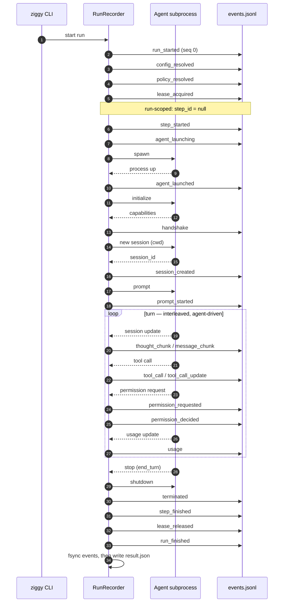
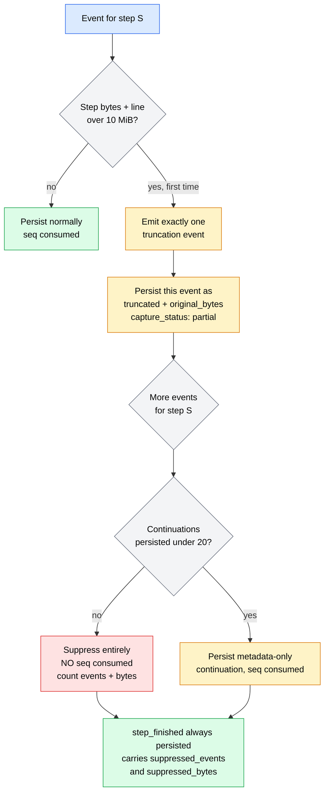

# RunResult & Event Stream Schemas

Every Ziggy invocation produces **two durable audit documents**, both schema-versioned so external tooling can validate a run's evidence *without importing Ziggy*:

| Document | Format | Model | Shipped schema |
|----------|--------|-------|----------------|
| `result.json` | single JSON object | [`RunResult`](#runresult) | `result.v1.json` |
| `events.jsonl` | one JSON object per line | [`EventEnvelope`](#eventenvelope) | `events.v1.json` |

!!! abstract "`events.jsonl` is the source of truth"
    `events.jsonl` is the **append-only, redacted source of truth** for a run. Every other artifact — `result.json`, the SQLite run index, the structured logs, the live terminal rendering — is a **derived view** assembled from the same in-memory pass that writes those lines.

    That ordering is deliberate. `RunRecorder.emit()` is the single entry point for everything that happens during a run: it redacts, applies the capture profile, enforces byte ceilings, stamps `seq`/`ts`/`monotonic_offset_ms`, appends the line, *then* updates the aggregations that become `StepResult`/`RunResult`, *then* fans out to the renderer. Nothing reaches a consumer that did not first pass through the line that was written to disk.

    Practically: if `result.json` and `events.jsonl` ever disagree, `events.jsonl` is the record. If a run was executed with `--no-save`, neither is written — sequencing, redaction, ceilings, and aggregation still behave identically, but nothing touches the filesystem.

## Where the documents live

Runs are written under the store root — `$ZIGGY_HOME` when set, otherwise `~/.ziggy`:

```text
~/.ziggy/
└── runs/
    ├── index.db                              # derived SQLite index (rebuildable)
    └── 01JQ8ZK7YB4W1N0P2R5T9VXC3D/           # run id (ULID)
        ├── result.json                       # RunResult manifest (atomic write)
        ├── events.jsonl                      # append-only event stream
        ├── changes/                          # patch refs, when captured
        └── artifacts/                        # artifact refs, when captured
```

The manifest is written atomically and *last*; the index row is inserted only once the manifest is durable. A missing `index.db` is never a data-loss event — `ziggy runs reindex` rebuilds it from the manifests. See [Runs and Audit](../guides/runs-and-audit.md).

---

## RunResult

`result.json` holds exactly one `RunResult` object. The model forbids unknown properties (`additionalProperties: false`), and pydantic serializes **every** field — so all keys below are physically present in a written manifest, with `null` for absent optional values, even though only `run_id`, `kind`, `target`, `status`, `started_at`, `workspace`, and `steps` appear in the JSON Schema's `required` list.

### Top-level fields

| Field | Type | Default | Notes |
|-------|------|---------|-------|
| `schema_version` | `int` | `1` | Document schema version. See [Schema versioning](#schema-versioning). |
| `run_id` | `str` | — | ULID, 26 chars, Crockford base32. Lexically sortable by creation time. |
| `kind` | `"agent"` \| `"workflow"` \| `"orchestrator"` | — | Which entry point produced the run. |
| `target` | `str` | — | Agent name, workflow name, or planner agent name, per `kind`. |
| `status` | `"success"` \| `"failed"` \| `"partial"` \| `"cancelled"` \| `"abandoned"` | — | Terminal run status. |
| `started_at` | `str` | — | UTC ISO-8601, `Z`-suffixed. |
| `ended_at` | `str \| null` | `null` | Absent only while the run is incomplete. |
| `duration_ms` | `int \| null` | `null` | Wall-clock duration from the run's monotonic clock. |
| `workspace` | `str` | — | Absolute workspace path the run executed against. |
| `capture_profile` | `"metadata"` \| `"standard"` \| `"debug"` | `"standard"` | See [Capture profiles](#capture-profiles). |
| `persisted` | `bool` | `true` | `false` when the manifest write failed or `--no-save` was used. |
| `config_fingerprint` | `str \| null` | `null` | Absent only if config validation failed before resolution. |
| `policy` | [`PolicyProvenance`](#policyprovenance) `\| null` | `null` | Absent only if trust/policy resolution failed. |
| `steps` | `dict[str, StepResult]` | — | Keyed by step id. **Must be non-empty** — enforced by a model validator. |
| `plan` | [plan variant](#orchestrator-plans) `\| null` | `null` | Discriminated on `plan_type`. Orchestrator runs only. |
| `plan_validation` | [`PlanValidation`](#planvalidation) `\| null` | `null` | **Required when `kind == "orchestrator"`** — enforced by a model validator. |
| `errors` | [`TypedError`](#typederror-taxonomy)`[]` | `[]` | Run-level errors (step-level errors live on the step). |
| `capture` | `dict[str, CaptureSummaryEntry]` | `{}` | Keyed by artifact class: `transcript`, `tool_calls`, `permissions`, `file_changes`. |
| `redaction` | [`RedactionSummary`](#redactionsummary) | `{...}` | Aggregate counts only — never matched text. |
| `egress` | [`EgressRecord`](#egressrecord)`[]` | `[]` | Provider lineage per step. |
| `usage` | [`UsageSummary`](#usagesummary) `\| null` | `null` | `null` when no `usage` event was ever observed. |
| `result_path` | `str \| null` | `null` | Absent under `--no-save`, or when the manifest write failed. |
| `events_path` | `str \| null` | `null` | Absent under `--no-save`. |

!!! warning "`persisted: false` with `result_path: null` is a valid terminal state"
    Persistence is not a precondition for success. A run can complete its work correctly and *then* fail to write its manifest — a full disk, a permissions change, a store root that vanished mid-run. When that happens, `persisted` is set back to `false`, `result_path` is cleared to `null`, and a `PersistenceError` is appended to `errors`, while `status` may still be `success`.

    Consumers must treat "the run succeeded" and "the evidence is on disk" as **two independent facts**. Reading only `status` will tell you the agent did its job; it will not tell you whether anything durable remains to prove it. Note also that a `--no-save` run produces this same shape by design.

### StepResult

One entry per step, keyed by `step_id` in `RunResult.steps`. Direct agent runs contain exactly one step with the id `main`; orchestrator runs always carry a `plan` step alongside the executed steps.

| Field | Type | Default | Notes |
|-------|------|---------|-------|
| `step_id` | `str` | — | Matches the map key. |
| `step_type` | `"agent"` | `"agent"` | The only member of `StepType` in v0.1. |
| `agent` | `str \| null` | `null` | Ziggy-registered agent name. |
| `agent_info` | [`AgentInfo`](#agentinfo) `\| null` | `null` | Present once the handshake completed. |
| `status` | `"success"` \| `"failed"` \| `"blocked"` \| `"skipped"` \| `"cancelled"` \| `"abandoned"` | — | `blocked`/`skipped` mean the step never ran. |
| `inputs_resolved` | `dict[str, Any]` | `{}` | Concrete post-interpolation values, **redacted**. |
| `input_sources` | `dict[str, str]` | `{}` | Input name → declared var or upstream output path. |
| `attempts` | [`Attempt`](#attempt)`[]` | `[]` | Empty before launch; exactly one in v0.1 (no retries). |
| `outputs` | `dict[str, Any]` | `{}` | `outputs["text"]` is the re-redacted assembled transcript. |
| `tool_calls` | [`ToolCallRecord`](#toolcallrecord)`[]` | `[]` | Merged by `tool_call_id`, first-seen order. |
| `file_changes` | [`FileChange`](#filechange)`[]` | `[]` | Inferred, deduplicated by `(path, capture_method)`. |
| `permission_decisions` | [`PermissionDecision`](#permissiondecision)`[]` | `[]` | In decision order. |
| `errors` | `TypedError[]` | `[]` | Step-level errors. |

!!! note "`outputs['text']` is redacted twice"
    Transcript chunks are redacted as they stream, then the *concatenated* text is redacted again before it becomes `outputs["text"]`. A secret split across two stream chunks is invisible to a per-chunk matcher but contiguous — and matchable — once assembled. This is defense in depth, not a proof; see [Trust & Policy](trust-and-policy.md).

### Attempt

| Field | Type | Default | Notes |
|-------|------|---------|-------|
| `attempt_no` | `int` | — | 1-based. Always `1` in v0.1. |
| `status` | `StepStatus` | — | Same vocabulary as `StepResult.status`. |
| `started_at` | `str` | — | UTC ISO-8601 `Z`. |
| `ended_at` | `str \| null` | `null` | |
| `duration_ms` | `int \| null` | `null` | |
| `stop_reason` | `str \| null` | `null` | Agent-reported turn stop reason (e.g. `end_turn`). |
| `exit_code` | `int \| null` | `null` | Agent subprocess exit code after teardown. |
| `errors` | `TypedError[]` | `[]` | |

### AgentInfo

Handshake-derived identity and capability snapshot for one step's agent. Everything here is **agent-reported**, not verified by Ziggy.

| Field | Type | Default | Notes |
|-------|------|---------|-------|
| `name` | `str` | — | Ziggy-registered agent name (the one you typed). |
| `provider` | `str \| null` | `null` | e.g. `anthropic`, `openai`, `custom`. |
| `protocol_version` | `int \| null` | `null` | Negotiated ACP protocol version. |
| `agent_name` | `str \| null` | `null` | Agent-reported `Implementation.name`. |
| `agent_title` | `str \| null` | `null` | |
| `agent_version` | `str \| null` | `null` | |
| `capabilities` | `dict[str, Any]` | `{}` | Raw handshake capability block. |
| `auth_methods` | `list[dict[str, Any]]` | `[]` | |
| `direct_tools_assumed` | `bool` | `true` | Conservative default: assume the agent may act outside ACP mediation until live probes prove otherwise. |
| `mediation` | `str` | `"advisory"` | Always `"advisory"` in v0.1. |

!!! danger "`mediation` is advisory, and `direct_tools_assumed` says why"
    ACP mediation **observes** the requests an agent chooses to route through the client. An agent that shells out directly, or that carries its own filesystem tools, is a normal OS process doing normal OS things — Ziggy sees none of it. `direct_tools_assumed: true` is Ziggy recording that assumption honestly rather than implying coverage it does not have. Nothing in this document constitutes sandboxing, isolation, or containment. See [Trust Boundary](../phase0/trust-boundary.md).

### ToolCallRecord

| Field | Type | Default | Notes |
|-------|------|---------|-------|
| `tool_call_id` | `str` | — | Merge key across `tool_call` / `tool_call_update` events. |
| `kind` | `str \| null` | `null` | Agent-reported. |
| `title` | `str \| null` | `null` | Agent-reported. |
| `status` | `str \| null` | `null` | `pending` \| `in_progress` \| `completed` \| `failed`, agent-reported. |
| `locations` | `str[]` | `[]` | Paths the agent associated with the call. |
| `capture_status` | `CaptureStatus` | `"complete"` | Degraded to `partial` if the step truncated. |
| `protocol_payload_ref` | `str \| null` | `null` | Debug capture only. |

### FileChange

| Field | Type | Default | Notes |
|-------|------|---------|-------|
| `path` | `str` | — | |
| `change_type` | `str` | — | `created` \| `modified` \| `deleted` \| `renamed` \| `unknown`. |
| `capture_method` | `str` | — | `acp_tool_call` \| `acp_fs_write` \| `workspace_diff` \| `unknown`. |
| `attribution` | `str` | `"unknown"` | `step` \| `run` \| `unknown`. |
| `patch_ref` | `str \| null` | `null` | Reference into `changes/`, when a patch was captured. |
| `binary` | `bool` | `false` | |
| `capture_status` | `CaptureStatus` | `"derived"` | |

!!! warning "`file_changes` is never a verified workspace diff in v0.1"
    File changes are **inferred** — from diff-typed tool-call content and from mediated `fs_write` calls that Ziggy itself served. The `file_changes` capture class is therefore reported as `derived` at *every* capture profile, including `debug`. An agent that writes through its own tools produces no `fs_write` event and may produce no diff content, and that write will simply not appear here.

    Read `file_changes` as "changes Ziggy observed being requested", never as "changes that occurred in the workspace".

### PermissionDecision

| Field | Type | Default | Notes |
|-------|------|---------|-------|
| `request_summary` | `str` | — | Bounded, redacted summary of the request. |
| `options_offered` | `str[]` | `[]` | Option kinds the agent offered. |
| `decision` | `"approved"` \| `"denied"` | — | |
| `rule_id` | `str` | — | Id of the winning rule. |
| `policy_name` | `str` | — | |
| `policy_source` | `str` | — | Config provenance of the winning rule. |
| `enforcement_scope` | `"acp_mediated"` \| `"agent_reported"` \| `"os_enforced"` | `"acp_mediated"` | See the callout below. |
| `ts` | `str` | — | UTC ISO-8601 `Z`. |
| `client_response` | `str \| null` | `null` | Server mode: what the upstream client answered. |

!!! danger "`os_enforced` is reserved, and v0.1 never emits it"
    `EnforcementScope` contains three members, but v0.1 emits only `acp_mediated` (and, where a claim originates with the agent rather than the client, `agent_reported`). `os_enforced` exists in the enum as a forward-compatible slot reserved for a **separately verified sandbox provider** that does not exist yet.

    If you are writing a consumer, do not build a code path that treats a v0.1 record as OS-enforced — nothing in this release can produce that value.

### EgressRecord

One record per step that receives another step's outputs, plus one per direct run.

| Field | Type | Default | Notes |
|-------|------|---------|-------|
| `step_id` | `str` | — | The **receiving** step. |
| `provider` | `str` | — | Egress identity of the receiving step's agent: its declared `provider`, or the `custom:<agent-name>` fallback when it declares none. Never null. |
| `input_sources` | `str[]` | `[]` | Raw `steps.<id>.outputs.<name>` strings, declaration order. `vars.*` inputs are not egress lineage. |
| `acknowledged_by` | `str \| null` | `null` | `config`, `flag:--acknowledge-egress`, or `null`. Stamped only when the step actually receives *another provider's* output. |

Single-provider workflows still get per-step lineage with `acknowledged_by: null` — they never cross a provider boundary, so nothing needed acknowledging. See [Trust & Policy](trust-and-policy.md) for the crossing gate.

### UsageSummary

| Field | Type | Default | Notes |
|-------|------|---------|-------|
| `provider` | `str \| null` | `null` | Filled from the run's agent provider. |
| `units` | `str \| null` | `null` | `"context_tokens"` when a token count was seen — a documented reinterpretation, not a provider unit. |
| `input_tokens` | `int \| null` | `null` | Sum of per-step ACP `used` values (tokens *currently in context*). |
| `output_tokens` | `int \| null` | `null` | **Always `null` in v0.1.** |
| `cost` | `float \| null` | `null` | Sum of per-step cumulative session costs. |
| `currency` | `str \| null` | `null` | |
| `capture_status` | `str` | `"unavailable"` | `derived` when tokens were seen, `partial` when they were not. Never `complete`. |
| `ceiling_enforceable` | `bool` | `false` | v0.1 cannot enforce a usage ceiling. |

!!! warning "`output_tokens` is always `null`, and usage capture is never `complete`"
    ACP's `usage_update` exposes a **context-occupancy gauge**, not a provider billing breakdown: `used` is "tokens currently in context", `size` is the context-window capacity, `cost` is the cumulative session cost. There is no input/output split anywhere in that payload, so Ziggy has nothing honest to put in `output_tokens` and leaves it `null` rather than inventing a number.

    For the same reason `capture_status` tops out at `derived` — a mapping was required to produce even `input_tokens`. It is never `complete`, because `complete` would claim a full, timely provider accounting that Ziggy never received. The raw `size` value stays in the canonical `usage` events on disk, where it is unambiguous.

    Do not use these fields for billing reconciliation. Use your provider's own usage reporting.

### PolicyProvenance

The effective mediation policy for the run: its ceiling, the rules applied, where they came from, and the default scope.

| Field | Type | Default | Notes |
|-------|------|---------|-------|
| `policy_name` | `str` | — | |
| `ceiling_source` | `str` | — | `default` \| `user` \| `env`. Project scope can never raise the ceiling. |
| `rules` | `list[dict[str, Any]]` | `[]` | The applied rule set. |
| `tightened_by` | `str[]` | `[]` | Project/workflow/step contributors — **deny-only**. |
| `enforcement` | `str` | `"advisory"` | Always `"advisory"` in v0.1. |
| `enforcement_scope_default` | `EnforcementScope` | `"acp_mediated"` | |

See [Configuration](configuration.md) for the trusted-scope merge and [Trust & Policy](trust-and-policy.md) for what the ceiling means.

### CaptureSummaryEntry

One entry per artifact class in `RunResult.capture`.

| Field | Type | Default | Notes |
|-------|------|---------|-------|
| `status` | `"complete"` \| `"partial"` \| `"derived"` \| `"unavailable"` | — | Only ever degrades; never reports better than reality. |
| `source` | `str` | — | `acp_session_updates`, `acp_tool_calls`, `policy_engine`, `acp_tool_call_inference`, or `metadata_profile`. |
| `event_count` | `int` | `0` | Persisted events in this class. |
| `byte_count` | `int` | `0` | Persisted line bytes in this class. |
| `truncated` | `bool` | `false` | Any event in this class hit a ceiling. |
| `path` | `str \| null` | `null` | The `events.jsonl` these counts describe. |

### RedactionSummary

| Field | Type | Default | Notes |
|-------|------|---------|-------|
| `total_redactions` | `int` | `0` | |
| `by_kind` | `dict[str, int]` | `{}` | e.g. `anthropic_api_key`, `github_token`, `private_key`. |
| `warnings` | `str[]` | `[]` | Configuration warnings raised while building the redactor. |

Counts only. **Matched text is never recorded** anywhere — not in the summary, not in the per-event [`RedactionMark`](#eventenvelope), not in logs. Redaction is defense in depth, not a proof.

### Orchestrator plans

`RunResult.plan` is a discriminated union on `plan_type` with exactly three variants and nothing else. The restricted inline schema is intentionally *not* the repository workflow schema: working directories, environment, credentials, policy, resources, scripts, and nesting cannot be expressed at all.

=== "`single_agent`"

    | Field | Type | Notes |
    |-------|------|-------|
    | `plan_type` | `"single_agent"` | Discriminator. |
    | `rationale` | `str` | Max 2000 chars. |
    | `agent` | `str` | |
    | `prompt` | `str` | |

=== "`named_workflow`"

    | Field | Type | Notes |
    |-------|------|-------|
    | `plan_type` | `"named_workflow"` | Discriminator. |
    | `rationale` | `str` | Max 2000 chars. |
    | `workflow_name` | `str` | Must resolve to a registered workflow. |
    | `variables` | `dict[str, Any]` | Default `{}`. |

=== "`inline_agent_workflow`"

    | Field | Type | Notes |
    |-------|------|-------|
    | `plan_type` | `"inline_agent_workflow"` | Discriminator. |
    | `rationale` | `str` | Max 2000 chars. |
    | `steps` | `InlineStep[]` | At least one. |

#### InlineStep

Exactly five keys parse — anything else is rejected outright.

| Field | Type | Default | Notes |
|-------|------|---------|-------|
| `id` | `str` | — | Must match `^[a-zA-Z][a-zA-Z0-9_-]{0,63}$`. |
| `agent` | `str` | — | |
| `prompt` | `str` | — | |
| `inputs` | `dict[str, str]` | `{}` | Each source must be `goal` or `steps.<id>.outputs.<name>` — validated. |
| `depends_on` | `str[]` | `[]` | |

#### PlanValidation

| Field | Type | Default | Notes |
|-------|------|---------|-------|
| `attempt_count` | `int` | — | `1` or `2` — one repair attempt maximum. |
| `repair_requested` | `bool` | `false` | |
| `errors` | `str[]` | `[]` | Bounded, redacted summaries — **never the raw model response**. |
| `valid` | `bool` | — | |

---

## Example `result.json`

A successful single-agent run at the `standard` capture profile.

```json title="~/.ziggy/runs/01JQ8ZK7YB4W1N0P2R5T9VXC3D/result.json"
{
  "schema_version": 1,
  "run_id": "01JQ8ZK7YB4W1N0P2R5T9VXC3D",
  "kind": "agent",
  "target": "claude",
  "status": "success",
  "started_at": "2026-03-14T09:41:02.118Z",
  "ended_at": "2026-03-14T09:41:48.552Z",
  "duration_ms": 46434,
  "workspace": "/Users/ada/dev/repos/ziggy",
  "capture_profile": "standard",
  "persisted": true,
  "config_fingerprint": "sha256:3f9c1a8e77b204d5",
  "policy": {
    "policy_name": "default-deny",
    "ceiling_source": "user",
    "rules": [
      { "rule_id": "read-src", "match": { "kind": "read" }, "decision": "approved" }
    ],
    "tightened_by": ["project:.ziggy/config.toml"],
    "enforcement": "advisory",
    "enforcement_scope_default": "acp_mediated"
  },
  "steps": {
    "main": {
      "step_id": "main",
      "step_type": "agent",
      "agent": "claude",
      "agent_info": {
        "name": "claude",
        "provider": "anthropic",
        "protocol_version": 1,
        "agent_name": "claude-code",
        "agent_title": "Claude Code",
        "agent_version": "0.63.0",
        "capabilities": { "loadSession": false, "promptCapabilities": { "image": true } },
        "auth_methods": [{ "id": "api-key", "name": "API key" }],
        "direct_tools_assumed": true,
        "mediation": "advisory"
      },
      "status": "success",
      "inputs_resolved": { "prompt": "summarize the event pipeline" },
      "input_sources": { "prompt": "direct:prompt" },
      "attempts": [
        {
          "attempt_no": 1,
          "status": "success",
          "started_at": "2026-03-14T09:41:02.402Z",
          "ended_at": "2026-03-14T09:41:48.201Z",
          "duration_ms": 45799,
          "stop_reason": "end_turn",
          "exit_code": 0,
          "errors": []
        }
      ],
      "outputs": { "text": "The recorder is the single entry point ..." },
      "tool_calls": [
        {
          "tool_call_id": "toolu_014r",
          "kind": "read",
          "title": "Read pipeline.py",
          "status": "completed",
          "locations": ["src/ziggy/events/pipeline.py"],
          "capture_status": "complete",
          "protocol_payload_ref": null
        }
      ],
      "file_changes": [
        {
          "path": "docs/notes.md",
          "change_type": "modified",
          "capture_method": "acp_tool_call",
          "attribution": "step",
          "patch_ref": null,
          "binary": false,
          "capture_status": "derived"
        }
      ],
      "permission_decisions": [
        {
          "request_summary": "read src/ziggy/events/pipeline.py",
          "options_offered": ["allow_once", "reject_once"],
          "decision": "approved",
          "rule_id": "read-src",
          "policy_name": "default-deny",
          "policy_source": "user",
          "enforcement_scope": "acp_mediated",
          "ts": "2026-03-14T09:41:09.883Z",
          "client_response": null
        }
      ],
      "errors": []
    }
  },
  "plan": null,
  "plan_validation": null,
  "errors": [],
  "capture": {
    "transcript": {
      "status": "complete",
      "source": "acp_session_updates",
      "event_count": 212,
      "byte_count": 48219,
      "truncated": false,
      "path": "/Users/ada/.ziggy/runs/01JQ8ZK7YB4W1N0P2R5T9VXC3D/events.jsonl"
    },
    "tool_calls": {
      "status": "complete",
      "source": "acp_tool_calls",
      "event_count": 6,
      "byte_count": 4102,
      "truncated": false,
      "path": "/Users/ada/.ziggy/runs/01JQ8ZK7YB4W1N0P2R5T9VXC3D/events.jsonl"
    },
    "permissions": {
      "status": "complete",
      "source": "policy_engine",
      "event_count": 2,
      "byte_count": 938,
      "truncated": false,
      "path": "/Users/ada/.ziggy/runs/01JQ8ZK7YB4W1N0P2R5T9VXC3D/events.jsonl"
    },
    "file_changes": {
      "status": "derived",
      "source": "acp_tool_call_inference",
      "event_count": 1,
      "byte_count": 317,
      "truncated": false,
      "path": "/Users/ada/.ziggy/runs/01JQ8ZK7YB4W1N0P2R5T9VXC3D/events.jsonl"
    }
  },
  "redaction": {
    "total_redactions": 1,
    "by_kind": { "anthropic_api_key": 1 },
    "warnings": []
  },
  "egress": [
    {
      "step_id": "main",
      "provider": "anthropic",
      "input_sources": [],
      "acknowledged_by": null
    }
  ],
  "usage": {
    "provider": "anthropic",
    "units": "context_tokens",
    "input_tokens": 18422,
    "output_tokens": null,
    "cost": 0.0412,
    "currency": "USD",
    "capture_status": "derived",
    "ceiling_enforceable": false
  },
  "result_path": "/Users/ada/.ziggy/runs/01JQ8ZK7YB4W1N0P2R5T9VXC3D/result.json",
  "events_path": "/Users/ada/.ziggy/runs/01JQ8ZK7YB4W1N0P2R5T9VXC3D/events.jsonl"
}
```

Three things to read carefully in that manifest, because they are the honest parts:

- `file_changes[0].capture_status` is `derived` and the class summary is `derived` — this run modified a file *as far as Ziggy could tell from the tool call*. It is not a verified diff.
- `usage.output_tokens` is `null` and `usage.capture_status` is `derived` — see the [usage callout](#usagesummary).
- `agent_info.direct_tools_assumed` is `true` and `mediation` is `advisory` — the permission decision above governed one mediated request, not the agent's whole behavior.

---

## events.jsonl

One `EventEnvelope` per line, UTF-8, newline-terminated, compact JSON (no inter-token whitespace), appended in `seq` order and never rewritten. Every field is serialized, including nulls and defaults, so each line is self-describing:

```json title="One real line, unabridged"
{"schema_version":1,"seq":0,"ts":"2026-03-14T09:41:02.118Z","monotonic_offset_ms":0,"run_id":"01JQ8ZK7YB4W1N0P2R5T9VXC3D","step_id":null,"attempt_no":null,"session_id":null,"event_type":"run_started","payload":{"kind":"agent","target":"claude","workspace":"/Users/ada/dev/repos/ziggy","capture_profile":"standard"},"protocol_payload_ref":null,"capture_status":"complete","redaction":{"applied":false,"counts":{}}}
```

### EventEnvelope

| Field | Type | Default | Notes |
|-------|------|---------|-------|
| `schema_version` | `int` | `1` | Envelope schema version. |
| `seq` | `int` | — | Monotonic per run, starting at `0`. See [seq semantics](#seq-semantics). |
| `ts` | `str` | — | UTC ISO-8601, `Z`-suffixed. Wall clock — subject to clock adjustment. |
| `monotonic_offset_ms` | `int` | — | Milliseconds since run start, from a monotonic clock. **Use this for ordering and durations**, not `ts`. |
| `run_id` | `str` | — | ULID. |
| `step_id` | `str \| null` | `null` | `null` for run-scoped events (lifecycle, lease, pre-launch errors). |
| `attempt_no` | `int \| null` | `null` | `null` when the event precedes any launch. |
| `session_id` | `str \| null` | `null` | Populated from `session_created` onward within a step. |
| `event_type` | `str` | — | One of the 33 canonical names below. `emit()` rejects anything else, so a typo can never invent a new vocabulary. |
| `payload` | `dict[str, Any]` | `{}` | Type-specific, **already redacted and profile-reduced**. |
| `protocol_payload_ref` | `str \| null` | `null` | Reference to a stored raw protocol payload. **Debug profile only** — forced to `null` otherwise. |
| `capture_status` | `"complete"` \| `"partial"` \| `"derived"` \| `"unavailable"` | `"complete"` | The pipeline may only *degrade* this, never upgrade it. |
| `redaction` | `RedactionMark` | `{"applied": false, "counts": {}}` | `applied: bool` plus `counts: dict[str, int]`. **Never the matched text.** |

### seq semantics

`seq` starts at `0` and increments by one for every event the recorder **persists**. Events that are not persisted consume no `seq` at all:

- `raw_frame` events outside the `debug` profile are dropped before sequencing.
- Post-budget continuations for a truncated step (see [Byte ceilings](#byte-ceilings-and-truncation)) are counted in memory and dropped.

So a well-formed `events.jsonl` has contiguous `seq` values `0..N-1` with no gaps, and `RunResult` carries no count that contradicts it. One exception is worth knowing: `seq` is assigned before the line is handed to the writer, so if an individual append fails at the OS level the recorder still advanced. Such failures are counted, capped at the first five as `PersistenceError` entries appended to `RunResult.errors`, and they **degrade every capture class** — `partial` if some events reached disk, `unavailable` if none did. A gap in `seq` is therefore always accompanied by evidence of *why* in the manifest; it is never silent.

Write failures never interrupt the event stream, and neither do renderer exceptions — those are swallowed and counted so a broken terminal cannot corrupt the audit record.

### Event type catalog

All 33 canonical event types, grouped by concern.

??? note "Lifecycle — run-scoped (6)"

    | `event_type` | `step_id` | Payload keys | Notes |
    |--------------|-----------|--------------|-------|
    | `run_started` | `null` | `kind`, `target`, `workspace`, `capture_profile` | Always `seq: 0`. |
    | `config_resolved` | `null` | `fingerprint` | Emitted only when a fingerprint was computed. |
    | `policy_resolved` | `null` | `policy_name`, `ceiling_source`, `rule_count`, `enforcement` | Falls back to `{policy_name, rule_id, enforcement}` for the built-in default-deny policy. |
    | `lease_acquired` | `null` | `workspace`, `lease_path` | Cross-process single-mutator workspace lease. Acquired **before any agent launch**. |
    | `lease_released` | `null` | `workspace` | Emitted from a `finally` block. |
    | `run_finished` | `null` | `status` | Always the last persisted event. |

??? note "Step lifecycle (9)"

    | `event_type` | Payload keys | Notes |
    |--------------|--------------|-------|
    | `step_started` | `agent` | |
    | `agent_launching` | `command`, `args` | Immediately before subprocess spawn. |
    | `agent_launched` | `pid`, `pgid` | Process group is tracked so teardown never leaks children. |
    | `handshake` | full handshake record | Protocol version, implementation identity, capabilities, auth methods. |
    | `session_created` | `session_id`, `cwd` | First event carrying `session_id`. |
    | `prompt_started` | `text` | The resolved prompt (redacted). |
    | `cancel_requested` | `reason`, `grace_seconds` | `reason` is `cancel` (SIGINT / client cancel) or `timeout`. |
    | `terminated` | `exit_code`, `reason` | `reason` is `turn_complete`, `protocol_error`, `cancel`, or `timeout`. |
    | `step_finished` | `status`, `duration_ms` | Also carries `suppressed_events` / `suppressed_bytes` when the step was truncated. **Always persisted.** |

??? note "Transcript — ACP session updates (8)"

    | `event_type` | Payload keys | Notes |
    |--------------|--------------|-------|
    | `message_chunk` | `role`, `text` | Agent-role chunks are concatenated into `outputs["text"]`. |
    | `thought_chunk` | `role`, `text` | Content reduced at `standard` **and** `metadata`. |
    | `tool_call` | `tool_call_id`, `phase`, `title`, `kind`, `status`, `locations`, `has_content`, `raw` | `phase: "start"`. |
    | `tool_call_update` | same as `tool_call` | Any non-start phase; merged into the same `ToolCallRecord`. |
    | `plan` | `entries` | The **agent's own** plan update. Unrelated to `RunResult.plan`, which is the orchestrator's plan. |
    | `usage` | `used`, `size`, `cost`, `currency`, `raw` | Context gauge — see [UsageSummary](#usagesummary). |
    | `mode` | `kind`, `payload` | Agent mode change. |
    | `unknown_update` | `update_type`, `payload` | Forward compatibility: an unrecognized ACP update is recorded verbatim rather than dropped. |

??? note "Mediation — requests Ziggy served or refused (6)"

    | `event_type` | Payload keys | Notes |
    |--------------|--------------|-------|
    | `permission_requested` | `request_summary`, `tool_call`, `options` | The embedded wire `tool_call` is reduced at the `metadata` profile. |
    | `permission_decided` | all [`PermissionDecision`](#permissiondecision) fields, plus `selected_option_id` | Aggregated into `StepResult.permission_decisions`. |
    | `fs_read` | `path`, `line`, `limit`, `decision`, `rule_id`, `policy_name`, `policy_source`, `reason` | `decision` is `allowed` or `denied`. |
    | `fs_write` | `path` **or** `requested_path`, `content_bytes`, `change_type`, `decision`, `rule_id`, … | A denied write reports `requested_path` and **never** `path` — only a `path`-keyed event becomes an applied `FileChange`. |
    | `terminal_op` | `op`, `decision`, `rule_id`, `command` | `decision` may be `denied`, `unsupported`, or `allowed-unsupported` — v0.1 implements no client-side terminal execution even when policy would permit it. |
    | `file_change` | [`FileChange`](#filechange) fields | Inferred change record. |

??? note "Other (4)"

    | `event_type` | `step_id` | Payload keys | Notes |
    |--------------|-----------|--------------|-------|
    | `egress_notice` | `null` | `provider_set`, `acknowledged_by`, `records` | Emitted before any launch when a run spans providers. |
    | `truncation` | step | `limit_bytes`, `bytes_at_truncation` | Exactly one per step that crosses its ceiling. |
    | `error` | step or `null` | `code`, `message`, `details` | `code` is a [`TypedError`](#typederror-taxonomy) code. Run-scoped for pre-launch failures. |
    | `raw_frame` | step | raw protocol frame | **Debug profile only.** Suppressed entirely — and consuming no `seq` — at `metadata` and `standard`. |

### Typical event ordering

A direct agent run (`ziggy run claude "…"`), success path:



Variations worth knowing:

- **Cancellation or timeout** inserts `cancel_requested` before `terminated`, and `terminated.reason` becomes `cancel` or `timeout`.
- **Workflows** emit one `step_started` … `step_finished` block per step, serially, all inside one lease. `egress_notice` (when the run spans providers) is emitted after `policy_resolved` and **before** the lease is taken.
- **Orchestrator runs** run a `plan` step first — a full `agent_launching` … `terminated` cycle against the planner agent — then the executed steps.
- **A blocked lease** produces a run-scoped `error` and *nothing* launches: no `agent_launching`, no step events. `RunResult.steps` is still non-empty, carrying the step in a `blocked`/`skipped` state.

---

## Capture profiles

The capture profile is a monotonic ladder: `metadata` < `standard` < `debug`. It controls how much **content** reaches disk. It does not change which events are recorded, except for `raw_frame`.

| | `metadata` | `standard` (default) | `debug` |
|---|---|---|---|
| Event envelopes for all types | recorded | recorded | recorded |
| `message_chunk` content | reduced | **kept** | kept |
| `thought_chunk` content | reduced | **reduced** | kept |
| `tool_call` / `tool_call_update` content (`raw`, `rawInput`, `rawOutput`, `content`) | reduced | kept | kept |
| `fs_read` / `fs_write` `content` | reduced | kept | kept |
| `permission_requested` embedded `tool_call` | reduced (recursively) | kept | kept |
| `terminal_op` `command` | reduced | kept | kept |
| `raw_frame` events | **suppressed** | **suppressed** | recorded |
| `protocol_payload_ref` | forced `null` | forced `null` | populated |

"Reduced" means the content value is replaced by `{"bytes": n, "type": "str"}` — the byte count describes the *redacted* content that would otherwise have been persisted, so it can be reported without leaking anything. A nested `tool_call` dict is **recursed into** rather than collapsed whole: `tool_call_id`, `kind`, `title`, `status` and other identity fields survive for auditability while only the content-bearing sub-keys are reduced. Any reduction degrades that event's `capture_status` to at least `partial`.

How profiles affect the `capture` summary in `RunResult`:

- At `metadata`, the `transcript`, `tool_calls`, and `permissions` classes report `status: "partial"` with `source: "metadata_profile"`. Permissions are degraded too — the embedded `tool_call` in `permission_requested` is reduced, so that class is no longer fully on disk.
- At `standard`, thought reduction is the profile's **documented contract**, so it alone does not degrade the transcript class. Truncation always does.
- `file_changes` reports `derived` at every profile, including `debug`.
- Events-write failures degrade every class regardless of profile.

Choose `metadata` when proprietary code or prompts must not land on disk; choose `debug` only when reproducing a protocol bug, and treat the resulting directory as sensitive. See [Configuration](configuration.md) for setting the profile and [Running Agents](../guides/running-agents.md) for the per-run flag.

---

## Byte ceilings and truncation

Two independent ceilings bound how large a run's event stream can grow. Defaults come from `EventLimits`:

| Limit | Default | Scope | Enforced by |
|-------|---------|-------|-------------|
| `max_event_bytes_per_step` | 10 MiB (`10485760`) | per step | the recorder |
| `max_payload_bytes_per_event` | 1 MiB (`1048576`) | per event | the recorder |
| `max_artifact_bytes_per_run` | 50 MiB (`52428800`) | per run | artifact writers — a passthrough; the recorder writes no artifacts and does not enforce it |

### Per-event ceiling

The raw payload is measured **before redaction and before profile reduction**. If it exceeds `max_payload_bytes_per_event`, it is replaced with `{"truncated": true, "original_bytes": n}`, `capture_status` becomes `partial`, and the `redaction` mark stays empty — nothing was persisted, so nothing was scanned.

!!! tip "Why the measurement order matters"
    Measuring first means a hostile multi-megabyte frame is reduced to truncation metadata **without ever being regex-walked**. Redaction runs a set of bounded pattern matchers over payload text; letting an attacker choose the size of that input would let them choose how much CPU each frame costs. Measuring before scanning keeps per-frame work bounded regardless of what the agent sends.

    An empty `redaction.counts` on a truncated event is therefore not evidence that the payload was clean — it is evidence that the payload was never examined.

### Per-step ceiling

Serialized envelope line sizes are accumulated per step. Crossing `max_event_bytes_per_step` starts a three-stage ladder:



In detail:

1. **One `truncation` event**, exactly once per step, with `{"limit_bytes": …, "bytes_at_truncation": …}`.
2. **Metadata-only continuations** — subsequent events for that step carry only `{"truncated": true, "original_bytes": n}` and `capture_status: "partial"`. At most **20** such lines are persisted.
3. **Suppression** — once the continuation budget is spent, further events for that step are not written at all. They consume no `seq`; their count and estimated bytes are held in memory and reported on the step's `step_finished` payload as `suppressed_events` and `suppressed_bytes`. A runaway step cannot grow `events.jsonl` without bound.

`step_finished` is always persisted, even for a fully suppressed step — the step's outcome is never lost. Truncation marks the affected artifact class `truncated: true` and degrades its `capture_status`; tool-call records already accumulated for that step are degraded to `partial` too.

---

## Schema versioning

Two constants define the document contract, both currently `1`:

```python
from ziggy import RESULT_SCHEMA_VERSION, EVENTS_SCHEMA_VERSION  # both == 1
```

!!! info "`v1` in the filename tracks the *document* version, not the model shape"
    `result.v1.json` is the schema for documents declaring `schema_version: 1`. The `v1` does **not** mean "the first shape we generated" — additive, backward-compatible model changes regenerate `result.v1.json` in place, and the committed artifact changes. A **breaking** change ships a new `result.v2.json` **beside** the old file; `result.v1.json` is never deleted or repurposed, so a tool pinned to v1 keeps validating v1 documents forever.

### Dumping the schemas

```bash
ziggy schemas dump              # writes into the current directory
ziggy schemas dump --out ./schemas
```

It writes `result.v1.json` and `events.v1.json` and prints each path. These are the exact artifacts shipped as wheel package data — the CLI is a convenience, not a separate generator.

Output is **deterministic**: `json.dumps(schema, indent=2, sort_keys=True)` plus a trailing newline, so it is stable across pydantic dict-ordering and editor round-trips. A test asserts the committed files are byte-identical to a fresh regeneration, and drift fails CI. If you regenerate and get a diff, the models changed — that diff is the signal, not noise.

### The compatibility promise

- A reader is entitled to assume every field documented for its `schema_version` exists with the documented type.
- `RunStore.read_result` rejects any unsupported `schema_version` **whole**. A manifest from a future Ziggy is never partially interpreted, never best-effort parsed, and never silently downgraded — you get a `PersistenceError` naming the version found and the versions supported. Reading half a manifest you do not understand is worse than reading none of it.
- A non-integer, missing, or boolean `schema_version` is rejected the same way.
- The SQLite index enforces its own `schema_version` independently; a mismatch fails rather than migrating in place. The index is derived, so `ziggy runs reindex` rebuilds it from manifests.

!!! warning "Two invariants live in the model, not the JSON Schema"
    The shipped JSON Schema describes *shape*. Two cross-field invariants cannot be expressed in it and are enforced only by the pydantic model validator:

    1. `steps` must be non-empty.
    2. `plan_validation` must be present when `kind == "orchestrator"`.

    An external validator will accept a document violating either. If you are writing a strict consumer, check both yourself.

---

## TypedError taxonomy

Every failure Ziggy reports serializes to a `TypedError`:

| Field | Type | Notes |
|-------|------|-------|
| `code` | `str` | One of the codes below. |
| `message` | `str` | Human-readable, already safe to persist. |
| `details` | `dict[str, Any]` | Bounded structured context — no secrets, no full payloads. |

Errors appear in three places: `RunResult.errors` (run-level), `StepResult.errors` and `Attempt.errors` (step-level), and as `error` events in the stream.

### Codes and CLI exit codes

| Code | Exit | Meaning |
|------|------|---------|
| `ValidationError` | **2** | Schema/structure validation failure — workflow YAML, plan shape, variables. |
| `ConfigError` | **2** | Configuration could not be loaded or resolved. |
| `TrustPolicyError` | **2** | A project, plan, or client attempted to exceed trusted user authority. |
| `CancelledError` | **130** | The run was cancelled (SIGINT or client cancel). |
| `AgentLaunchError` | 1 | The agent subprocess could not be started. |
| `ProtocolError` | 1 | ACP protocol violation or transport failure. |
| `CapabilityError` | 1 | A required agent capability was absent. |
| `PermissionDeniedError` | 1 | A mediated request was denied by policy. |
| `StepTimeoutError` | 1 | A step exceeded its timeout. |
| `ResourceLimitError` | 1 | A resource ceiling was exceeded. |
| `OrchestratorPlanInvalid` | 1 | The planner's output did not validate as one of the three plan variants. |
| `ServerBusyError` | 1 | Serve mode rejected a concurrent request. |
| `WorkspaceBusyError` | 1 | The workspace lease is held by another run. |
| `PersistenceError` | 1 | A store write failed. |
| `AbandonedError` | 1 | The run was abandoned without a clean terminal state. |

`EgressNotAcknowledgedError` is a subclass of `TrustPolicyError` and **serializes under the code `TrustPolicyError`** (exit 2). It is raised when a run would cross a provider boundary without acknowledgement. Do not expect a distinct `EgressNotAcknowledgedError` string in a manifest — you will not find one.

The CLI maps a terminal `RunResult` to an exit code in this order: cancellation wins (130); then the first run-level error's mapped code; then `0` for `success` and `1` for any other terminal status. An unrecognized code maps to `1`. See [CLI Reference](cli.md).

---

## Validating a run externally

The point of shipping these schemas is that a CI job, a compliance script, or an auditor's tooling can verify a run's evidence without a Ziggy install.

=== "check-jsonschema"

    ```bash
    ziggy schemas dump --out ./schemas
    RUN=~/.ziggy/runs/01JQ8ZK7YB4W1N0P2R5T9VXC3D

    # result.json — one object
    check-jsonschema --schemafile ./schemas/result.v1.json "$RUN/result.json"

    # events.jsonl — one object per line
    check-jsonschema --schemafile ./schemas/events.v1.json \
                     --data-transform jsonlines "$RUN/events.jsonl"
    ```

=== "Python (jsonschema)"

    ```python
    import json
    from pathlib import Path
    from jsonschema import Draft202012Validator

    schemas = Path("./schemas")
    run = Path.home() / ".ziggy/runs/01JQ8ZK7YB4W1N0P2R5T9VXC3D"

    result_v = Draft202012Validator(json.loads((schemas / "result.v1.json").read_text()))
    events_v = Draft202012Validator(json.loads((schemas / "events.v1.json").read_text()))

    manifest = json.loads((run / "result.json").read_text())
    if manifest["schema_version"] != 1:          # reject whole, never partially interpret
        raise SystemExit(f"unsupported schema_version {manifest['schema_version']}")
    result_v.validate(manifest)

    prev = -1
    with (run / "events.jsonl").open(encoding="utf-8") as fh:
        for lineno, line in enumerate(fh, 1):
            event = json.loads(line)
            events_v.validate(event)
            assert event["run_id"] == manifest["run_id"], lineno
            assert event["seq"] == prev + 1, f"seq gap at line {lineno}"
            prev = event["seq"]

    # Invariants the JSON Schema cannot express:
    assert manifest["steps"], "RunResult must contain at least one step"
    if manifest["kind"] == "orchestrator":
        assert manifest["plan_validation"] is not None
    ```

=== "jq (no validator)"

    ```bash
    RUN=~/.ziggy/runs/01JQ8ZK7YB4W1N0P2R5T9VXC3D

    # every event type present, with counts
    jq -r .event_type "$RUN/events.jsonl" | sort | uniq -c | sort -rn

    # any event whose capture was not complete
    jq -c 'select(.capture_status != "complete")
           | {seq, event_type, capture_status}' "$RUN/events.jsonl"

    # honest capture posture for the run
    jq '.capture | to_entries | map({(.key): .value.status}) | add' "$RUN/result.json"

    # did anything get truncated or suppressed?
    jq -c 'select(.event_type == "truncation" or (.payload.suppressed_events // 0) > 0)' \
       "$RUN/events.jsonl"
    ```

A useful validation checklist, beyond schema conformance:

1. `seq` is contiguous from `0`. A gap means write failures — cross-check `RunResult.errors` for `PersistenceError` and the `capture` entries for degraded status.
2. Every event's `run_id` matches the manifest's.
3. `run_started` is the first line; `run_finished` is the last.
4. `RunResult.capture` statuses are what you expect for the profile the run used. A `complete` transcript on a `metadata`-profile run would indicate tampering.
5. `steps` is non-empty, and orchestrator runs carry `plan_validation`.

`ziggy runs show <run-id> --json` prints the raw manifest through the same version-checking read path, if you would rather not read the file directly.

---

## See also

- [CLI Reference](cli.md) — `ziggy schemas dump`, `ziggy runs show`, `ziggy runs list`, exit codes
- [Configuration](configuration.md) — capture profile, store path, event limits, redaction patterns
- [Trust & Policy](trust-and-policy.md) — the mediation ceiling, egress acknowledgement, what advisory means
- [Runs and Audit](../guides/runs-and-audit.md) — reading, indexing, and pruning stored runs
- [Running Agents](../guides/running-agents.md) — per-run flags that shape what gets captured
- [Trust Boundary](../phase0/trust-boundary.md) — the normative statement of what Ziggy can and cannot observe

!!! note "Pre-release"
    v0.1.0 is not yet tagged or released. Both document schemas are at version `1` and the compatibility promise above applies from the tagged release onward.
