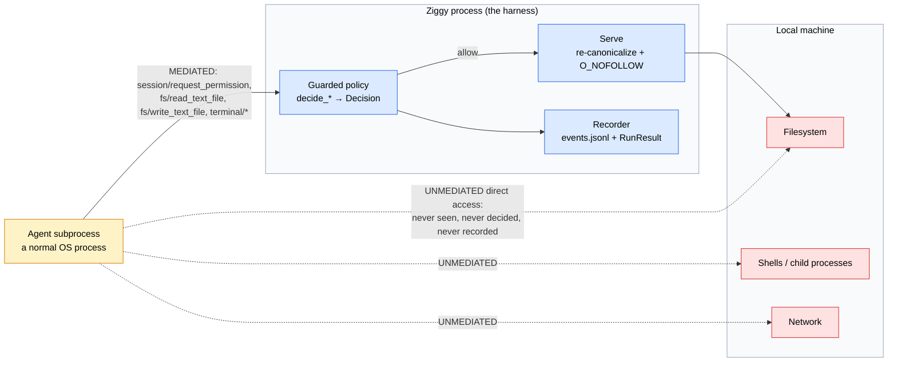
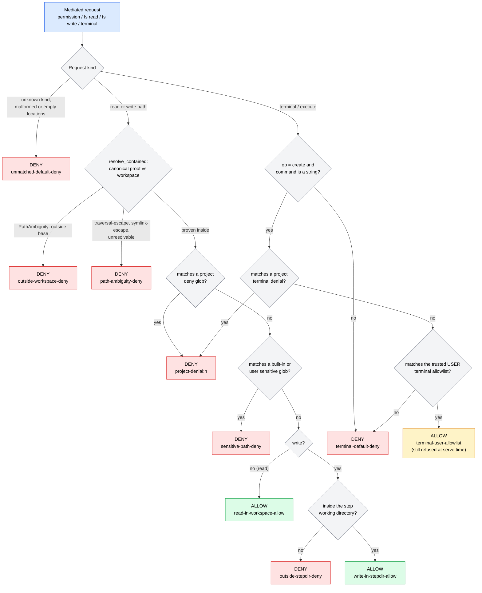

# Trust model and mediation policy

!!! danger "Ziggy is observable governance, not containment"

    Ziggy mediates exactly the ACP **client-bound** surface an agent chooses to call. An agent subprocess is a normal OS process: nothing in Ziggy prevents it from opening files, spawning shells, or making network calls **directly**, outside the protocol and outside everything on this page.

    Every rule, allowlist, and deny glob documented here applies **only to requests the agent routes through ACP**. They produce a recorded, reviewable decision trail. They do not confine the process. Treat a Ziggy policy decision as *evidence about what was asked and answered*, never as proof of what the agent could do.

    In v0.1 both built-in agents are **assumed** to have direct filesystem and shell tools (live capability probes are deferred), so `ziggy doctor` reports their mediation as `advisory`.

The vocabulary on this page is normative for code, docs, CLI output, and `RunResult` payloads. It comes from [`../phase0/trust-boundary.md`](../phase0/trust-boundary.md); where this page and the source disagree, the source and the code win.

---

## The boundary

Ziggy sits between an ACP client (the CLI, or an upstream editor when running `ziggy serve`) and an agent subprocess it launched. It sees, decides, and records the JSON-RPC requests the agent sends *back* to it — the client-bound surface. Everything the agent does without asking is invisible.



The solid path is governed and recorded. The dotted paths are not — and in v0.1 both built-ins are assumed to use them.

### The mediated surface

| ACP method | Ziggy's decision | What happens on allow |
|---|---|---|
| `session/request_permission` | `MediationPolicy.decide_permission` derives a read / write / terminal decision from the tool call's `kind` and `locations` | The narrowest matching wire option is selected (`allow_once` before `allow_always`) |
| `fs/read_text_file` | `decide_fs_read` | Ziggy serves the read itself, capped at 5 MiB (`MAX_MEDIATED_READ_BYTES`) |
| `fs/write_text_file` | `decide_fs_write` | Ziggy creates parent directories and writes the content itself |
| `terminal/*` | `decide_terminal` (only `create` carries a matchable command) | Nothing runs — see below |

!!! warning "v0.1 never executes a mediated terminal command"

    `PolicyHooks.handle_terminal` records the decision and then **always** raises `UnsupportedByPolicy`. Even a request that matches the trusted user terminal allowlist is recorded as `decision: "allowed-unsupported"` and refused: v0.1 does not implement client-side terminal execution, and does not pretend anything ran. A terminal allowlist entry in your config therefore changes what is *recorded*, not what executes.

    This says nothing about the agent's own shell. An agent with direct shell tools runs commands without ever sending `terminal/create`.

### What Ziggy does enforce — in its own process

These controls bind Ziggy, not the agent. Each has an honest limit.

| Control | Mechanism | Honest limit |
|---|---|---|
| Which commands launch | Trusted user config only; project scope can never name a command | The user config is trusted by definition |
| Child environment | Minimal baseline (`HOME`, `PATH`, `TERM`, `LANG` when present) + explicit `inherit_env` + one `api_key_env` | The agent can still read `~/.claude`-style state through `HOME` |
| Mediated FS/terminal requests | Guarded policy + canonical path proof, fail-closed | Only requests routed through ACP |
| Prompt / step / time / byte ceilings | Engine counters and timeouts | Cannot bound the agent's own internal work |
| Workspace lease | Cross-process lock held outside the repo | Cooperative among Ziggy processes only |
| Redaction | Bounded streaming redactor before persist and emit | Defense in depth, not a guarantee |
| Egress records | Provider identity + upstream-output lineage + acknowledgement | Records and gates; cannot un-send data |

---

## `enforcement_scope`: the vocabulary

Every recorded decision carries an `enforcement_scope`. The enum (`ziggy.models.common.EnforcementScope`) has exactly three values:

| Value | Meaning |
|---|---|
| `acp_mediated` | Ziggy resolved an ACP request. The decision is real, and its reach ends at the protocol. |
| `agent_reported` | The agent claims it did or did not do something. There is **no independent verification**. |
| `os_enforced` | **Reserved.** Only a separately verified sandbox provider may emit it. **No such provider exists in v0.1 — nothing in Ziggy ever emits this value.** |

The guarded policy engine only ever emits `acp_mediated`: `Decision.enforcement_scope` defaults to it and is never overridden. `PolicyProvenance.enforcement_scope_default` on a `RunResult` is `acp_mediated`, and `PolicyProvenance.enforcement` is the string `advisory`.

Every user-facing permission summary carries its scope. From `ziggy runs show`:

```text
policy: guarded (ceiling: default; enforcement: advisory; default scope: acp_mediated)
...
    policy decisions: 2
      denied 'Read project secrets' rule=sensitive-path-deny scope=acp_mediated
      approved 'Read src/main.py' rule=read-in-workspace-allow scope=acp_mediated
```

If you build tooling on top of Ziggy, carry the scope through. A permission line without its scope invites the reader to assume enforcement that does not exist.

---

## The guarded policy

`guarded` is the **only** policy engine in v0.1.

`permissions.default_policy` and a workflow step's `policy_profile` do **not** select a different engine. They name a user-scope `[permissions.profiles.<name>]` entry that *parametrizes* the same guarded engine with two additions: a terminal allowlist and extra deny globs. An unknown profile name is a `ConfigError` before launch; `PolicyProfile.allow_read_outside_workspace` is deliberately rejected by the schema — user scope may not widen reads.

Semantics, in one paragraph: mediated **reads** are auto-approved anywhere inside the canonical workspace; mediated **writes** are auto-approved only inside the canonical step working directory (a subset of the workspace); mediated **terminal** execution is denied unless a trusted user-scope allowlist rule matches on exact `argv[0]` plus an argument prefix; sensitive-path globs deny mediated reads **and** writes even inside otherwise-allowed directories; project scope may only *add* deny rules; deny always wins; unknown request kinds fall through to `unmatched-default-deny`.

### How one decision is reached



Deny rules are evaluated before allow rules on every branch, and there is no path past the final default deny.

### Rule ids

Rule ids are stable, recorded verbatim in `events.jsonl` and in `RunResult`, and are never renamed.

| Rule id | Effect | `policy_source` | Fires when |
|---|---|---|---|
| `read-in-workspace-allow` | allow | `default` | A mediated read resolves inside the canonical workspace and hits no deny rule |
| `write-in-stepdir-allow` | allow | `default` | A mediated write resolves inside the canonical step working directory and hits no deny rule |
| `terminal-user-allowlist` | allow | `user` | Exact `argv[0]` match plus argument-prefix match against a trusted user-scope `terminal_allowlist` rule (execution is still refused — see above) |
| `sensitive-path-deny` | deny | `default` or `user` | The workspace-relative path matches a built-in glob (`default`) or a user-added glob (`user`) |
| `outside-workspace-deny` | deny | `default` | The path canonicalizes cleanly but lands outside the workspace (`PathAmbiguity` reason `outside-base`) |
| `outside-stepdir-deny` | deny | `default` | A write is inside the workspace but outside the step working directory |
| `terminal-default-deny` | deny | `default` | Any terminal op that is not an allowlisted `create`: lifecycle ops (`output`, `wait_for_exit`, `kill`, `release`), a malformed payload, a missing or non-string command, malformed args, or a command matching no allowlist rule |
| `unmatched-default-deny` | deny | `default` | A permission request with no tool-call payload, an unmapped tool `kind`, or malformed/absent locations |
| `path-ambiguity-deny` | deny | `default` | Containment could not be proven: `traversal-escape`, `symlink-escape`, or `unresolvable` |
| `project-denial:<n>` | deny | `project-denial` | The path or command matches project deny rule at index `<n>` in `permissions.project_denials` |

Two provenance notes worth knowing when reading records:

- A `Decision` records `policy_source = "project-denial"`; the corresponding entry in `RunResult.policy.rules` records `source: "project"`. Same rule, two field conventions.
- `PolicyProvenance.ceiling_source` is `user` when any user-scope profile or extra glob contributed, otherwise `default` (or `env` when the caller says so).

Serving an allowed request can still fail, and those outcomes get their own non-policy rule ids so a refused service is never blamed on the rule that allowed it: `mediated-read-limit` (file exceeds 5 MiB), `mediated-io-error` (the `os.open`/read/write raised), and the serve-time re-check ids described below. The Phase-1 recording-only hooks use `phase1-default-deny` with policy name `default-deny`.

### Hostile input never crashes the engine

The `decide_*` methods **never raise** on agent-supplied input. Every failure mode — a missing tool call, a non-dict payload, a `locations` list containing a non-string non-dict entry, a path with NUL bytes, an unresolvable path, malformed terminal args — becomes a deny `Decision`. When a permission request carries multiple locations, **any** denied location denies the whole request, and that location's rule is the one recorded.

The single exception is deliberate and is not agent data: `MediationPolicy.guarded` raises `PathAmbiguity` if the engine hands it a `step_dir` that is not inside the `workspace`. That is a caller bug, and it fails closed.

---

## Sensitive paths

Eight deny globs ship built in (`DEFAULT_SENSITIVE_GLOBS`). They deny mediated reads **and** mediated writes, even inside the workspace and even inside the step working directory. Configuration can only **add** to this set — nothing removes a built-in.

| Glob | Covers |
|---|---|
| `**/.env` | A `.env` at any depth, including the workspace root |
| `**/.env.*` | `.env.local`, `.env.production`, and friends |
| `**/*_key` | Any file whose name ends in `_key` |
| `**/*.pem` | PEM-encoded material |
| `**/id_rsa*` | `id_rsa`, `id_rsa.pub`, `id_rsa_old` |
| `**/.aws/**` | An `.aws` directory itself and everything beneath it, at any depth |
| `**/.ssh/**` | An `.ssh` directory itself and everything beneath it, at any depth |
| `**/.ziggy/config.toml` | The project config, so an agent cannot read the trust rules it is subject to |

Matching semantics (`ziggy.policy.paths`):

- Patterns are matched against the path **relative to the canonical workspace**, after containment is proven.
- A `**` *segment* matches zero or more whole segments — which is why `**/.aws/**` matches `.aws` itself as well as anything under it.
- Any other segment matches exactly one path segment via `fnmatchcase`; `*` and `?` never cross a `/`.
- A pattern with no `/` is a basename pattern: it matches the final component at any depth (`p` behaves as `**/p`).

!!! note "Glob matching is case-insensitive by design"

    Every pattern segment and path segment is folded exactly once with `str.casefold` before comparison. This is a security choice, not a convenience: on a case-insensitive filesystem (APFS, NTFS), a `.ENV` that slipped past a case-sensitive `.env` deny would open the real `.env`. A deny rule stricter than the underlying filesystem can only over-deny; the reverse leaks secrets. Case-folding can only *add* denials.

User scope adds globs through `[permissions.profiles.<name>] deny_paths` or extra sensitive globs supplied by the engine; project scope adds them through `permissions.project_denials` with `kind = "path"`. Project denials are checked **first**, then built-ins, then user additions — all deny, so the order only affects which `policy_source` is recorded.

A project terminal denial (`kind = "terminal"`) names an exact `argv[0]`. The v0.1 config schema for a project denial carries no argument prefix, so such a rule denies **every** invocation of that command.

---

## Path containment and the decide/serve window

`resolve_contained(base, candidate)` is the single containment primitive, and it is fail-closed: anything that cannot be *proven* to stay inside the base raises `PathAmbiguity`. "Containment" here means one thing only — a proof about a path string relative to a base directory. It is not process containment and grants no OS enforcement.

- The base is `realpath`-resolved first, so a workspace that is itself a symlink is fine.
- An absolute candidate is accepted only if it lands inside the resolved base; a relative candidate is resolved against the base.
- Canonicalization is `os.path.realpath(..., strict=False)`: symlinks in every existing component are resolved, and non-existent trailing components are appended lexically — so an agent can create a new file inside the workspace and read it back.
- The function never returns a path outside the resolved base.

`PathAmbiguity.reason` is one of four stable strings:

| Reason | Meaning | Maps to rule |
|---|---|---|
| `outside-base` | Resolved cleanly, but lies outside the base (e.g. a plain `/etc/hosts`) | `outside-workspace-deny` |
| `traversal-escape` | Escaped the base through `..` traversal | `path-ambiguity-deny` |
| `symlink-escape` | Sat inside the base lexically; only symlink resolution moved it out | `path-ambiguity-deny` |
| `unresolvable` | Could not be canonicalized at all (NUL bytes, wrong type, OS resolution failure) | `path-ambiguity-deny` |

A `..` that **stays inside** the base after resolution is perfectly fine — `src/../README.md` resolves inside the workspace and is allowed. Only actual escape is denied. The containment check runs before the classification branch, so a benign `..` never reaches `traversal-escape`.

### The decide/serve window

A decision is made against the path string the agent supplied. Time passes before Ziggy opens anything. In between, a symlink or a directory component can be swapped underneath. Two narrowings apply:

1. **Serve-time re-assertion.** Before opening, `PolicyHooks` re-canonicalizes the path and re-asserts the same predicates the decision proved, on the freshly resolved path: workspace containment, project deny globs, sensitive globs, and — for writes — step-directory membership. A path that flipped is denied and never opened, recorded under the rule the re-check hit (`outside-workspace-deny`, `sensitive-path-deny`, `project-denial:<n>`, or `outside-stepdir-deny`) with a reason naming the serve-time re-check. A re-canonicalization that now fails outright is recorded as `path-ambiguity-deny`.
2. **`O_NOFOLLOW` on the final component.** Reads use `os.open(path, O_RDONLY | O_NOFOLLOW)`; writes use `os.open(path, O_WRONLY | O_CREAT | O_TRUNC | O_NOFOLLOW, 0o600)`. A last-hop symlink swapped in after the re-check makes the open fail with `ELOOP` rather than following it; the failure is recorded as `mediated-io-error` and the bytes never move.

!!! warning "This narrows the window; it does not close it"

    Both mechanisms are observable-governance narrowings of an inherent decide/serve race, and they close the specific swaps a hostile agent can aim at. They are not process containment and confer no OS enforcement — the scope on every one of these decisions remains `acp_mediated`. The regression tests that pin this behavior live in `tests/security/test_workflow_policy_intersection.py`.

---

## The two-scope trust model

Ziggy reads configuration from exactly two scopes with sharply different trust ([configuration.md](configuration.md) covers the full field reference):

- **User scope** — `$ZIGGY_HOME/config.toml` (default `~/.ziggy/config.toml`), plus `ZIGGY_<SECTION>__<KEY>` environment overrides applied over it. **Trusted.** It may set anything.
- **Project scope** — `<workspace>/.ziggy/config.toml`. **Untrusted**, because it travels with the repository. It may do four things and nothing else.

| Project scope may | Fields | Merge rule |
|---|---|---|
| Add permission denials | `permissions.project_denials` | `project_denials` — deny-only, appended |
| Tighten six numeric ceilings (lower only) | `engine.max_workflow_steps`, `engine.max_prompt_bytes`, `engine.default_step_timeout_seconds`, `engine.default_workflow_timeout_seconds`, `engine.max_event_bytes_per_step`, `engine.max_artifact_bytes_per_run` | `tighten_min` |
| Tighten capture | `results.capture` | `tighten_capture` — `metadata` < `standard` < `debug` |
| Name a default workflow | `workflows.default_name` | `project_ok` |

Everything else is `user_only` by **fail-closed default**: `merge_rule_for` returns `USER_ONLY` for any path not explicitly listed, so a new config field is untouchable by project scope until someone deliberately opts it in.

How violations are handled:

- **Unknown keys and user-only keys.** Collected in a first pass across the whole project file and raised as one path-precise `ConfigError` **before any project value is applied**, and therefore before any subprocess launch. The message names the offending TOML path and the project file.
- **Ceiling raises.** A project value that would *raise* a `tighten_min` ceiling is collected and raised as a `ConfigError` before `load_config` returns — no project value ever reaches the engine.
- **Capture raises.** Deliberately softer: a project asking for *more* capture (e.g. `standard` → `debug`) is **not** an error. The user value is kept, the field is recorded with `project_action = rejected`, and a warning is attached, so `ziggy config show` can display the rejection. The hostile value never reaches the engine.
- **Equal values** are recorded as `project_action = ignored`; genuine tightenings as `tightened`; the deny/default-workflow fields as `applied`.

Two more deliberate asymmetries:

- `permissions.project_denials` is **project-only**. Setting it in the user file is a `ConfigError` — deny rules are the one thing an untrusted scope contributes, and the loader keeps the channels separate.
- `results.retention_days` is `user_only` even though "smaller" looks like tightening. A shorter retention window destroys audit evidence sooner, so it is not a security ceiling a project may lower.

!!! danger "A symlink does not launder trust"

    A project config that is a symlink pointing at the trusted user file is still evaluated as **untrusted project content**. The loader opens `<workspace>/.ziggy/config.toml` and applies project rules to whatever it finds there; the user file's agent registrations then surface as forbidden project keys, reported against the project path. Trust follows the scope the file was read as, never the bytes' origin. This is pinned by `tests/security/test_hostile_project.py`.

Every effective leaf field carries `{source, project_action}` provenance (`default | user | env | project`), and the resolved config exposes a stable sha256 fingerprint embedded in every `RunResult` as `config_fingerprint`.

---

## Egress and acknowledgement

Ziggy records and gates **cross-provider data flow**: sending one provider's output into a different provider's context.

**A crossing is a data edge.** Egress is derived exclusively from `inputs` entries of the form `steps.<id>.outputs.<name>` where the sending step's provider differs from the receiving step's provider.

- `depends_on` is pure ordering and carries no data — it can **never** create a crossing.
- `vars.*` inputs are user-provided values, not another provider's output — they **never** count as crossings either. (Secret variables are governed separately; see below.)

Provider identity is the agent's declared `provider`, falling back to a stable `custom:<agent-name>` so unlabelled agents are never conflated with each other or with a known provider.

**Acknowledgement is exact set equality.** The crossing provider set must be acknowledged either through trusted user config:

```toml
[egress]
acknowledged_provider_sets = [["anthropic", "openai"]]
```

or per invocation:

```bash
ziggy workflow run review --acknowledge-egress anthropic,openai
```

Order and duplicates are irrelevant; a **subset or superset never matches**. Acknowledging `{anthropic, openai}` does nothing for a run that crosses `{anthropic, openai, custom:local}`. The per-invocation flag wins when both match, and the recorded `acknowledged_by` is `flag:--acknowledge-egress` or `config`.

**Unacknowledged crossings fail closed.** For workflows, the egress preflight runs before **any** agent launches: `EgressNotAcknowledgedError` (a `TrustPolicyError`, exit code 2) naming the exact sorted provider set and a rerun hint.

One `EgressRecord` is emitted per step that *receives* upstream outputs, carrying `step_id`, the receiving `provider`, the raw `steps.<id>.outputs.<name>` sources in declaration order, and `acknowledged_by` — stamped only on steps that actually cross. Single-provider workflows still get per-step lineage with `acknowledged_by = null` and never trigger the gate.

### The orchestrator is different in two ways

- **Planning is always egress.** The user goal and the bounded agent catalog go to the planner's provider on every run, recorded as `EgressRecord{step_id: "plan", input_sources: ["goal", "catalog"]}`.
- **The planner counts as a data sender into every executed step.** The plan itself — selected targets, generated prompts, variables — is planner output that parameterizes each step, so the plan-derived provider set always includes the planner. Intra-plan `steps.<id>.outputs.text` edges cross exactly as in a workflow.

The orchestrator's crossing gate necessarily runs **after** the planning turn (the provider set is not knowable until the plan exists) and **before any execution agent launches**. An unacknowledged crossing stops the run with the validated plan preserved in the result and a rerun hint. See [../guides/orchestration.md](../guides/orchestration.md).

Recording is not prevention: an egress record tells you what was sent and how it was acknowledged. It cannot un-send data.

---

## Credentials and redaction

### Credentials are referenced by name

An agent's credential is declared as an environment variable **name**, never a value:

```toml
[agents.claude]
api_key_env = "ANTHROPIC_API_KEY"
```

The name must match `^[A-Z][A-Z0-9_]*$`. A named-but-unset variable raises `ConfigError` **before** any subprocess launches. The child environment is composed explicitly — the minimal baseline (`HOME`, `PATH`, `TERM`, `LANG`, each only when present in the parent), then `inherit_env` names, then the literal `env` table, then the credential — never a wholesale parent-environment passthrough.

**Literal secrets in config are rejected at load.** Both scopes plus every environment override are scanned with the redactor's own matchers; any value matching a secret pattern raises a `ConfigError` listing the offending paths and the matched *kinds*. Error messages never echo the value.

### What redaction does

The `Redactor` combines three matcher classes against the raw text, merging overlapping spans into union intervals labelled by the most specific contributor:

1. **Exact secret values** — the resolved `api_key_env` value, values of `redaction.extra_value_env_vars` present in the parent environment, and resolved secret workflow variables. Values shorter than 6 characters still redact but record a warning, because they can over-redact unrelated text.
2. **Built-in token regexes** — Anthropic, OpenAI, GitHub, AWS access-key-id and secret-access-key, Slack, Google, `Authorization: Bearer`, and PEM private-key headers. Each declares a `max_width` that bounds its match, and token-charset patterns extend a bounded match to the end of a still-continuing token run so no secret tail survives beside the marker.
3. **User custom patterns** from `redaction.patterns`. A pattern without `max_width` is applied only to complete events, never on the streaming path — the streaming carry window cannot be sized for it. Invalid regexes surface as a `ConfigError` at config validation.

Matched spans become `[REDACTED:<kind>]`. Because all matchers run against raw input and never against already-marked text, markers cannot be re-matched or corrupted. Streaming redaction holds back only the trailing bytes that could still grow into a match, so a secret split across two chunks is buffered and redacted whole while clean chunks stream through untouched.

`RedactionSummary` carries **counts only** — `total_redactions`, `by_kind`, and warnings. It never carries matched text.

!!! warning "Redaction is defense in depth, not a proof"

    Redaction is **not** a proof that arbitrary secret or proprietary data cannot appear in captured output. It covers value matches and known token shapes; it cannot recognize a secret it has never been told about and whose format it does not know. **Capture minimization and retention are the stronger controls** — lower `results.capture`, and keep `results.retention_days` deliberate.

    The seeded-secret corpus in `tests/security/test_secret_corpus.py` verifies *that corpus*, and its own docstring says so: it is not a universal no-secret guarantee.

Two mechanical limits worth knowing:

- `redact_payload` recursively redacts string **values** through nested dicts and lists. It leaves dict **keys** untouched. A secret used as a key is not redacted.
- Redaction runs before persist and emit. It cannot reach data the agent sent somewhere else directly.

### Secret workflow variables

A workflow variable declared `secret: true` may only be interpolated into a step whose agent provider is explicitly listed in trusted user config:

```toml
[workflows.secret_variable_allowances]
token = ["anthropic"]
```

`workflows.secret_variable_allowances` is `user_only` — project scope is rejected outright. Any secret variable flowing to a step whose provider is not listed for that variable fails as a `ValidationError` before execution, and a step with no resolvable provider identity fails closed the same way. Resolved secret values are also registered as exact-match redaction values, so they are redacted from persisted artifacts including `inputs_resolved`. See [../guides/workflows.md](../guides/workflows.md).

---

## The uncontained-planner gate

An agent whose `AgentConfig.direct_tools_assumed` is true is one Ziggy assumes has direct filesystem or shell tools it cannot disable. In v0.1 that is **both built-ins and every custom agent**.

Using such an agent as the orchestrator's planner is **refused by default**. `prepare_orchestration` raises `TrustPolicyError` (exit code 2) unless trusted **user** config sets:

```toml
[orchestrator]
allow_uncontained_planner = true
```

Project config can never set it — the field is `user_only`, so a repository cannot acknowledge this boundary on your behalf. When the acknowledgement is present, it is recorded: an `egress_notice` event carrying `uncontained_planner_ack: true`, `enforcement: "advisory"`, and `acknowledged_by: "config:orchestrator.allow_uncontained_planner"`, plus the run's policy provenance.

The planner runs under a **reduced-exposure** profile — never a sandbox:

- An empty `tempfile.mkdtemp(prefix="ziggy-plan-")` working directory that Ziggy creates, supplies no workspace contents to, and removes in a `finally`.
- The minimal baseline environment plus the planner's explicit trusted-config values only; `inherit_env` passthrough is cleared for planning.
- A `PlanningMediationPolicy` where mediated reads are allowed only inside that temp directory, **every** mediated write is denied by a categorical `planning-write-deny` rule (not a directory trick), and the terminal surface has no allowlist at all.
- Planning-step permission requests are decided locally and never forwarded to an upstream client.
- The workspace lease is acquired before launching an uncontained planner and held through execution or plan-only completion.

That profile shapes what the planner can obtain *through ACP*. It says nothing about the direct tools the acknowledgement exists to flag — which is exactly why the acknowledgement and the lease exist. `ziggy doctor` reports the gate's state per agent; see [cli.md](cli.md).

---

## Reading the record

Trust decisions are auditable after the fact. The relevant surfaces:

- `events.jsonl` — `permission_requested`, `permission_decided` (with `rule_id`, `policy_name`, `policy_source`, `enforcement_scope`, and in server mode `client_response`), `fs_read`, `fs_write`, `terminal_op`, `egress_notice`.
- `RunResult` — `policy` (`PolicyProvenance`: policy name, ceiling source, the full effective rule list, `tightened_by`, `enforcement: "advisory"`, `enforcement_scope_default: "acp_mediated"`), `config_fingerprint`, `egress`, per-step `permission_decisions` and `file_changes`.
- Field-by-field shapes are in [schemas.md](schemas.md); how to browse and prune runs is in [../guides/runs-and-audit.md](../guides/runs-and-audit.md).

Capture completeness in those records comes from provenance rules, never from optimism: an artifact class is marked `complete` only when the capture mechanism proves it, and `partial`, `derived`, or `unavailable` otherwise.

---

## What would change this

Nothing on this page is a permanent verdict about the built-in agents — it is the **conservative default** that follows from evidence Ziggy does not yet have.

The direct-tool rows in [../phase0/capability-matrix.md](../phase0/capability-matrix.md) are `UNVERIFIED (live probe deferred)`, so both built-ins are classified `direct_tools_assumed = true`. The probe that would change it is specified there: run each adapter against a canary workspace with the client `fs`/`terminal` capabilities disabled and observe whether edits and commands still happen (direct tools present) or the agent degrades to the mediated path.

If a built-in proves to route its filesystem and shell work through ACP, its `direct_tools_assumed` flag flips, `ziggy doctor` stops warning about it, and the uncontained-planner gate stops requiring an acknowledgement for it. The contained branch in the orchestrator already exists for exactly that update.

What would **not** change is `os_enforced`. That value stays reserved for a separately verified sandbox provider, and none exists in v0.1. Verifying that agents *cooperate* with mediation is not the same as enforcing anything at the OS level; ACP mediation would remain observable governance either way.

The full set of deferred live and human items — probes, the Zed interoperability smoke, the security review sign-off, and the release mechanics — is tracked in [../RELEASE-CHECKLIST.md](../RELEASE-CHECKLIST.md). **v0.1.0 is not yet tagged or released**; treat everything here as the current state of an unreleased harness.
