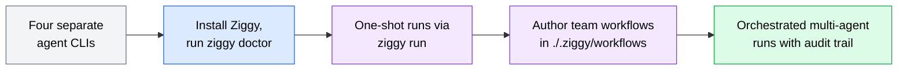
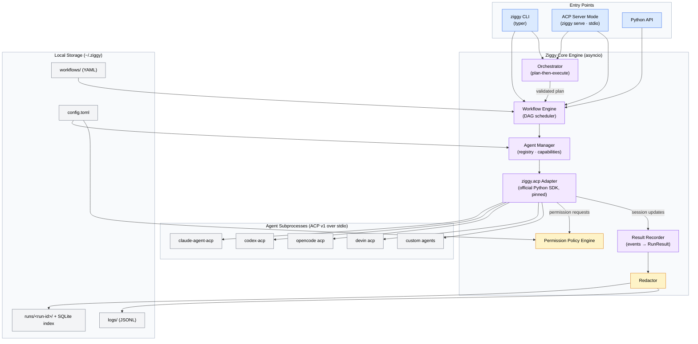
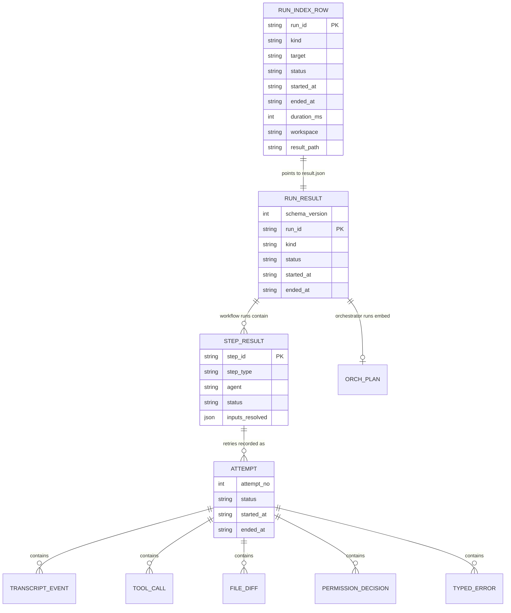
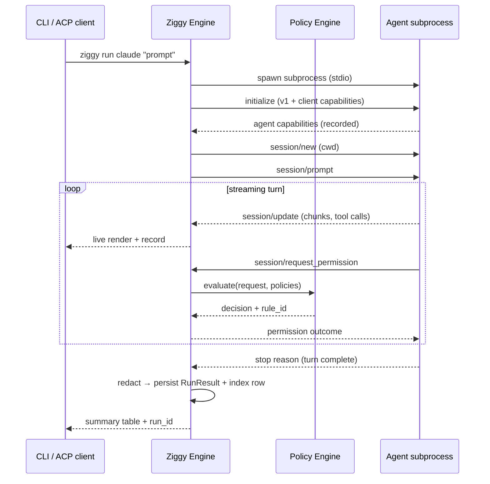

# ziggy-mvp PRD

**Version**: 1.0

**Author**: Ada

**Date**: 2026-07-28

**Status**: Draft

**Spec Type**: New product

**Spec Depth**: Full technical documentation

**Description**: Ziggy is a Python meta-harness for AI agents: a single CLI and engine that runs any ACP-speaking agent (Claude, Codex, OpenCode, Devin, custom), composes agents into dependency-graph workflows, produces structured redacted RunResults, exposes itself as an ACP agent to clients like Zed, and offers an optional orchestrator that plans and dispatches work across agents.

---

## 1. Executive Summary

Ziggy is a meta-harness for AI coding agents. It provides one interface — a CLI and a Python engine — over every agent that speaks the [Agent Client Protocol (ACP)](https://agentclientprotocol.com), turning today's fragmented landscape of per-agent CLIs into a single, scriptable, auditable system. Every run produces a structured `RunResult`; multiple agents compose into dependency-graph workflows; Ziggy itself speaks ACP as an agent so it can be driven from editors like Zed; and an optional orchestrator agent can plan and dispatch multi-agent work from a single prompt.

## 2. Problem Statement

### 2.1 The Problem

Developers who use multiple AI coding agents face three compounding problems:

1. **Fragmented tooling** — Claude Code, Codex, OpenCode, and Devin each ship their own CLI, configuration, auth setup, and output format. Switching agents means context-switching entire toolchains.
2. **No orchestration** — There is no first-class way to compose agents into pipelines where one agent's output feeds another's prompt, with independent work running concurrently.
3. **Unstructured results** — Agent runs emit terminal scrollback, not machine-readable artifacts. There is no durable, comparable, auditable record of what an agent did: what it was asked, which tools it called, which files it changed, what permissions it was granted or denied.

### 2.2 Current State

Each agent is run through its own CLI directly. Multi-agent pipelines are stitched together manually (copy-pasting outputs between terminals) or via ad-hoc shell scripts with no shared result format, no permission governance, and no run history.

### 2.3 Impact Analysis

- Every multi-agent task carries manual glue overhead and is unrepeatable.
- No audit trail exists for what agents were permitted to do in a workspace.
- Team knowledge about "how we run agents" lives in individual habits rather than versioned workflow definitions.

*(No quantitative baseline exists; the product itself creates the measurement surface via RunResults.)*

### 2.4 Business Value

Ziggy converts agent usage from individual craft into team infrastructure: versioned workflows in repos, uniform onboarding (`ziggy doctor`), auditable runs, and a foundation (structured results + workflow engine) that later supports evals, dashboards, and CI integration. Betting on ACP — an open, vendor-neutral protocol with a growing registry of 40+ agents — means every new ACP agent is supported nearly for free.

## 3. Goals & Success Metrics

### 3.1 Primary Goals

1. **Daily-driver CLI** — Ziggy replaces direct agent CLIs as the primary way the team launches agent runs.
2. **Reliable workflows** — Multi-agent YAML/Python workflows run end-to-end dependably with structured, partial-failure-aware results.
3. **Works in ACP clients** — Ziggy is usable as an agent inside Zed and other ACP clients.
4. **Orchestrator works** — A registered agent, acting as orchestrator, can plan and dispatch single-agent or workflow responses from one prompt.

### 3.2 Success Metrics

| Metric | Current Baseline | Target | Measurement Method | Timeline |
|--------|------------------|--------|-------------------|----------|
| Team members using Ziggy as primary agent launcher | 0 | All active teammates | Informal team check-in | v0.1 + 1 month |
| Workflow run success rate (non-user-error) | n/a | ≥ 90% | `status` field across persisted RunResults | v0.1 + 1 month |
| Built-in agents passing `ziggy doctor` handshake | 0/4 | 4/4 | `ziggy doctor` output | v0.1 release |
| Ziggy usable from Zed as an ACP agent | No | Yes (prompt → streamed response) | Manual verification in Zed | Phase 4 complete |
| Orchestrator plans validated & executed successfully | n/a | ≥ 80% of orchestrator runs | Typed-error rate on `OrchestratorPlanInvalid` | Phase 5 + 2 weeks |

### 3.3 Non-Goals

- Not building a new AI agent — Ziggy runs existing agents.
- Not an agent marketplace or hosting platform — local, stdio-subprocess execution only.
- Not an eval/benchmark harness in the MVP (explicitly deferred).

## 4. User Research

### 4.1 Target Users

#### Primary Persona: Ada (project owner / power user)
- **Role/Description**: Senior developer running multiple AI agents daily across projects.
- **Goals**: One command surface for all agents; repeatable multi-agent pipelines; auditable results.
- **Pain Points**: Tool fragmentation, manual output-piping between agents, no run history.
- **Context**: Terminal-first, macOS, also drives agents from Zed.
- **Technical Proficiency**: Expert.

#### Secondary Persona: Teammate developer
- **Role/Description**: Developer on the same team adopting shared agent workflows.
- **Goals**: Get productive fast without learning four agent CLIs; run team-authored workflows.
- **Pain Points**: Onboarding friction (auth, installs, config); silent failure modes across four agent CLIs.

### 4.2 User Journey Map



### 4.3 User Workflows

#### Workflow 1: One-shot agent run


#### Workflow 2: Multi-agent workflow run

User runs `ziggy workflow run review-and-fix`. The engine resolves the YAML, validates the DAG, runs independent steps concurrently (default limit 4), threads step outputs into dependent prompts, applies permission policies headlessly, and writes a workflow-level RunResult containing per-step results — including partial results if a branch failed.

## 5. Functional Requirements

> Requirement IDs are stable and referenced by the implementation plan. Items marked *(assumption)* were inferred during spec compilation and should be corrected if wrong.

### 5.1 Feature: ACP Agent Interface & Built-in Agents

**Priority**: P0 (Critical)
**Complexity**: High

#### User Stories

**US-001**: As a developer, I want to run any ACP-speaking agent through one interface so that I never touch per-agent CLIs directly.

**REQ-001: Unified ACP agent interface**

**Acceptance Criteria**:
- [ ] Ziggy launches agents as stdio subprocesses and drives them via ACP protocol v1 (`initialize` → `session/new` → `session/prompt` → `session/update` stream).
- [ ] The ACP layer is implemented with the official `agent-client-protocol` Python SDK, pinned to an exact version, wrapped in a thin internal adapter module (`ziggy.acp`) that exposes Ziggy-native types only — no SDK types leak outside the module.
- [ ] Each agent's negotiated protocol version and capabilities are recorded at `initialize` as first-class per-agent state and gate feature exposure.
- [ ] Turn completion is modeled as an event stream (not "prompt response == turn complete"), so ACP v2 semantics can be adopted later without domain-model changes.
- [ ] As an ACP client, Ziggy implements: `session/update` handling, `session/request_permission`, `fs/read_text_file`, `fs/write_text_file`, and `terminal/*`. `elicitation` is declared unsupported *(assumption)*.

**REQ-002: Built-in agents**

**Acceptance Criteria**:
- [ ] Four built-in agents work with zero/minimal config: Claude (`claude-agent-acp` via npx), Codex (`codex-acp` via npx), OpenCode (`opencode acp`), Devin (`devin acp`).
- [ ] Built-in launch commands are pinned to known-good adapter versions; config can override command, args, and env.
- [ ] Custom agents are registered in config with `command`, plus optional `args`, `env`, `working_dir`, and `api_key_env`.

**Technical Notes**:
- Built-in launch commands should be verifiable against the machine-readable ACP registry (`https://cdn.agentclientprotocol.com/registry/v1/latest/registry.json`) — see Open Question #2.
- Per-agent quirks (Devin degraded terminal rendering, OpenCode missing undo/redo over ACP, claude-agent-acp adapter churn) are isolated in per-agent capability records, not special-cased across the engine.

**Edge Cases**:
| Scenario | Input | Expected Behavior |
|----------|-------|-------------------|
| Agent binary not installed | `ziggy run devin "..."` with no devin on PATH | `AgentLaunchError` with install hint; nonzero exit; RunResult persisted with typed error |
| Protocol version mismatch | Agent only supports a version Ziggy doesn't | Connection closed per ACP spec; `ProtocolError` recorded with both versions |
| Agent crashes mid-turn | Subprocess exits during `session/prompt` | Partial transcript captured; `ProtocolError` with exit code; retry policy applies if configured |
| Malformed JSON-RPC from agent | Corrupt frame on stdout | Adapter surfaces `ProtocolError`; raw frame logged (redacted) for debugging |

**Error Handling**:
| Error Condition | User Message | System Action |
|-----------------|--------------|---------------|
| Launch failure | "Failed to launch agent '{name}': {reason}. Try `ziggy doctor`." | Typed `AgentLaunchError` in RunResult; exit code 1 |
| Missing API key env var | "Agent '{name}' requires env var {VAR} (not set)." | Fail before subprocess launch; `ConfigError` |
| Capability unsupported | "Agent '{name}' does not support {capability}; step requires it." | Fail step with `CapabilityError` before prompting |

---

### 5.2 Feature: CLI (Headless One-Shot Runs)

**Priority**: P0 (Critical)
**Complexity**: Medium

#### User Stories

**US-002**: As a developer, I want a single command to send a prompt to any agent or workflow and watch it stream, so that Ziggy is my daily driver.

**REQ-003: Command surface** *(command names are assumptions; semantics are requirements)*

| Command | Purpose |
|---------|---------|
| `ziggy run <agent> "<prompt>"` | One-shot headless run against a named agent |
| `ziggy workflow run <name\|path> [--var k=v]` | Run a workflow by name (searched in `./.ziggy/workflows`, then `~/.ziggy/workflows`) or direct path |
| `ziggy workflow list` | List discoverable workflows |
| `ziggy orchestrate "<prompt>"` | One-shot run through the configured orchestrator |
| `ziggy agents list` | List registered agents with negotiated capability summary (from last handshake) |
| `ziggy runs list [--failed]` / `ziggy runs show <run-id>` | Browse the SQLite run index / inspect a persisted RunResult |
| `ziggy serve` | Run Ziggy as an ACP agent on stdio (server mode) |
| `ziggy doctor` | Diagnostics (see REQ-013) |
| `ziggy config show` / `ziggy config validate` | Inspect effective merged config / validate it |

**Acceptance Criteria**:
- [ ] Interactive chat sessions are **not** part of the MVP; all commands are headless one-shot.
- [ ] During a run the terminal shows rich live progress: per-step status (workflows), streamed agent output and tool-call events as they occur, and a summary table at the end (status, duration, files changed, permissions denied, result path).
- [ ] `--json` flag emits the final RunResult to stdout for scripting *(assumption)*.
- [ ] Exit codes: 0 success, 1 run failure, 2 usage/config error *(assumption)*.

**Technical Notes**:
- CLI built with typer; live rendering with rich *(assumption: rich, consistent with typer ecosystem)*.
- Streamed `session/update` events map to render events through the same event stream the RunResult recorder consumes — one event pipeline, two consumers.

---

### 5.3 Feature: Structured Results (RunResult)

**Priority**: P0 (Critical)
**Complexity**: High

#### User Stories

**US-003**: As a developer, I want every run to produce a durable, machine-readable, secrets-redacted record so that runs are auditable, comparable, and scriptable.

**REQ-004: RunResult contents**

**Acceptance Criteria**:
- [ ] Every run (agent, workflow, orchestrator) produces a `RunResult` containing: schema version, run ID, kind, target, status, timing, full transcript (message/thought/tool-call events), tool-call records, file diffs, permission decisions (each with the policy rule that produced it), retry attempts, and typed errors.
- [ ] Workflow RunResults nest per-step `StepResult`s and record partial results for steps that completed before a failure.
- [ ] Statuses: `success`, `failed`, `partial`, `cancelled`.

**REQ-005: Persistence**

**Acceptance Criteria**:
- [ ] Each run persists to `~/.ziggy/runs/<run-id>/` with `result.json` (schema-versioned), `transcript.jsonl`, and `diffs/` *(layout is an assumption; the split of index vs. files is a requirement)*.
- [ ] A SQLite index at `~/.ziggy/runs/index.db` records one row per run (run_id, kind, target, status, timestamps, duration, workspace, result path) and powers `ziggy runs list`.
- [ ] Persistence is on by default and can be disabled per run (`--no-save`) *(assumption)*.
- [ ] Run IDs are ULIDs (sortable by creation time) *(assumption)*.

**REQ-006: Secrets redaction**

**Acceptance Criteria**:
- [ ] Before persistence and before log emission, all transcript/tool-call/diff text passes through a redactor.
- [ ] Redaction combines: (a) built-in regexes for known token formats (e.g., `sk-...`, `ghp_...`, AWS access keys), (b) exact-match redaction of the **values** of env vars Ziggy knows to be secrets (any var referenced via `api_key_env` plus a configurable list), and (c) user-configurable additional patterns in config.
- [ ] Redacted spans are replaced with `[REDACTED:<kind>]` markers *(assumption)*.
- [ ] Redaction is applied to persisted artifacts and structured logs; live terminal streaming is also redacted *(assumption: same pipeline)*.

**Edge Cases**:
| Scenario | Input | Expected Behavior |
|----------|-------|-------------------|
| Secret split across stream chunks | Token boundary falls between two `session/update` chunks | Redactor buffers at chunk boundaries sufficient for pattern window; no partial-secret leak in persisted artifacts |
| Very large transcript | Multi-hour agent run | `transcript.jsonl` streamed to disk incrementally, not held wholly in memory |
| Disk full / unwritable runs dir | Persistence fails | Run completes; persistence failure reported as warning + typed `PersistenceError` in exit summary; index row skipped |

---

### 5.4 Feature: Configuration System

**Priority**: P0 (Critical)
**Complexity**: Medium

**US-004**: As a team member, I want one declarative config file with env-var overrides so that setup is reviewable and portable.

**REQ-007: Config file & precedence**

**Acceptance Criteria**:
- [ ] Single TOML config: `~/.ziggy/config.toml` (global) and `./.ziggy/config.toml` (project). Project values override global; environment variables (`ZIGGY_*`) override both *(env-var naming convention `ZIGGY_SECTION__KEY` is an assumption)*.
- [ ] Config covers: engine settings (concurrency, timeouts, dirs), agent registry, permission policies, workflow settings, orchestrator settings, redaction patterns.
- [ ] Config carries `schema_version`; unknown keys produce warnings, invalid values produce `ConfigError` with path-precise messages.
- [ ] Secrets are never stored literally: agent credentials are referenced by env-var name (e.g., `api_key_env = "ANTHROPIC_API_KEY"`). `ziggy config validate` rejects config values matching built-in secret patterns.

**Example** *(illustrative)*:

```toml
schema_version = 1

[engine]
max_concurrent_steps = 4
default_step_timeout_seconds = 1800

[agents.claude]
api_key_env = "ANTHROPIC_API_KEY"   # built-in: command defaults provided

[agents.internal-helper]
command = ["/opt/agents/helper", "acp"]
env = { HELPER_MODE = "ci" }
api_key_env = "HELPER_API_KEY"

[permissions]
default_policy = "safe"

[orchestrator]
agent = "claude"
```

---

### 5.5 Feature: Permission Policy Engine

**Priority**: P0 (Critical)
**Complexity**: Medium

**US-005**: As a developer running headless workflows, I want permission requests resolved by declared policy — with a safe default — so that unattended runs are both possible and governed.

**REQ-008: Policy-based permission handling**

**Acceptance Criteria**:
- [ ] Every ACP `session/request_permission` is resolved by a policy: auto-approve, auto-reject, or allowlist rules, configurable per agent and per workflow/step (step overrides workflow overrides agent overrides global default).
- [ ] The **safe default policy** ships enabled: auto-approve reads within the workspace; auto-approve writes only within the step's working directory; deny shell/execute requests unless explicitly allowlisted.
- [ ] Every permission decision is recorded in the RunResult with: the request, the decision, and the specific rule that produced it.
- [ ] A permission rejection that the agent cannot proceed past surfaces as a typed `PermissionDeniedError` on the step (and triggers normal failure semantics).
- [ ] A `permissive` built-in policy exists for trusted workflows (approve all) but must be explicitly selected *(assumption)*.

**Edge Cases**:
| Scenario | Input | Expected Behavior |
|----------|-------|-------------------|
| Request outside workspace | Agent asks to write `/etc/hosts` | Denied by safe policy; decision + rule recorded |
| Request kind not covered by policy | Novel permission option shape | Deny by default; decision recorded with rule `unmatched-default-deny` |
| Policy references unknown agent | Config typo | `ConfigError` at validation time, not at run time |

---

### 5.6 Feature: Workflow Engine

**Priority**: P0 (Critical)
**Complexity**: High

**US-006**: As a developer, I want to define multi-agent pipelines as dependency graphs in YAML or Python so that multi-agent work is repeatable and versioned.

**REQ-009: Workflow definition**

**Acceptance Criteria**:
- [ ] Workflows are defined in YAML (discovered in `./.ziggy/workflows/`, `~/.ziggy/workflows/`, or by direct path) or directly in Python against the engine API.
- [ ] YAML carries `version: 1`; files failing schema validation are rejected with path-precise errors before any step runs.
- [ ] Step types: **agent** (named agent + prompt; prompts may instruct the agent to invoke its own skills/slash-commands — no separate step type needed), and **script** (Python or shell, run as subprocess).
- [ ] DAG edges are declared via an explicit `inputs` map (data dependencies) and `depends_on` (pure ordering dependencies) *(depends_on is an assumption to cover data-free ordering)*.
- [ ] Prompt bodies support template interpolation of declared inputs (e.g., `{{ inputs.plan }}`) and workflow variables (`--var k=v`). Only declared inputs are available to a step — undeclared references are validation errors.
- [ ] Cycles, references to unknown steps, and references to unknown agents are validation-time errors.

**Example** *(illustrative)*:

```yaml
version: 1
name: review-and-fix
description: Plan with Claude, fix with Codex, verify with tests.

steps:
  plan:
    agent: claude
    prompt: |
      Analyze the failing tests in this repo and produce a numbered fix plan.

  fix:
    agent: codex
    inputs:
      plan: steps.plan.output
    prompt: |
      Apply this plan exactly:
      {{ inputs.plan }}
    retry:
      max_retries: 2
      backoff_seconds: 30

  verify:
    script: ./scripts/run_tests.sh
    depends_on: [fix]
```

**REQ-010: Execution semantics**

**Acceptance Criteria**:
- [ ] Independent steps run concurrently up to `max_concurrent_steps` (default 4, configurable globally and per workflow).
- [ ] Each step has a timeout (default 30 minutes, configurable globally, per workflow, per step) enforced with subprocess termination and `StepTimeoutError` *(default value is an assumption)*.
- [ ] **Failure semantics (default)**: a failed step cancels its downstream dependents; already-running independent branches run to completion; the workflow RunResult has status `partial` (or `failed` if nothing else succeeded) with per-step results.
- [ ] **Retries (opt-in)**: steps may declare `retry: {max_retries, backoff_seconds}` applying to transient failures (agent crash, timeout, rate-limit-shaped errors); every attempt is recorded in the StepResult.
- [ ] Script steps receive declared inputs as environment variables and/or stdin JSON *(assumption: env vars `ZIGGY_INPUT_<NAME>` + `ZIGGY_RUN_ID`)*; nonzero exit is a step failure with captured stdout/stderr.
- [ ] All steps share the invocation working directory by default; a step may declare `working_dir`. Parallel write collisions are the workflow author's concern in MVP (worktree isolation is future work — see 8.3).
- [ ] Cancellation (Ctrl-C / ACP `session/cancel`) gracefully cancels in-flight ACP sessions, terminates subprocesses, and persists a `cancelled` RunResult.

**REQ-011: Python workflow API**

**Acceptance Criteria**:
- [ ] The YAML surface is a strict subset of the Python API: everything YAML can express, Python can, plus dynamic graph construction.
- [ ] Programmatic use returns the same `RunResult` objects (`await ziggy.workflow(...).run()`) *(API shape is an assumption)*.

---

### 5.7 Feature: ACP Server Mode

**Priority**: P1 (High)
**Complexity**: High

**US-007**: As a Zed user, I want to connect to Ziggy as an agent so that orchestrated multi-agent power is available inside my editor.

**REQ-012: Ziggy as an ACP agent**

**Acceptance Criteria**:
- [ ] `ziggy serve` speaks ACP v1 as an agent over stdio; Zed can register it via standard custom-agent config.
- [ ] Default routing: prompts go to the **orchestrator**.
- [ ] The client can target a **specific agent** or a **named workflow** instead of the orchestrator, exposed via ACP session modes/config options *(mechanism assumption: session modes named `orchestrator`, `agent:<name>`, `workflow:<name>`)*.
- [ ] Downstream agent activity (message chunks, tool calls, step transitions) is re-emitted to the client as `session/update` notifications so the client sees live progress of the whole pipeline.
- [ ] Permission requests from downstream agents are resolved by policy exactly as in CLI mode; decisions appear in the transcript. Forwarding permission prompts to the connecting client is out of scope for MVP *(assumption — policy-only keeps server mode headless-consistent)*.
- [ ] Server-mode runs also persist RunResults, identically to CLI runs.
- [ ] `loadSession` is not declared in MVP *(assumption)*.

---

### 5.8 Feature: Orchestrator

**Priority**: P1 (High)
**Complexity**: High

**US-008**: As a developer, I want to hand Ziggy a goal and have an orchestrator agent decide whether one agent or a workflow should handle it.

**REQ-013: Plan-then-execute orchestration**

**Acceptance Criteria**:
- [ ] Any registered agent can be configured as orchestrator (`[orchestrator] agent = "..."`).
- [ ] Ziggy sends the orchestrator a **meta-prompt** containing: the user's request, the registry of available agents (names + capability summaries), and available named workflows (names + descriptions).
- [ ] The orchestrator must respond with a structured JSON plan — either `{"plan_type": "single_agent", "agent": ..., "prompt": ...}` or `{"plan_type": "workflow", "workflow": {<inline workflow definition, same schema as YAML>}}` — plus a `reasoning` string.
- [ ] Ziggy validates the plan (known agents, valid workflow schema, DAG checks) **before** execution; invalid plans produce `OrchestratorPlanInvalid` with the validation detail, and one automatic re-prompt with the validation errors is attempted *(re-prompt count of 1 is an assumption)*.
- [ ] The executed plan and its full RunResult are recorded under a single orchestrator RunResult (kind `orchestrator`), including the plan JSON and reasoning.
- [ ] The iterative tool-driven orchestration mode is explicitly out of scope (future consideration).

---

### 5.9 Feature: Diagnostics & Run Browsing

**Priority**: P1 (High)
**Complexity**: Low

**US-009**: As a new teammate, I want one command that tells me exactly what is broken in my setup.

**REQ-014: `ziggy doctor`**

**Acceptance Criteria**:
- [ ] Validates merged config (schema, unknown keys, policy references).
- [ ] Checks each registered agent's command is resolvable/executable.
- [ ] Verifies each referenced `api_key_env` is set — without printing values.
- [ ] Performs a live ACP `initialize` handshake per agent and reports negotiated protocol version and capability summary.
- [ ] Exits nonzero if any check fails; output is human-readable with per-check pass/fail and fix hints; `--json` supported *(assumption)*.

**REQ-015: Run browsing**

**Acceptance Criteria**:
- [ ] `ziggy runs list` reads the SQLite index (filter flags: `--failed`, `--kind`, `--agent`, `--since`) *(flag set is an assumption)*.
- [ ] `ziggy runs show <run-id>` renders the persisted RunResult summary: status, timing, steps, files changed, permission denials, errors.

---

### 5.10 Feature: Observability (Structured Logs)

**Priority**: P1 (High)
**Complexity**: Low

**REQ-016: Structured logging**

**Acceptance Criteria**:
- [ ] All runs emit structured JSONL logs to `~/.ziggy/logs/` with timestamps, agent names, run IDs, and step IDs on every record.
- [ ] Log records include lifecycle events (launch, handshake, session, prompt, updates, permission decisions, retries, termination) and reference the persisted RunResult path.
- [ ] `run_id`/`step_id` correlate logs ↔ RunResults ↔ index rows.
- [ ] Log files rotate by size or day with a retention cap *(assumption: daily files, 30-day default retention, configurable)*.

## 6. Non-Functional Requirements

### 6.1 Performance Requirements

*(Local tool — targets are engineering budgets, not SLAs. All are assumptions to validate.)*

| Metric | Requirement | Measurement Method |
|--------|-------------|-------------------|
| CLI startup overhead (before agent subprocess launch) | < 300 ms | Benchmark in CI |
| Streaming pass-through latency (agent chunk → terminal render) | < 50 ms | Manual + benchmark harness |
| Concurrent agent subprocesses supported | ≥ 8 (default limit 4) | Integration test with mock agents |
| `ziggy runs list` on 10k-run index | < 100 ms | Benchmark with seeded index |
| Redaction overhead on transcript throughput | < 5% | Benchmark |

### 6.2 Security Requirements

#### Authentication
- Ziggy itself has no accounts. Agent credentials are env-var references only (`api_key_env`); literal secrets in config are rejected by validation.

#### Authorization
| Role | Permissions |
|------|------------|
| Local user | Full control — Ziggy is a single-user local tool; OS boundaries apply |
| Agents (via ACP) | Governed by the permission policy engine (REQ-008): safe default — workspace reads, working-dir writes, no shell unless allowlisted |

#### Data Protection
- Secrets redaction (REQ-006) applied to all persisted artifacts and logs.
- No network services opened: all transport is stdio subprocess pipes.
- RunResults may contain proprietary code (diffs/transcripts); stored under the user's home directory with default file permissions `0600`/`0700` *(assumption)*.

### 6.3 Scalability Requirements
- Vertical only: bounded by local machine resources; concurrency limits are configurable.
- SQLite index and JSONL streaming must remain responsive at 10k+ runs and multi-hour transcripts.

### 6.4 Reliability Requirements
- Deterministic failure semantics (fail-fast + surviving branches + partial results) — REQ-010.
- Opt-in per-step retries with recorded attempts.
- Crash safety: a killed Ziggy process must not corrupt the SQLite index (WAL mode) *(assumption)*; incomplete run directories are marked `abandoned` on next CLI invocation *(assumption)*.

### 6.5 Accessibility Requirements
- Terminal output honors `NO_COLOR` and provides `--plain` for non-TTY/screen-reader-friendly output *(assumption)*.
- Not a GUI product; WCAG not applicable to MVP.

## 7. Technical Architecture

### 7.1 System Overview



### 7.2 Tech Stack

| Layer | Technology | Justification |
|-------|------------|---------------|
| Language/runtime | Python 3.12+ | User choice; asyncio maturity; matches SDK support (3.10–3.14) |
| Packaging | uv | Fast, lockfile-based; `uv tool install` from git is the distribution path |
| CLI | typer | Typed command surface, good help UX |
| Live terminal UI | rich | Live progress + streamed output rendering *(assumption)* |
| Models/validation | pydantic v2 | Config, workflow schema, RunResult, orchestrator plan validation |
| ACP protocol | `agent-client-protocol` (official Python SDK, pinned exact) | Both client & agent sides; generated Pydantic models track the canonical schema |
| Concurrency | asyncio | Subprocess + stream multiplexing across concurrent steps |
| Run index | SQLite (stdlib `sqlite3`, WAL) | Zero-dep queryable index over JSON artifacts |
| Lint/format/test | ruff, pytest, pytest-asyncio | User choice |

### 7.3 Data Models

All models are Pydantic and carry `schema_version`.

#### Entity Relationships



#### Entity: RunResult

| Field | Type | Constraints | Description |
|-------|------|-------------|-------------|
| schema_version | int | NOT NULL | RunResult schema version (starts at 1) |
| run_id | str (ULID) | PK | Sortable unique run identifier |
| kind | enum | `agent` \| `workflow` \| `orchestrator` | What was executed |
| target | str | NOT NULL | Agent name, workflow name/path, or orchestrator agent |
| status | enum | `success` \| `failed` \| `partial` \| `cancelled` | Outcome |
| started_at / ended_at | datetime (UTC) | NOT NULL | Timing |
| workspace | path | NOT NULL | Invocation working directory |
| agent_info | AgentInfo? | agent runs | Negotiated protocol version + capabilities snapshot |
| steps | dict[str, StepResult]? | workflow runs | Per-step results incl. partial |
| plan | OrchestratorPlan? | orchestrator runs | Validated plan + reasoning |
| errors | list[TypedError] | — | Run-level typed errors |
| redaction | RedactionSummary | NOT NULL | Pattern counts applied (never the matched text) |

#### Entity: StepResult / Attempt

| Field | Type | Description |
|-------|------|-------------|
| step_id | str | Step name from workflow definition |
| step_type | enum | `agent` \| `script` |
| agent | str? | Agent name for agent steps |
| status | enum | `success` \| `failed` \| `skipped` \| `cancelled` |
| inputs_resolved | dict | The concrete input values after interpolation (redacted) |
| attempts | list[Attempt] | ≥ 1; each with transcript events, tool calls, file diffs, permission decisions, errors, timing |
| output | str | The step's final output text (what downstream `inputs` consume) |

#### Supporting types

- **TranscriptEvent**: `{ts, session_id, event_type (message_chunk|thought_chunk|tool_call|tool_call_update|plan|other), payload}` — persisted as JSONL.
- **ToolCall**: `{tool_call_id, kind, title, status, locations, raw}`.
- **FileDiff**: `{path, change_type, unified_diff}`.
- **PermissionDecision**: `{request_summary, options_offered, decision, rule_id, policy_name, ts}`.
- **TypedError** (taxonomy): `AgentLaunchError`, `ProtocolError`, `CapabilityError`, `PermissionDeniedError`, `StepTimeoutError`, `ScriptError`, `ValidationError`, `ConfigError`, `OrchestratorPlanInvalid`, `PersistenceError`, `CancelledError`.
- **AgentConfig**: `{name, builtin, command[], args[], env{}, working_dir?, api_key_env?, permission_policy?}`.
- **WorkflowDef / StepDef / RetryPolicy**: mirror the YAML schema (§5.6); identical whether authored in YAML or Python.
- **OrchestratorPlan**: `{plan_type: single_agent|workflow, reasoning, agent?, prompt?, workflow?: WorkflowDef}`.

### 7.4 Interface Specifications

Ziggy has no HTTP API. Its public contracts are: the CLI (§5.2), the workflow YAML schema (§5.6), the orchestrator plan schema (§5.8), the RunResult JSON schema (§7.3), and the ACP surfaces below.

#### ACP surface — Ziggy as CLIENT (driving agents)

| Direction | Method | Ziggy behavior |
|-----------|--------|----------------|
| → agent | `initialize` | Sends `protocolVersion: 1` + client capabilities: `fs.readTextFile`, `fs.writeTextFile`, `terminal` (elicitation omitted = unsupported); records agent's response as capability state |
| → agent | `session/new` | One session per step/run; cwd = step working dir; `mcpServers: []` (passthrough out of scope) |
| → agent | `session/prompt` | Sends composed prompt (content blocks); completion detected via event stream + stop reason |
| → agent | `session/cancel` | On Ctrl-C, timeout, or branch cancellation |
| ← agent | `session/update` | Fanned out to Result Recorder + live renderer |
| ← agent | `session/request_permission` | Resolved by Policy Engine; decision returned + recorded |
| ← agent | `fs/read_text_file`, `fs/write_text_file` | Served against the step working dir, subject to policy path rules |
| ← agent | `terminal/*` | Supported (claude-agent-acp depends on it); executions subject to policy |

#### ACP surface — Ziggy as AGENT (`ziggy serve`)

| Method | Ziggy behavior |
|--------|----------------|
| `initialize` | Accepts `protocolVersion: 1`; declares prompt capabilities (text; image passthrough deferred *(assumption)*); no `loadSession` |
| `session/new` | Creates a Ziggy session bound to client cwd |
| `session/set_mode` / config options | Selects routing: `orchestrator` (default) \| `agent:<name>` \| `workflow:<name>` *(mechanism assumption)* |
| `session/prompt` | Routes per mode; re-emits downstream activity as `session/update`; returns stop reason at pipeline completion |
| `session/cancel` | Cancels the underlying run graph gracefully |

#### Run lifecycle (client side)



### 7.5 Integration Points

| System | Type | Protocol | Purpose | Authentication |
|--------|------|----------|---------|----------------|
| claude-agent-acp (npm) | Agent subprocess | ACP v1 / stdio | Claude Code runs | `ANTHROPIC_API_KEY` (or adapter auth flow) |
| codex-acp (npm) | Agent subprocess | ACP v1 / stdio | Codex runs | ChatGPT login / `OPENAI_API_KEY` |
| opencode (`opencode acp`) | Agent subprocess | ACP v1 / stdio (native) | OpenCode runs | Per-provider keys via OpenCode config |
| devin (`devin acp`) | Agent subprocess | ACP v1 / stdio | Devin runs | Devin API key |
| ACP registry JSON | Static feed | HTTPS GET | Verify/pin built-in launch commands (Open Question #2) | None |
| Zed (and other ACP clients) | Inbound client | ACP v1 / stdio | Drive Ziggy in server mode | None (local subprocess) |

**Known per-agent degradations** (record in user docs; capability-gate in code): Devin renders terminal output through generic ACP surfaces only; OpenCode does not support `/undo`//`/redo` over ACP; claude-agent-acp is an adapter that may lag Claude Code and has non-standard, capability-gated subagent transcript nesting.

### 7.6 Technical Constraints

| Constraint | Impact | Mitigation |
|------------|--------|------------|
| ACP Python SDK is pre-1.0 (0.11.x) with breaking-change history | Upgrades can break the protocol layer | Pin exact version; all SDK usage confined to `ziggy.acp`; contract tests gate upgrades |
| ACP v2 draft (2026-07-20) removes `fs/*`, `terminal/*`, inverts turn semantics | Designs that assume v1 shapes become migration debt | Target v1 explicitly; event-stream turn model; adapter isolation; v2 behind future flag |
| Agent CLIs are external, fast-moving processes | Behavior drift between releases | Pinned adapter versions; `ziggy doctor` handshake checks; opt-in live contract tests |
| stdio-only transport (remote ACP is upstream WIP) | No remote agents in MVP | Scope explicitly excludes non-stdio transports |
| Shared working directory for parallel steps | Concurrent writes can collide | Documented author responsibility; worktree isolation designed-for in 8.3 |
| macOS/Linux only for MVP *(assumption)* | No Windows support | Revisit post-MVP; avoid gratuitous POSIX-isms in path handling |

## 8. Scope Definition

### 8.1 In Scope

- Python engine + typer CLI, headless one-shot runs (agent, workflow, orchestrator)
- ACP client support for 4 built-in agents + custom agent registration
- Structured `RunResult` with redaction, per-run JSON persistence, SQLite index
- Single-file TOML config with project/global/env precedence and env-var secret references
- Policy-based permission engine with safe default
- Workflow engine: YAML + Python, explicit-inputs DAG, concurrency, fail-fast + partial results, opt-in retries, script steps
- ACP server mode with orchestrator/agent/workflow routing
- Plan-then-execute orchestrator
- `ziggy doctor`, run browsing, structured JSONL logs
- Testing: units + mock ACP agent fixture + opt-in live contract tests

### 8.2 Out of Scope

- **Interactive chat sessions** (CLI): headless-first MVP; revisit after v0.1
- **Git worktree isolation** for parallel steps: significant machinery; designed-for but deferred
- **MCP server passthrough** to agents: deferred
- **Web/TUI dashboard** for browsing runs: CLI only
- **Evals / agent comparison**: RunResult makes it possible later; not in MVP
- **Workflow resume/checkpointing** from failed steps: deferred
- **ACP v2**: draft protocol; explicitly not targeted
- **Remote (non-stdio) agents**: upstream support is itself WIP
- **PyPI publishing**: git-based install for now

### 8.3 Future Considerations

- Worktree-isolated parallel steps with merge/collect semantics (architecture should keep step working-dir resolution pluggable)
- Tool-driven orchestrator mode (orchestrator drives `run_agent`/`run_workflow` tools iteratively)
- Interactive sessions; permission-prompt forwarding to ACP clients in server mode
- Evals layer over RunResults; run-diffing between agents
- ACP registry–driven agent discovery and version pinning
- ACP v2 adoption behind version negotiation

## 9. Implementation Plan

### 9.1 Phase 1: Foundation — Engine Core, ACP Client, One Agent, RunResult

**Completion Criteria**: `python -m ziggy run claude "hello"` (minimal CLI stub) completes a real run against claude-agent-acp, streams output, and persists a redacted, schema-versioned RunResult with SQLite index row.

| Deliverable | Description | Technical Tasks | Dependencies |
|-------------|-------------|-----------------|--------------|
| Project scaffold | uv project, ruff/pytest config, package layout | `pyproject.toml`, `src/ziggy/`, CI lint+test | None |
| `ziggy.acp` adapter | Thin wrapper over pinned official SDK; Ziggy-native session/event/permission types | Pin SDK; subprocess spawn; initialize/capability capture; event-stream turn model | SDK version verification (OQ #1) |
| Event pipeline | Single stream feeding renderer + recorder | asyncio fan-out; backpressure-safe JSONL writer | Adapter |
| RunResult + persistence | Pydantic models, redactor, run dir writer, SQLite index (WAL) | Models; built-in regex set; env-value redaction; ULID; index DDL | Event pipeline |
| Claude built-in agent | First built-in with pinned launch command | Launch config; `api_key_env` handling | Adapter |
| Mock ACP agent fixture | Scripted fake agent for integration tests | Test-only ACP agent (SDK agent-side) with programmable scenarios | Adapter |

**Checkpoint Gate**:
- [ ] Architecture review: adapter boundary holds (no SDK types outside `ziggy.acp`)
- [ ] RunResult JSON schema + index DDL reviewed and approved
- [ ] Redaction verified against seeded secrets in transcripts (incl. chunk-boundary case)

---

### 9.2 Phase 2: CLI, Config, All Agents, Permission Policies

**Completion Criteria**: All four built-ins pass `ziggy doctor`; one-shot runs work for each; safe default policy governs permissions headlessly; runs browsable.

| Deliverable | Description | Technical Tasks | Dependencies |
|-------------|-------------|-----------------|--------------|
| Full CLI surface | `run`, `agents list`, `runs list/show`, `config show/validate`, `doctor` | typer commands; rich live view; `--json`; exit codes | Phase 1 |
| Config system | TOML load/merge/validate, env overrides, secret-reference enforcement | Pydantic settings; precedence tests; path-precise errors | None |
| Permission policy engine | Safe default + allowlists + per-agent/workflow/step resolution | Rule matcher; decision recording; `unmatched-default-deny` | Adapter |
| Remaining built-ins | Codex, OpenCode, Devin | Pinned commands; per-agent capability records; quirk documentation | Config |
| `ziggy doctor` | Full diagnostics incl. live handshakes | Check framework; secret-safe env reporting | All above |

**Checkpoint Gate**:
- [ ] Security review of the permission policy engine and safe defaults
- [ ] Config schema review (it is a public, team-facing contract)
- [ ] All four agents demonstrated live from a clean-machine setup following docs

---

### 9.3 Phase 3: Workflow Engine

**Completion Criteria**: The `review-and-fix` example (§5.6) runs end-to-end: concurrent execution, output threading, script step, retry on injected transient failure, partial results on injected hard failure.

| Deliverable | Description | Technical Tasks | Dependencies |
|-------------|-------------|-----------------|--------------|
| Workflow schema + validation | YAML `version: 1`, inputs/depends_on DAG, template interpolation | Pydantic schema; cycle/unknown-ref detection; Jinja-style interpolation of declared inputs only | Phase 2 |
| DAG scheduler | Concurrency-limited async execution, fail-fast + surviving branches, cancellation | Ready-set scheduling; per-step timeout; cancel propagation | RunResult (StepResult) |
| Script steps | Python/shell subprocess steps with inputs via env/stdin | Capture stdout/stderr; nonzero-exit failure mapping | Scheduler |
| Retry policy | Opt-in per-step retries with backoff, attempts recorded | Transient-error classification; backoff timer | Scheduler |
| Python workflow API | Programmatic construction mirroring YAML | Builder API; shared execution path; `RunResult` return | Scheduler |
| Workflow CLI | `workflow run/list`, `--var` | Discovery in `./.ziggy/workflows` + `~/.ziggy/workflows` + path | CLI |

**Checkpoint Gate**:
- [ ] Workflow YAML schema review (public, team-facing contract) before broad authoring
- [ ] Failure-semantics integration tests pass (fail-fast, partial, cancel, retry)

---

### 9.4 Phase 4: ACP Server Mode

**Completion Criteria**: Zed connects to `ziggy serve`; prompts route to orchestrator-placeholder (single default agent until Phase 5), specific agents, and named workflows; downstream activity streams into the editor; RunResults persist.

| Deliverable | Description | Technical Tasks | Dependencies |
|-------------|-------------|-----------------|--------------|
| Agent-side ACP | Ziggy as ACP agent on stdio | SDK agent-side wiring in `ziggy.acp`; capability declaration | Phase 1 adapter |
| Routing modes | orchestrator / `agent:<name>` / `workflow:<name>` | Session mode/config-option surface; mode registry | Phase 3 |
| Update re-emission | Downstream events → client `session/update` | Event-pipeline second consumer → outbound notifications | Event pipeline |
| Zed verification | Documented Zed setup + manual test script | Docs; smoke checklist | All above |

**Checkpoint Gate**:
- [ ] Live demo from Zed: agent run + workflow run with streamed progress
- [ ] Cancellation from client verified to tear down the full downstream graph

---

### 9.5 Phase 5: Orchestrator

**Completion Criteria**: `ziggy orchestrate "<goal>"` and server-mode default routing produce validated plans that execute as single-agent runs or inline workflows, with plan + reasoning recorded in the RunResult.

| Deliverable | Description | Technical Tasks | Dependencies |
|-------------|-------------|-----------------|--------------|
| Meta-prompt composer | Request + agent registry + workflow catalog → orchestrator prompt | Prompt template; capability summaries | Phase 2 |
| Plan schema + validation | `OrchestratorPlan` parsing, DAG validation, one re-prompt on invalid | JSON extraction; validator reuse from workflow schema | Phase 3 |
| Plan execution | Route to single agent or inline workflow under one orchestrator RunResult | Nested run recording | Phase 3 |
| CLI + server integration | `ziggy orchestrate`; default server-mode route | Wire-up | Phase 4 |

**Checkpoint Gate**:
- [ ] Meta-prompt + plan schema review (quality of plans depends on it)
- [ ] `OrchestratorPlanInvalid` rate measured across a trial prompt set before calling v0.1

## 10. Testing Strategy

### 10.1 Test Levels

| Level | Scope | Tools | Coverage Target |
|-------|-------|-------|-----------------|
| Unit | Config merge, redaction, DAG validation/scheduling, policy matching, plan validation, models | pytest | ≥ 85% on core modules *(assumption)* |
| Integration | Full engine against the **mock ACP agent fixture**: runs, streams, permissions, retries, cancellation, server mode (Ziggy client ↔ Ziggy serve loopback) | pytest-asyncio + fixture agent | All REQ acceptance criteria exercised |
| Contract (opt-in, live) | Real CLIs: initialize → session/new → prompt → update stream → permission → cancel, per agent | pytest marker `-m live`, requires keys | 4/4 agents on release + on SDK/adapter upgrades |
| Performance | Startup overhead, streaming latency, 10k-run index, redaction throughput | benchmark harness in CI | Budgets in §6.1 |

### 10.2 Test Scenarios

#### Critical Path: Workflow with failure + retry + partial results
| Step | Action | Expected Result |
|------|--------|-----------------|
| 1 | Run 4-step workflow (2 independent branches) with mock agents | Branches run concurrently (≤ limit) |
| 2 | Inject transient failure in step `fix` (attempt 1) | Retry fires with backoff; attempt 1 + 2 both recorded |
| 3 | Inject hard failure in branch B mid-run | Branch B dependents cancelled; branch A completes |
| 4 | Inspect RunResult | status `partial`; per-step statuses correct; permission decisions + rules present; secrets redacted |
| 5 | `ziggy runs show <id>` | Renders the same picture from disk |

#### Critical Path: Secrets never persist
Seed mock-agent transcript and file diffs with known fake secrets (pattern-matching and env-value forms, including one split across stream chunks); assert zero occurrences across `result.json`, `transcript.jsonl`, `diffs/`, and logs.

### 10.3 Performance Test Plan
- Bench: engine overhead with 8 concurrent mock-agent steps for 10 minutes (soak) — no leaks, bounded memory with multi-MB transcripts.
- Index: seed 10k runs; `ziggy runs list` under budget.

## 11. Deployment & Operations

### 11.1 Distribution Strategy
- **Install**: `uv tool install git+<repo-url>` (team); tagged semver releases (`v0.1.0`); PyPI deferred.
- **Rollback**: install previous git tag.
- **Upgrades of pinned externals** (ACP SDK, adapter versions): deliberate PRs that must pass the live contract suite.

### 11.2 Configuration Toggles
*(No server-side feature flags — config-driven toggles instead.)*

| Toggle | Purpose | Default |
|--------|---------|---------|
| `permissions.default_policy` | Safe vs permissive governance | `safe` |
| `engine.max_concurrent_steps` | Concurrency ceiling | `4` |
| `engine.default_step_timeout_seconds` | Step timeout | `1800` |
| `results.persist` | RunResult persistence | `true` |

### 11.3 Monitoring & Alerting
Local tool — "monitoring" is self-inspection: structured JSONL logs with run/step IDs (§5.10), `ziggy runs list --failed`, and `ziggy doctor` as the health check. No alerting channels in MVP.

### 11.4 Runbook
- **Agent won't launch / handshake fails**: `ziggy doctor` → check install hint, env vars, pinned adapter version.
- **Run hangs**: check per-step timeout config; Ctrl-C persists a `cancelled` RunResult; inspect `~/.ziggy/logs/` by run_id.
- **Index/result mismatch**: index is derived data — rebuild command `ziggy runs reindex` *(assumption)* rescans run dirs.

## 12. Dependencies

### 12.1 Technical Dependencies
| Dependency | Owner | Status | Risk if Delayed |
|------------|-------|--------|-----------------|
| `agent-client-protocol` (Python SDK) | ACP org (primary maintainer: PsiACE) | 0.11.1, pre-1.0 | Core protocol layer; mitigated by adapter + pinning |
| claude-agent-acp | agentclientprotocol org | 0.63.0, active churn | Claude support degrades; pin + contract tests |
| codex-acp | agentclientprotocol org | 1.1.7 | Codex support |
| OpenCode CLI | OpenCode | 1.18.8, native ACP | OpenCode support |
| Devin CLI | Cognition | ACP mode documented (Zed) | Devin support; least-validated pairing |
| uv, typer, pydantic, rich, ruff, pytest | Community | Stable | Low |

### 12.2 Cross-Team Dependencies
| Team | Dependency | Status |
|------|------------|--------|
| Teammates | API keys/accounts for the four agents; willingness to author workflows | Informal — no blockers |

## 13. Risks & Mitigations

| Risk | Impact | Likelihood | Mitigation Strategy | Owner |
|------|--------|------------|--------------------|-------|
| ACP v2 migration (draft 2026-07-20 removes fs/terminal, inverts turn semantics) | High | Medium | Target v1; event-stream turn model; all protocol code in `ziggy.acp`; v2 behind future negotiation flag | Ada |
| Python SDK pre-1.0 breaking changes (history at 0.7/0.8/0.11) | High | Medium | Pin exact version; upgrades are deliberate PRs gated by live contract tests | Ada |
| SDK single-maintainer bus factor | Medium | Medium | Thin adapter keeps a transport fork/reimplementation bounded, not existential | Ada |
| SDK↔schema lag (SDK tracks ~v1.16 vs upstream v1.20) | Medium | Medium | Verify alignment at Phase 1 start (OQ #1); avoid depending on newest capability fields | Ada |
| Per-agent behavioral divergence (Devin terminals, OpenCode undo/redo, claude adapter churn) | Medium | High | Per-agent capability records; quirks documented; per-agent contract tests | Ada |
| Upstream release velocity (multiple schema releases/week) | Medium | High | Scheduled upgrade cadence, never chase releases | Ada |
| Parallel steps corrupt shared workspace | Medium | Medium | Safe policy limits writes to working dir; docs warn; worktree isolation designed-for future | Ada |
| Orchestrator plan quality poor | Medium | Medium | Strict plan validation + one re-prompt; measure `OrchestratorPlanInvalid` rate at Phase 5 gate | Ada |
| Redaction misses a secret class | High | Low | Layered detection (patterns + env values + custom); dedicated leak tests incl. chunk-boundary | Ada |

## 14. Open Questions

| # | Question | Owner | Due Date | Resolution |
|---|----------|-------|----------|------------|
| 1 | Exact `agent-client-protocol` version to pin — verify SDK↔schema alignment (0.11.x tracks ~v1.16 vs upstream v1.20) and that all needed v1 surfaces are modeled | Ada | Phase 1 start | |
| 2 | Consume the ACP registry JSON for built-in launch commands/version pinning vs hardcoding (leaning: hardcoded pins verified against registry in CI) | Ada | Phase 2 start | |
| 3 | Confirm assumed CLI command names/flags (§5.2) before docs are written | Ada | Phase 2 start | |
| 4 | Server mode: is policy-only permission handling acceptable in editors, or should permission forwarding to the client be pulled into scope? | Ada | Phase 4 gate | |
| 5 | Windows support explicitly deferred — confirm | Ada | v0.1 release | |

## 15. Appendix

### 15.1 Glossary
| Term | Definition |
|------|------------|
| ACP | Agent Client Protocol — open JSON-RPC 2.0 protocol over stdio between clients (editors/harnesses) and AI agents |
| Agent | An ACP-speaking subprocess (Claude, Codex, OpenCode, Devin, or custom) |
| RunResult | Ziggy's schema-versioned structured record of a run |
| Workflow | A dependency graph of agent/script steps defined in YAML or Python |
| Orchestrator | A registered agent given a meta-prompt to plan single-agent or workflow execution |
| Step | One node in a workflow DAG |
| Safe policy | Default permission policy: workspace reads, working-dir writes, no shell unless allowlisted |
| Server mode | `ziggy serve` — Ziggy acting as an ACP agent for clients like Zed |

### 15.2 References
- ACP homepage & spec: https://agentclientprotocol.com (initialization/versioning: /protocol/initialization; schema: /protocol/schema)
- ACP v2 draft announcement & migration: https://agentclientprotocol.com/announcements/acp-v2-draft · /protocol/v2/migration
- Official Python SDK: https://github.com/agentclientprotocol/python-sdk · https://pypi.org/project/agent-client-protocol/
- Agent adapters: https://github.com/agentclientprotocol/claude-agent-acp · https://github.com/agentclientprotocol/codex-acp
- OpenCode ACP docs: https://opencode.ai/docs/acp/ · Devin CLI ACP: https://docs.devin.ai/cli/acp/zed
- ACP agent registry (machine-readable): https://cdn.agentclientprotocol.com/registry/v1/latest/registry.json
- Zed ACP overview: https://zed.dev/acp
- Source context: `internal/prompts/ziggy-spec.md`

### 15.3 Change Log
| Version | Date | Author | Changes |
|---------|------|--------|---------|
| 1.0 | 2026-07-28 | Ada | Initial version — compiled from adaptive interview (6 rounds, 25 questions) + ACP ecosystem research |

---

*Document generated by SDD Tools*
